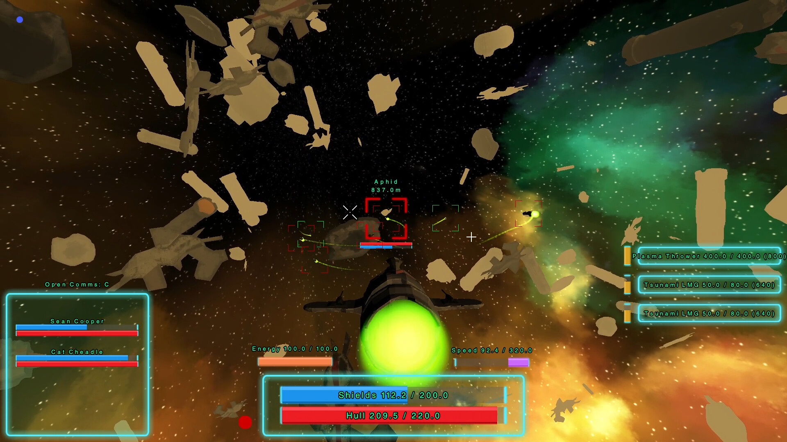

[](https://github.com/SanderMertens/flecs/releases)
[](https://github.com/SanderMertens/flecs/blob/master/LICENSE)
[](https://www.flecs.dev/flecs/md_docs_2Docs.html)
[](https://github.com/SanderMertens/flecs/actions?query=workflow%3ACI)
[](https://discord.gg/BEzP5Rgrrp)

Flecs is a fast and lightweight Entity Component System that lets you build games and simulations with millions of entities ([join the Discord!](https://discord.gg/BEzP5Rgrrp)). Here are some of the framework's highlights:

- Fast and [portable](#language-bindings) zero dependency [C99 API](https://www.flecs.dev/flecs/group__c.html)
- Modern type-safe [C++11 API](https://www.flecs.dev/flecs/group__cpp.html) that doesn't use STL containers
- First open source ECS with full support for [Entity Relationships](https://www.flecs.dev/flecs/md_docs_2Relationships.html)!
- Fast native support for [hierarchies](https://www.flecs.dev/flecs/md_docs_2Relationships.html#the-childof-relationship) and [prefabs](https://www.flecs.dev/flecs/md_docs_2Relationships.html#the-isa-relationship)
- Code base that builds in less than 5 seconds
- Runs [in the browser](https://flecs.dev/city) without modifications with emscripten
- Cache friendly [archetype/SoA storage](https://ajmmertens.medium.com/building-an-ecs-2-archetypes-and-vectorization-fe21690805f9) that can process millions of entities every frame
- Supports entities with hundreds of components and applications with tens of thousands of archetypes
- Automatic component registration that works out of the box across shared libraries/DLLs
- Write free functions with [queries](https://github.com/SanderMertens/flecs/tree/master/examples/cpp/queries/basics) or run code automatically in [systems](https://github.com/SanderMertens/flecs/tree/master/examples/cpp/systems/pipeline)
- Run games on multiple CPU cores with a fast lockless scheduler
- Verified on all major compilers and platforms with [CI](https://github.com/SanderMertens/flecs/actions) running more than 6000 tests
- Integrated [reflection framework](https://www.flecs.dev/flecs/group__c__addons__meta.html) with [JSON serializer](https://github.com/SanderMertens/flecs/tree/master/examples/cpp/reflection/basics_json) and support for [runtime components](https://github.com/SanderMertens/flecs/tree/master/examples/cpp/reflection/runtime_component)
- [Unit annotations](https://github.com/SanderMertens/flecs/tree/master/examples/cpp/reflection/units) for components
- Powerful [query language](https://github.com/SanderMertens/flecs/tree/master/examples/cpp/rules) with support for [joins](https://github.com/SanderMertens/flecs/tree/master/examples/cpp/rules/setting_variables) and [inheritance](https://github.com/SanderMertens/flecs/tree/master/examples/cpp/rules/component_inheritance)
- [Statistics addon](https://www.flecs.dev/flecs/group__c__addons__stats.html) for profiling ECS performance
- A web-based UI for monitoring & controlling your apps ([demo](https://flecs.dev/explorer), [code](https://github.com/flecs-hub/explorer)):

[](https://flecs.dev/explorer)

To support the project, give it a star 🌟 !

## What is an Entity Component System?
ECS is a way of organizing code and data that lets you build games that are larger, more complex and are easier to extend. Something is called an ECS when it:
- Has _entities_ that uniquely identify objects in a game
- Has _components_ which are datatypes that can be added to entities
- Has _systems_ which are functions that run for all entities matching a component _query_

For more information, check the [ECS FAQ](https://github.com/SanderMertens/ecs-faq)!

## Try it out!
The [Flecs playground](https://www.flecs.dev/explorer/?local=true&wasm=https://www.flecs.dev/explorer/playground.js) lets you try Flecs without writing any C/C++ code!

[](https://www.flecs.dev/explorer/?local=true&wasm=https://www.flecs.dev/explorer/playground.js)

To learn how to use the playground, check the [Flecs Script Tutorial](https://www.flecs.dev/flecs/md_docs_2FlecsScriptTutorial.html).


The [Flecs C playground](https://godbolt.org/z/vYhfsddx4) lets you try Flecs by writing C code online!

<div><iframe width="800px" height="1800px" src="https://godbolt.org/e#z:OYLghAFBqd5QCxAYwPYBMCmBRdBLAF1QCcAaPECAMzwBtMA7AQwFtMQByARg9KtQYEAysib0QXACx8BBAKoBnTAAUAHpwAMvAFYTStJg1AB9U8lJL6yAngGVG6AMKpaAVxYMQAJlIOAMngMmABy7gBGmMQgAJzSAA6oCoS2DM5uHt6kCUk2AgFBoSwRUbEWmFa5DEIETMQEae6ePpaY1inVtQT5IeGRMdIKNXUNGc1DXYE9RX2xAJQWqK7EyOwcAKReAMyByG5YANRrm44IBARxCiAA9FfETADuAHTAhAiuYa5Ky7KMBI9oLCuQkMWGIAFlIgRGAorlQrDCWExBpFYfDHggjtg1hoAIIbbYMXauA5HE5nC7XW4PZ6vd6fSJoQS/f6oQHAhigiF1aGo1oIpFQ4i85AKf6Y7F4rY7PaYQ7HTCqVqBfjo8W4/HS4my0mDfCoVWbLHqqWEmVyxy62h4MIGo143EEACecUwWCo%2B0GxFc1kOAHYAEIS/b7OGoJgEfaqUj7R1HQPq30AEX2ykSyQE0YAauVUMhCLHNvH7cWbvsAGIke61dD7LC7WqygEJIKCD2ofb3RuGfb0/aEEPEVkh1yEyoKfaoAgISL7KfdxGBCXYRxCYyOADyYOU6%2BC2GCABVjInl34cQAlbAQVM5FKzONLldrzfb3cHo8n8%2BX7O0XP5u%2BFiUJUGcM8GQfYADdUDwGskmAJRgHAiBAgjWDo1g5VUGMCMACoMOjSDoP2bDvWMAj0DvBMi2DYMqDhT4EAgXVFgIf8qOo2i3AUBjdUiYhWMApNANxMj9jiYhkKwpgwiQ1sajCCi8QDIN2JIGSIzwOVkw0OM%2B3NI5kzknSNkDLx/TwBTqMs0TxMEKgIA2LxLIc/iE0TIScREsSJN%2BfM1NnKToz5Yx7hIWh0Cwoi%2BUCkVjB8p0IswWY/TY4NkAQWoiLicMEGMT1NP2ILgEwAhjCoVxaFoLKpwgKKCpcnFLLSjLsKdF1coIYh8qC1rMHa4gapFaKFGMIqSp6gaFEC2Z6ssrzBEk6S5Jm6i5oIOyHPxDYAFYa228c1i2kytoUA7kwcwLoyqnLPWjHq%2BuW4MgsSUriEwTAIDuz0HoKmLnqoV73qu%2B771c9yRLBVBwPeoLCEiCLcJY5LlOvdMGEyrqYpocp0CQghoxRypoy4Zbv1/J0iPAjHhqxsLcazHM8ydaMvHq5T%2BE6vyNP0/ZtMLXTST7AgAFpMTQEcCB0vBjOMpK1iU3FZoOszTseVRDlM7nwKVqWtsTVWiMFkXDSwWgaiwvA2BBhqVu1lXHXVwNNmTLXDp1vX7eww3MRNs2bEtgCFZWmySrix0IA0aNCCN7BXrEYLQvQSPhcxOK8EwE7XdO77VvWrxHIhqH7K8LaqGjbaqDvLbHAYc7RNt3XVcu%2Bv3dYw5A7ltzQfVbucWAmwwJEpQ5w5eh%2BuQj08GAfCoJrCBsPSkfIlmNS0MnjD4enwjsPmITomxaIrODce4SYOCFLlot989b0UMnpg2gED0mCt3e2BYIei4ANgUJhowjieABemBUB2R/tNF%2BGhog/0eD/XKd8H5o25gvdAo8IFQKYDApgpUDBwXykIHExghAAEkADiRDghlnXH6RwIYcEnQDvaKBk9MAsDiE6D%2BGxv4YNgYiBQABrVmkC8DukYvAyooip7qy4X/cB3c96QJzkXLwsF76VGci/QSPdx4LgYH5WowBzD7Cap1bC%2BiXaBl1rLeW1tgy7yHsg0eEBiEkKENgEhmZV5wUwAhGREDiyWSCiFYgYV4Z8ipsYQIhBgrGH0QoCA%2BjDFmMETY/Yy5Vwbi3DuPch5jxlnIZeWqBNbxW0smkp8mTXw5OwHk3cE16Y/kZo6ZJTlA7BjKUIAAmkIfc2AwR1P2AXTA0ZsAinXAwOQcR0DhiGSmNMhN9ik0ac06ixiCrMEtodLa2ldYlOouPfufD6EpVoWGCM6AJYMOUsGBQogGC5y8NtXaxd3TbUkFA2unCDmTSkecwK6zEp%2BICTFUOCVwlBHuLFQQvlaqMFYAChhQLhofxhfjOZKQy4Bi4P/Lw2kkzfSCsiwaBV6lk0dBi/0XBmYd2%2BlckMJB9ic3yrzf0/NjizlAocoyGtTLmTbiki%2BtLEXGDEqgYAr0FBxNquc5Zh8OL0UYgQdAzEaWaP8dRV6BAlhoyCjQBgeAJqsyTBweYtBOBbV4J4DgWhSCoE4DQhQixljai2DwUgBBNDGvmHwiQGgI6mo4JIXgLAQC%2BmiI8AAHFtT%2Bn9w2%2BnDdEcNGh41cHDaQS11rbUcF4JcCO7qrXGtIHAWASAFStFcEQMgFB4nEDgsoQw5QhAIFQPcS1rqmx0BAgIOtQRaCNubem3g7bR4oGAFwTYPgh2RGCHCzgg7WRxDoJEdc5a%2B0to9b4RUyAcQ1suFmjdrRqj4FbRoHmjwuD7BxEVQQvB%2BCCBEGIdgUgZCCEUCodQ%2BbSC6EpQYIwIBTDGHMFaMIlxIDzFQGwlIu6hbEHQI6dZoFeCQ14tBdO8B5heihWwfcqAXAgYgPMB1SwVh6F1IEbtDam1ro/fcO4cROA8BNWai167M3YE3eW%2Blqhw2fyFp/SQ%2BwDFgTHY8RyEBHDDPwBW9Wmxia8DzVoaapBpxMFBJQRjAag3eA0GeyQmwZNeCxVwaIWLw1eE/mmljs6LAgFzR6xT/rNjMY/ZmuTdn5hQ2IEkOwkggA%3D%3D"></iframe></div>

## Documentation
- [Quickstart](https://www.flecs.dev/flecs/md_docs_2Quickstart.html)
- [FAQ](https://www.flecs.dev/flecs/md_docs_2FAQ.html)
- [Examples](https://github.com/SanderMertens/flecs/tree/master/examples)
- [All Documentation](https://www.flecs.dev/flecs/md_docs_2Docs.html)

## Performance
For a list of regularly tracked benchmarks, see the [ECS Benchmark](https://github.com/SanderMertens/ecs_benchmark) project.

## Show me the code!
C99 example:
```c
typedef struct {
  float x, y;
} Position, Velocity;

void Move(ecs_iter_t *it) {
  Position *p = ecs_field(it, Position, 1);
  Velocity *v = ecs_field(it, Velocity, 2);

  for (int i = 0; i < it->count; i++) {
    p[i].x += v[i].x;
    p[i].y += v[i].y;
  }
}

int main(int argc, char *argv[]) {
  ecs_world_t *ecs = ecs_init();

  ECS_COMPONENT(ecs, Position);
  ECS_COMPONENT(ecs, Velocity);

  ECS_SYSTEM(ecs, Move, EcsOnUpdate, Position, Velocity);

  ecs_entity_t e = ecs_new_id(ecs);
  ecs_set(ecs, e, Position, {10, 20});
  ecs_set(ecs, e, Velocity, {1, 2});

  while (ecs_progress(ecs, 0)) { }
}
```

Same example in C++11:

```cpp
struct Position {
  float x, y;
};

struct Velocity {
  float x, y;
};

int main(int argc, char *argv[]) {
  flecs::world ecs;

  ecs.system<Position, const Velocity>()
    .each([](Position& p, const Velocity& v) {
      p.x += v.x;
      p.y += v.y;
    });

  auto e = ecs.entity()
    .set([](Position& p, Velocity& v) {
      p = {10, 20};
      v = {1, 2};
    });

  while (ecs.progress()) { }
}
```

## Projects using Flecs
If you have a project you'd like to share, let me know on [Discord](https://discord.gg/BEzP5Rgrrp)!

### [Hytale](https://hytale.com/)
[](https://hytale.com/)

> We knew that we wanted to build Hytale around an Entity-Component-System (ECS). When we analyzed the options, FLECS rose to the top. FLECS provides the backbone of the Hytale Game Engine. Its flexibility has allowed us to build highly varied gameplay while supporting our vision for empowering Creators.

-- Dann Webster, Hypixel studios

### [Tempest Rising](https://store.steampowered.com/app/1486920/Tempest_Rising/)
[](https://store.steampowered.com/app/1486920/Tempest_Rising/)

### [Territory Control](https://store.steampowered.com/app/690290/Territory_Control_2/)
[](https://store.steampowered.com/app/690290/Territory_Control_2/)

### [The Forge](https://github.com/ConfettiFX/The-Forge)
[](https://github.com/ConfettiFX/The-Forge)

### [Extermination Shock](https://store.steampowered.com/app/2510820/Extermination_Shock/)
[](https://store.steampowered.com/app/2510820/Extermination_Shock/)

### [Sol Survivor](https://nicok.itch.io/sol-survivor-demo)
[](https://nicok.itch.io/sol-survivor-demo)

### [Equilibrium Engine](https://github.com/clibequilibrium/EquilibriumEngine)
[](https://github.com/clibequilibrium/EquilibriumEngine)

### [Gravitas](https://thepunkcollective.itch.io/gravitas)
[](https://thepunkcollective.itch.io/gravitas)

### [After Sun](https://github.com/foxnne/aftersun)
[](https://github.com/foxnne/aftersun)

### Flecs Demo's
https://www.flecs.dev/tower_defense/etc ([repository](https://github.com/SanderMertens/tower_defense))


https://www.flecs.dev/city ([repository](https://github.com/flecs-hub/city))


## Resources

### Resources provided by the community :heart:
- [Unreal Minimum Viable Flecs Project](https://github.com/PreyK/Unreal-Minimum-Viable-Flecs)
- [Bgfx/Imgui module](https://github.com/flecs-hub/flecs-systems-bgfx/tree/bgfx_imgui)
- [Tower defense example](https://gist.github.com/oldmanauz/b4ced44737bf9d248233538fa06a989e)
- [Unreal + Flecs example](https://github.com/PreyK/Unreal-Minimum-Viable-Flecs)
- [Building a space battle with Flecs in UE4](https://twitter.com/ajmmertens/status/1361070033334456320)
- [Flecs + SDL + Web ASM example](https://github.com/HeatXD/flecs_web_demo) ([live demo](https://heatxd.github.io/flecs_web_demo/))
- [Flecs + Raylib example](https://github.com/Lexxicon/FlecsRaylib)
- [Flecs + gunslinger example](https://github.com/MrFrenik/gs_examples/blob/main/ex_demos/flecs/source/main.c)
- [Flecs based 3D game engine with editor](https://bit.ly/3T9cc1o)

### Flecs around the web
- [Discord](https://discord.gg/BEzP5Rgrrp)
- [Medium](https://ajmmertens.medium.com)
- [Twitter](https://twitter.com/ajmmertens)
- [Reddit](https://www.reddit.com/r/flecs)

## Flecs Hub
[Flecs Hub](https://github.com/flecs-hub) is a collection of repositories that show how Flecs can be used to build game systems like input handling, hierarchical transforms and rendering.

Module      | Description
------------|------------------
[flecs.components.cglm](https://github.com/flecs-hub/flecs-components-cglm) | Component registration for cglm (math) types
[flecs.components.input](https://github.com/flecs-hub/flecs-components-input) | Components that describe keyboard and mouse input
[flecs.components.transform](https://github.com/flecs-hub/flecs-components-transform) | Components that describe position, rotation and scale
[flecs.components.physics](https://github.com/flecs-hub/flecs-components-physics) | Components that describe physics and movement
[flecs.components.geometry](https://github.com/flecs-hub/flecs-components-geometry) | Components that describe geometry
[flecs.components.graphics](https://github.com/flecs-hub/flecs-components-graphics) | Components used for computer graphics
[flecs.components.gui](https://github.com/flecs-hub/flecs-components-gui) | Components used to describe GUI components
[flecs.systems.transform](https://github.com/flecs-hub/flecs-systems-transform) | Hierarchical transforms for scene graphs
[flecs.systems.physics](https://github.com/flecs-hub/flecs-systems-physics) | Systems for moving objects and collision detection
[flecs.systems.sokol](https://github.com/flecs-hub/flecs-systems-sokol) | Sokol-based renderer
[flecs.game](https://github.com/flecs-hub/flecs-game) | Generic game systems, like a camera controller

## Language bindings
The following language bindings have been developed with Flecs! Note that these are projects built and maintained by helpful community members, and may not always be up to date with the latest commit from master!
- C#:
  - [flecs-hub/flecs-cs](https://github.com/flecs-hub/flecs-cs)
  - [BeanCheeseBurrito/Flecs.NET](https://github.com/BeanCheeseBurrito/Flecs.NET)
- Rust:
  - [flecs-rs](https://github.com/jazzay/flecs-rs)
  - [flecs-polyglot](https://github.com/flecs-hub/flecs-polyglot)
- Zig:
  - [michal-z/zig-gamedev](https://github.com/michal-z/zig-gamedev/tree/main/libs/zflecs)
  - [foxnne/zig-flecs](https://github.com/foxnne/zig-flecs)
  - [prime31/zig-flecs](https://github.com/prime31/zig-flecs)
- Lua:
  - [sro5h/flecs-luajit](https://github.com/sro5h/flecs-luajit)
  - [flecs-hub/flecs-lua](https://github.com/flecs-hub/flecs-lua)
