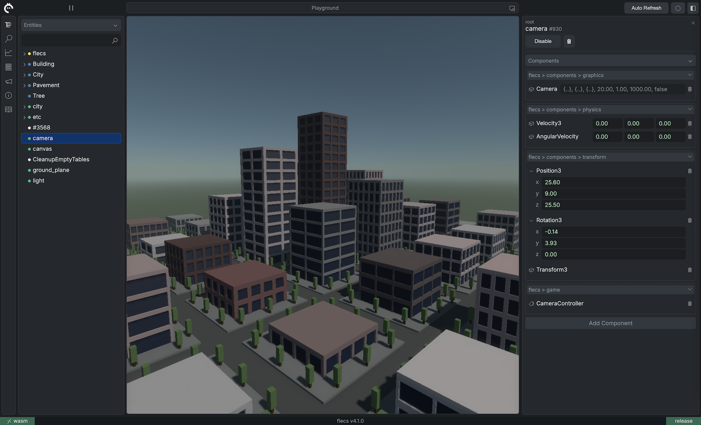
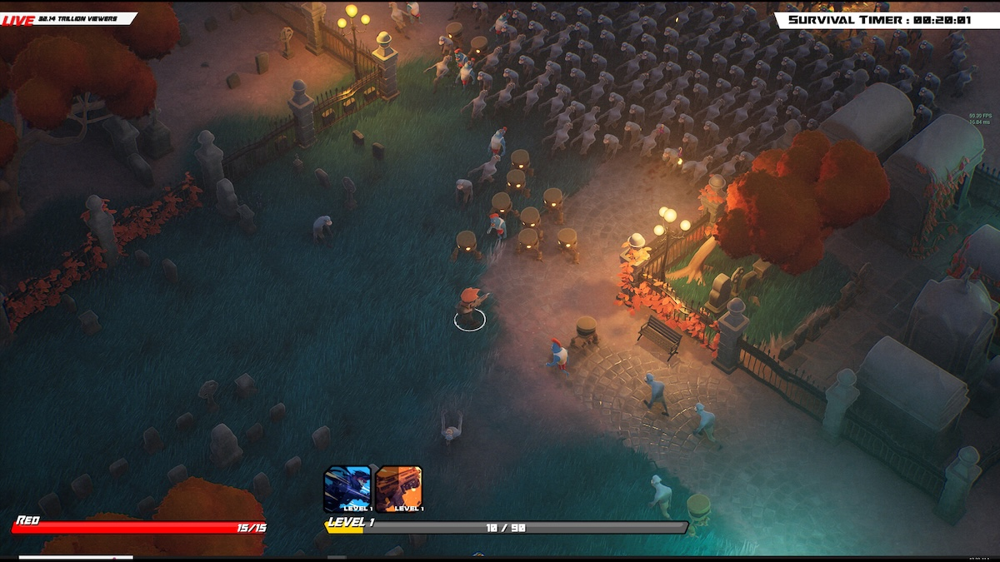
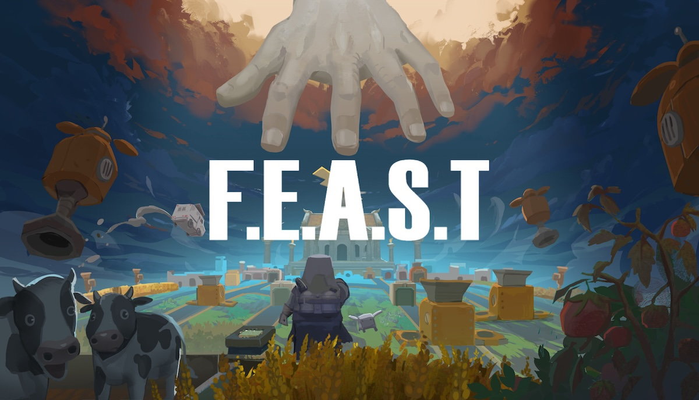
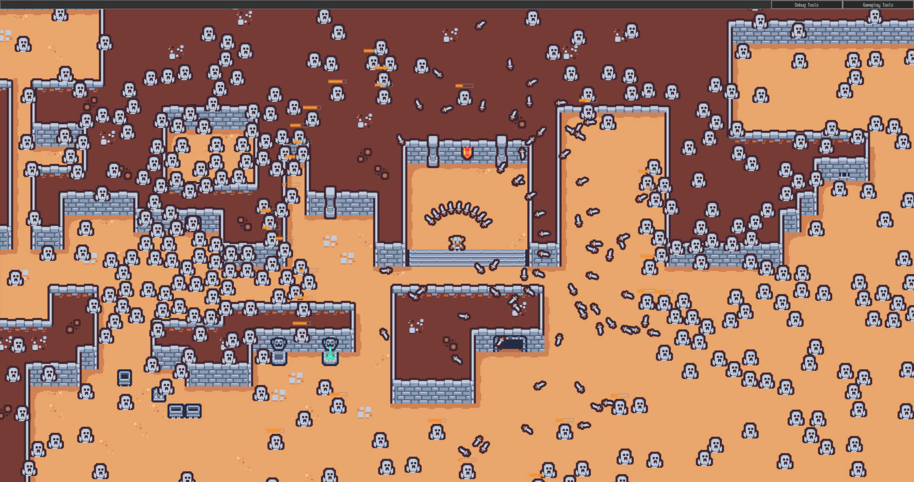

[](https://github.com/SanderMertens/flecs/releases)
[](https://github.com/SanderMertens/flecs/blob/master/LICENSE)
[](https://www.flecs.dev/flecs/md_docs_2Docs.html)
[](https://github.com/SanderMertens/flecs/actions?query=workflow%3ACI)
[](https://discord.gg/BEzP5Rgrrp)

Flecs is a fast and lightweight Entity Component System that lets you build games and simulations with millions of entities ([join the Discord!](https://discord.gg/BEzP5Rgrrp)). Here are some of the framework's highlights:

- Fast and [portable](#language-bindings) zero dependency [C99 API](https://www.flecs.dev/flecs/group__c.html)
- Modern type-safe [C++17 API](https://www.flecs.dev/flecs/group__cpp.html) that doesn't use STL containers
- First open source ECS with full support for [Entity Relationships](https://www.flecs.dev/flecs/md_docs_2Relationships.html)!
- Fast native support for [hierarchies](https://www.flecs.dev/flecs/md_docs_2Relationships.html#the-childof-relationship) and [prefabs](https://www.flecs.dev/flecs/md_docs_2Relationships.html#the-isa-relationship)
- Code base that builds in less than 5 seconds
- Runs [in the browser](https://flecs.dev/city) without modifications with emscripten
- Cache friendly [archetype/SoA storage](https://ajmmertens.medium.com/building-an-ecs-2-archetypes-and-vectorization-fe21690805f9) that can process millions of entities every frame
- Automatic component registration that works out of the box across shared libraries/DLLs
- Write free functions with [queries](https://github.com/SanderMertens/flecs/tree/master/examples/cpp/queries/basics) or run code automatically in [systems](https://github.com/SanderMertens/flecs/tree/master/examples/cpp/systems/pipeline)
- Run games on multiple CPU cores with a fast lockless scheduler
- Verified on all major compilers and platforms with [CI](https://github.com/SanderMertens/flecs/actions) running more than 10000 tests
- Integrated [reflection framework](https://www.flecs.dev/flecs/group__c__addons__meta.html) with [JSON serializer](https://github.com/SanderMertens/flecs/tree/master/examples/cpp/reflection/basics_json) and support for [runtime components](https://github.com/SanderMertens/flecs/tree/master/examples/cpp/reflection/runtime_component)
- [Unit annotations](https://github.com/SanderMertens/flecs/tree/master/examples/cpp/reflection/units) for components
- Powerful [query language](https://github.com/SanderMertens/flecs/tree/master/examples/cpp/queries) with support for [joins](https://github.com/SanderMertens/flecs/tree/master/examples/cpp/queries/setting_variables) and [inheritance](https://github.com/SanderMertens/flecs/tree/master/examples/cpp/queries/component_inheritance)
- [Statistics addon](https://www.flecs.dev/flecs/group__c__addons__stats.html) for profiling ECS performance
- A web-based UI for monitoring & controlling your apps:

[](https://flecs.dev/explorer)

To support the project, give it a star 🌟 !

## What is an Entity Component System?
ECS is a way of organizing code and data that lets you build games that are larger, more complex and are easier to extend. Something is called an ECS when it:
- Has _entities_ that uniquely identify objects in a game
- Has _components_ which are datatypes that can be added to entities
- Has _systems_ which are functions that run for all entities matching a component _query_

For more information, check the [ECS FAQ](https://github.com/SanderMertens/ecs-faq)!

## Show me the code!
C99 example:
```c
typedef struct {
  float x, y;
} Position, Velocity;

void Move(ecs_iter_t *it) {
  Position *p = ecs_field(it, Position, 0);
  Velocity *v = ecs_field(it, Velocity, 1);

  for (int i = 0; i < it->count; i++) {
    p[i].x += v[i].x;
    p[i].y += v[i].y;
  }
}

int main(int argc, char *argv[]) {
  ecs_world_t *ecs = ecs_init();

  ECS_COMPONENT(ecs, Position);
  ECS_COMPONENT(ecs, Velocity);

  ECS_SYSTEM(ecs, Move, EcsOnUpdate, Position, Velocity);

  ecs_entity_t e = ecs_insert(ecs,
    ecs_value(Position, {10, 20}),
    ecs_value(Velocity, {1, 2}));

  while (ecs_progress(ecs, 0)) { }
}
```

Same example in C++:

```cpp
struct Position {
  float x, y;
};

struct Velocity {
  float x, y;
};

int main(int argc, char *argv[]) {
  flecs::world ecs;

  ecs.system<Position, const Velocity>()
    .each([](Position& p, const Velocity& v) {
      p.x += v.x;
      p.y += v.y;
    });

  auto e = ecs.entity()
    .insert([](Position& p, Velocity& v) {
      p = {10, 20};
      v = {1, 2};
    });

  while (ecs.progress()) { }
}
```

## Projects using Flecs
If you have a project you'd like to share, let me know on [Discord](https://discord.gg/BEzP5Rgrrp)!

### Tempest Rising
[](https://store.steampowered.com/app/1486920/Tempest_Rising/)

### Territory Control 2
[](https://store.steampowered.com/app/690290/Territory_Control_2/)

### Resistance is Brutal
[](https://store.steampowered.com/app/3378140/Resistance_Is_Brutal/)

### Age of Respair
[](https://store.steampowered.com/app/3164360/Age_of_Respair/)

### FEAST
[](https://store.steampowered.com/app/3823480/FEAST/)

### Gloam Vault
[](https://store.steampowered.com/app/3460840/Gloamvault/)

### Extermination Shock
[](https://store.steampowered.com/app/2510820/Extermination_Shock/)

### The Forge
[](https://github.com/ConfettiFX/The-Forge)

### ECS survivors
[](https://laurent-voisard.itch.io/ecs-survivors/)

### Ascendant
[](https://vkguide.dev/docs/ascendant/)

### Tome Tumble Tournament
[](https://terzalo.itch.io/tome-tumble-tournament)

### Sol Survivor
[](https://nicok.itch.io/sol-survivor-demo)

### Equilibrium Engine
[](https://github.com/clibequilibrium/EquilibriumEngine)

### After Sun
[](https://github.com/foxnne/aftersun)

### Flecs Demo's
https://github.com/SanderMertens/tower_defense
[](https://www.flecs.dev/tower_defense/etc)

https://github.com/flecs-hub/city
[](https://www.flecs.dev/city)

## Flecs Hub
[Flecs Hub](https://github.com/flecs-hub) is a collection of repositories that show how Flecs can be used to build game systems like input handling, hierarchical transforms and rendering.

Module      | Description
------------|------------------
[flecs.components.cglm](https://github.com/flecs-hub/flecs-components-cglm) | Component registration for cglm (math) types
[flecs.components.input](https://github.com/flecs-hub/flecs-components-input) | Components that describe keyboard and mouse input
[flecs.components.transform](https://github.com/flecs-hub/flecs-components-transform) | Components that describe position, rotation and scale
[flecs.components.physics](https://github.com/flecs-hub/flecs-components-physics) | Components that describe physics and movement
[flecs.components.geometry](https://github.com/flecs-hub/flecs-components-geometry) | Components that describe geometry
[flecs.components.graphics](https://github.com/flecs-hub/flecs-components-graphics) | Components used for computer graphics
[flecs.components.gui](https://github.com/flecs-hub/flecs-components-gui) | Components used to describe GUI components
[flecs.systems.transform](https://github.com/flecs-hub/flecs-systems-transform) | Hierarchical transforms for scene graphs
[flecs.systems.physics](https://github.com/flecs-hub/flecs-systems-physics) | Systems for moving objects and collision detection
[flecs.systems.sokol](https://github.com/flecs-hub/flecs-systems-sokol) | Sokol-based renderer
[flecs.game](https://github.com/flecs-hub/flecs-game) | Generic game systems, like a camera controller

## Language bindings
The following language bindings have been developed with Flecs! Note that these are projects built and maintained by helpful community members, and may not always be up to date with the latest commit from master!
- C#:
  - [BeanCheeseBurrito/Flecs.NET](https://github.com/BeanCheeseBurrito/Flecs.NET)
- Rust:
  - [Flecs-Rust](https://github.com/Indra-db/Flecs-Rust)
  - [flecs-polyglot](https://github.com/flecs-hub/flecs-polyglot)
- Zig:
  - [zig-gamedev/zflecs](https://github.com/zig-gamedev/zflecs)
- Lua:
  - [sro5h/flecs-luajit](https://github.com/sro5h/flecs-luajit)
  - [flecs-hub/flecs-lua](https://github.com/flecs-hub/flecs-lua)
- Clojure
  - [vybe-flecs](https://vybegame.dev/vybe-flecs)
