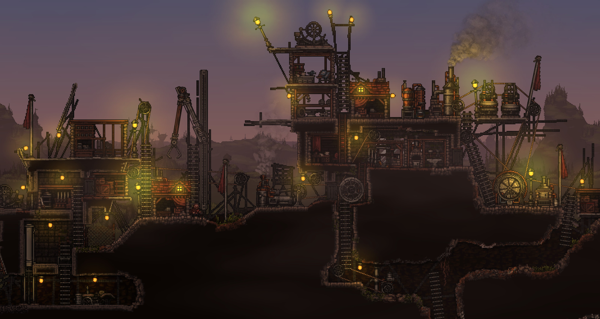

## Introduction
[](https://github.com/SanderMertens/flecs/releases)
[](/LICENSE)
[](https://www.flecs.dev/flecs)
[](https://github.com/SanderMertens/flecs/actions?query=workflow%3ARust)
[](https://discord.gg/BEzP5Rgrrp)

Flecs is a fast and lightweight Entity Component System that lets you build games and simulations with millions of entities ([join the Discord!](https://discord.gg/BEzP5Rgrrp)). Here are some of the framework's highlights:

- Fast and [portable](#language-bindings) zero dependency [C99 API](https://flecs.docsforge.com/master/api-c/)
- Modern type-safe [C++11 API](https://flecs.docsforge.com/master/api-cpp/) that doesn't use STL containers
- First open source ECS with full support for [Entity Relationships](https://ajmmertens.medium.com/building-games-in-ecs-with-entity-relationships-657275ba2c6c)!
- Fast native support for [hierarchies](https://flecs.docsforge.com/master/relationships-manual/#the-childof-relationship) and [prefabs](https://flecs.docsforge.com/master/relationships-manual/#the-isa-relationship)
- Minimal ECS core with optional [addons](#addons)
- Entire codebase builds in less than 5 seconds
- Runs [in the browser](https://flecs.dev/city) without modifications with emscripten
- Cache friendly [archetype/SoA storage](https://ajmmertens.medium.com/building-an-ecs-2-archetypes-and-vectorization-fe21690805f9) that can process millions of entities every frame
- Supports entities with hundreds of components and applications with tens of thousands of archetypes
- Automatic component registration that works out of the box across shared libraries/DLLs
- Write free functions with [queries](https://github.com/SanderMertens/flecs/tree/master/examples/cpp/queries/basics) or run code automatically in [systems](https://github.com/SanderMertens/flecs/tree/master/examples/cpp/systems/pipeline)
- Run games on multiple CPU cores with a fast lockless scheduler
- Compiles warning-free on 8 compilers on all major platforms, with [CI](https://github.com/SanderMertens/flecs/actions) running more than 4000 tests
- Integrated [reflection framework](https://flecs.docsforge.com/master/api-meta/) with [JSON serializer](https://github.com/SanderMertens/flecs/tree/master/examples/cpp/reflection/basics_json) and support for [runtime components](https://github.com/SanderMertens/flecs/tree/master/examples/cpp/reflection/runtime_component)
- [Unit annotations](https://github.com/SanderMertens/flecs/tree/master/examples/cpp/reflection/units) for components
- Powerful [query language](https://github.com/SanderMertens/flecs/tree/master/examples/cpp/rules) with support for [joins](https://github.com/SanderMertens/flecs/tree/master/examples/cpp/rules/setting_variables) and [inheritance](https://github.com/SanderMertens/flecs/tree/master/examples/cpp/rules/component_inheritance)
- [Statistics addon](https://flecs.docsforge.com/master/api-stats/) for profiling ECS performance
- A web-based dashboard ([demo](https://flecs.dev/explorer), [code](https://github.com/flecs-hub/explorer)) for inspecting entities, running ECS queries and monitoring games:

[](https://flecs.dev/explorer)

## What is an Entity Component System?
ECS is a new way of organizing code and data that lets you build games that are larger, more complex and are easier to extend.

Something is called an ECS when it:
- Has _entities_ that uniquely identify objects in a game
- Has _components_ which are datatypes that can be added to entities
- Has _systems_ which are functions that run for all entities matching a component _query_

For example, a game has a `Move` _system_ that has a _query_ with two _components_, `Position, Velocity`. When the system is ran it is dynamically matched with all _entities_ that have at least these two components.

For more info on ECS, check the [ECS FAQ](https://github.com/SanderMertens/ecs-faq)!

## Getting Started
To use Flecs, add the [flecs.c](https://raw.githubusercontent.com/SanderMertens/flecs/master/flecs.c) and [flecs.h](https://raw.githubusercontent.com/SanderMertens/flecs/master/flecs.h) files to your project. When importing the files into a C++ project, make sure to compile [flecs.c](https://raw.githubusercontent.com/SanderMertens/flecs/master/flecs.c) as C code (for example by using `gcc` and `clang` instead of `g++` and `clang++`).

Flecs can also be built as a standalone library, by using the cmake, meson, bazel or [bake](https://github.com/SanderMertens/bake) build files. If you are using a custom build file to compile Flecs as a library, make sure to define `flecs_EXPORTS`, for example by adding `-Dflecs_EXPORTS` to the compiler command.

If you want to use the [flecs.c](https://raw.githubusercontent.com/SanderMertens/flecs/master/flecs.c) and [flecs.h](https://raw.githubusercontent.com/SanderMertens/flecs/master/flecs.h) files to build a standalone library, make sure to remove this line from the top of the [flecs.h](https://raw.githubusercontent.com/SanderMertens/flecs/master/flecs.h) file:

```c
#define flecs_STATIC
```

By default Flecs includes many features that may not be useful for every project. Builds can be customized to minimize the overhead of the library. See the [Addons](#addons) section for more information on customized builds.

## Documentation
Make sure to view the documentation at https://www.flecs.dev/ !

- [FAQ](/docs/FAQ.md)
- [Quickstart](/docs/Quickstart.md)
- [Query Manual](/docs/Queries.md)
- [Relationships Manual](/docs/Relationships.md)
- [JSON Format Manual](/docs/JsonFormat.md)
- [REST API Manual](/docs/RestApi.md)
- [Manual](/docs/Manual.md)
- [API reference](https://flecs.docsforge.com/master/)
- [C examples](https://github.com/SanderMertens/flecs/tree/master/examples/c)
- [C++ examples](https://github.com/SanderMertens/flecs/tree/master/examples/cpp)

## Show me the code!
C99 example:
```c
typedef struct {
  float x, y;
} Position, Velocity;

void Move(ecs_iter_t *it) {
  Position *p = ecs_field(it, Position, 1);
  Velocity *v = ecs_field(it, Velocity, 2);

  for (int i = 0; i < it->count; i++) {
    p[i].x += v[i].x;
    p[i].y += v[i].y;
  }
}

int main(int argc, char *argv[]) {
  ecs_world_t *ecs = ecs_init();

  ECS_COMPONENT(ecs, Position);
  ECS_COMPONENT(ecs, Velocity);

  ECS_SYSTEM(ecs, Move, EcsOnUpdate, Position, Velocity);

  ecs_entity_t e = ecs_new_id(ecs);
  ecs_set(ecs, e, Position, {10, 20});
  ecs_set(ecs, e, Velocity, {1, 2});

  while (ecs_progress(ecs, 0)) { }
}
```

Same example in C++11:
```cpp
struct Position {
  float x, y;
};

struct Velocity {
  float x, y;
};

int main(int argc, char *argv[]) {
  flecs::world ecs;

  ecs.system<Position, const Velocity>()
    .each([](Position& p, const Velocity& v) {
      p.x += v.x;
      p.y += v.y;
    });

  auto e = ecs.entity()
    .set([](Position& p, Velocity& v) {
      p = {10, 20};
      v = {1, 2};
    });

  while (ecs.progress()) { }
}
```

## Projects using Flecs
If you have a project you'd like to share, let me know on [Discord](https://discord.gg/BEzP5Rgrrp)!

### Territory Control
https://store.steampowered.com/app/690290/Territory_Control_2/


### Sol Survivor
https://nicok.itch.io/sol-survivor-demo


### The Forge
https://github.com/ConfettiFX/The-Forge


### Gravitas
https://thepunkcollective.itch.io/gravitas


### After Sun
https://github.com/foxnne/aftersun


### Tower defense (open source demo)
https://www.flecs.dev/tower_defense/etc ([repository](https://github.com/SanderMertens/tower_defense))


### Procedural City (open source demo)
https://www.flecs.dev/city ([repository](https://github.com/flecs-hub/city))


## Resources

### Resources provided by the community :heart:
- [Bgfx/Imgui module](https://github.com/flecs-hub/flecs-systems-bgfx/tree/bgfx_imgui)
- [Tower defense example](https://gist.github.com/oldmanauz/b4ced44737bf9d248233538fa06a989e)
- [Flecs + UE4 is magic](https://jtferson.github.io/blog/flecs_and_unreal/)
- [Quickstart with Flecs in UE4](https://jtferson.github.io/blog/quickstart_with_flecs_in_unreal_part_1/) 
- [Automatic component registration in UE4](https://jtferson.github.io/blog/automatic_flecs_component_registration_in_unreal/)
- [Building a space battle with Flecs in UE4](https://twitter.com/ajmmertens/status/1361070033334456320) 
- [Flecs + SDL + Web ASM example](https://github.com/HeatXD/flecs_web_demo) ([live demo](https://heatxd.github.io/flecs_web_demo/))
- [Flecs + Raylib example](https://github.com/Lexxicon/FlecsRaylib)
- [Flecs + gunslinger example](https://github.com/MrFrenik/gs_examples/blob/main/ex_demos/flecs/source/main.c)
- [Flecs based 3D game engine with editor](https://bit.ly/3T9cc1o)

### Flecs links
- [Discord](https://discord.gg/BEzP5Rgrrp)
- [Medium](https://ajmmertens.medium.com)
- [ECS FAQ](https://github.com/SanderMertens/ecs-faq)
- [Twitter](https://twitter.com/ajmmertens)
- [Reddit](https://www.reddit.com/r/flecs)

### Articles
- [Where are my entities and components](https://ajmmertens.medium.com/building-an-ecs-1-where-are-my-entities-and-components-63d07c7da742)
- [Archetypes and vectorization](https://ajmmertens.medium.com/building-an-ecs-2-archetypes-and-vectorization-fe21690805f9)
- [Making the most of entity identifiers](https://ajmmertens.medium.com/doing-a-lot-with-a-little-ecs-identifiers-25a72bd2647)
- [Building games in ECS with entity relationships](https://ajmmertens.medium.com/building-games-in-ecs-with-entity-relationships-657275ba2c6c)
- [Why storing state machines in ECS is a bad idea](https://ajmmertens.medium.com/why-storing-state-machines-in-ecs-is-a-bad-idea-742de7a18e59)
- [Why vanilla ECS is not enough](https://ajmmertens.medium.com/why-vanilla-ecs-is-not-enough-d7ed4e3bebe5)
- [ECS: From tool to paradigm](https://ajmmertens.medium.com/ecs-from-tool-to-paradigm-350587cdf216)

## Addons
Flecs has a modular architecture that makes it easy to only build the features you really need. By default all addons are built. To customize a build, first define `FLECS_CUSTOM_BUILD`, then add defines for the addons you need. For example:

```c
#define FLECS_CUSTOM_BUILD  // Don't build all addons
#define FLECS_SYSTEM        // Build FLECS_SYSTEM
```

Additionally, you can also specify addons to exclude from a build by adding `NO` to the define:

```c
#define FLECS_NO_LOG
```

The following addons can be configured:

Addon         | Description                                      | Define              |
--------------|--------------------------------------------------|---------------------|
[Cpp](https://flecs.docsforge.com/master/api-cpp/)           | C++11 API                                        | FLECS_CPP           |
[Module](https://flecs.docsforge.com/master/api-module/)     | Organize game logic into reusable modules        | FLECS_MODULE        |
[System](https://flecs.docsforge.com/master/api-systems/)    | Create & run systems                             | FLECS_SYSTEM        |
[Pipeline](https://flecs.docsforge.com/master/api-pipeline/) | Automatically schedule & multithread systems     | FLECS_PIPELINE      |
[Timer](https://flecs.docsforge.com/master/api-timers/)      | Run systems at time intervals or at a rate       | FLECS_TIMER         |
[Meta](https://flecs.docsforge.com/master/api-meta/)         | Flecs reflection system                          | FLECS_META          |
[Units](https://flecs.docsforge.com/master/api-units/)       | Builtin unit types                               | FLECS_UNITS         |
[Meta_C](https://flecs.docsforge.com/master/api-meta-c/)     | (C) Utilities for auto-inserting reflection data | FLECS_META_C        |
[Expr](https://flecs.docsforge.com/master/api-expr/)         | String format optimized for ECS data             | FLECS_EXPR          |
[JSON](https://flecs.docsforge.com/master/api-json/)         | JSON format                                      | FLECS_JSON          |
[Doc](https://flecs.docsforge.com/master/api-doc/)           | Add documentation to components, systems & more  | FLECS_DOC           |
[Coredoc](https://flecs.docsforge.com/master/api-coredoc/)   | Documentation for builtin components & modules   | FLECS_COREDOC       |
[Http](https://flecs.docsforge.com/master/api-http/)         | Tiny HTTP server for processing simple requests  | FLECS_HTTP          |
[Rest](https://flecs.docsforge.com/master/api-rest/)         | REST API for showing entities in the browser     | FLECS_REST          |
[Parser](https://flecs.docsforge.com/master/api-parser/)     | Create entities & queries from strings           | FLECS_PARSER        |
[Plecs](https://flecs.docsforge.com/master/api-plecs/)       | Small utility language for asset/scene loading   | FLECS_PLECS         |
[Rules](https://flecs.docsforge.com/master/api-rules/)       | Powerful prolog-like query language              | FLECS_RULES         |
[Snapshot](https://flecs.docsforge.com/master/api-snapshot/) | Take snapshots of the world & restore them       | FLECS_SNAPSHOT      |
[Stats](https://flecs.docsforge.com/master/api-stats/)       | See what's happening in a world with statistics  | FLECS_STATS         |
[Monitor](https://flecs.docsforge.com/master/api-monitor/)   | Periodically collect & store statistics          | FLECS_MONITOR       |
[Log](https://flecs.docsforge.com/master/api-log/)           | Extended tracing and error logging               | FLECS_LOG           |
[App](https://flecs.docsforge.com/master/api-app/)           | Flecs application framework                      | FLECS_APP           |
[OS API Impl](https://flecs.docsforge.com/master/api-os-api-impl/)   | Default OS API implementation for Posix/Win32    | FLECS_OS_API_IMPL   |

## Flecs Hub
Flecs Hub is a collection of repositories that show how Flecs can be used to build game systems like input handling, hierarchical transforms and rendering.

Module      | Description      
------------|------------------
[flecs.components.cglm](https://github.com/flecs-hub/flecs-components-cglm) | Component registration for cglm (math) types
[flecs.components.input](https://github.com/flecs-hub/flecs-components-input) | Components that describe keyboard and mouse input
[flecs.components.transform](https://github.com/flecs-hub/flecs-components-transform) | Components that describe position, rotation and scale
[flecs.components.physics](https://github.com/flecs-hub/flecs-components-physics) | Components that describe physics and movement
[flecs.components.geometry](https://github.com/flecs-hub/flecs-components-geometry) | Components that describe geometry
[flecs.components.graphics](https://github.com/flecs-hub/flecs-components-graphics) | Components used for computer graphics
[flecs.components.gui](https://github.com/flecs-hub/flecs-components-gui) | Components used to describe GUI components
[flecs.systems.transform](https://github.com/flecs-hub/flecs-systems-transform) | Hierarchical transforms for scene graphs
[flecs.systems.physics](https://github.com/flecs-hub/flecs-systems-physics) | Systems for moving objects and collision detection
[flecs.systems.sdl2](https://github.com/flecs-hub/flecs-systems-sdl2) | SDL window creation & input management
[flecs.systems.sokol](https://github.com/flecs-hub/flecs-systems-sokol) | Sokol-based renderer
[flecs.game](https://github.com/flecs-hub/flecs-game) | Generic game systems, like a camera controller

## Language bindings
The following language bindings have been developed with Flecs! Note that these are projects built and maintained by helpful community members, and may not always be up to date with the latest commit from master!
- [Lua](https://github.com/flecs-hub/flecs-lua)
- [Zig](https://github.com/prime31/zig-flecs)
- [C#](https://github.com/flecs-hub/flecs-cs)
- [Rust](https://github.com/jazzay/flecs-rs)

## Supporting Flecs ♥️
Supporting Flecs goes a long way towards keeping the project going and the community alive! If you like the project, consider:
- Giving it a star 🌟
- Becoming a sponsor: https://github.com/sponsors/SanderMertens
