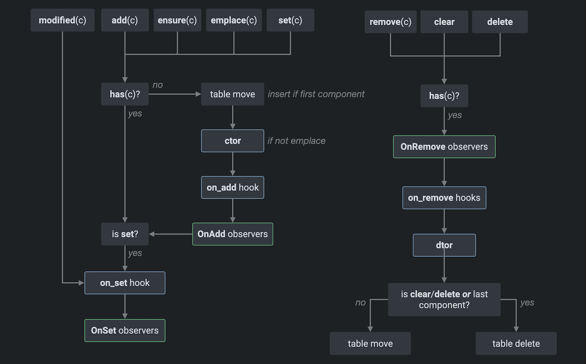

# Entities and Components

## Introduction
Entities and components are the main building blocks of any ECS application. This manual describes the behavior of entities and components in Flecs.

## Entities
Entities are uniquely identifiable objects in a game or simulation. In a real time strategy game, there may be entities for the different units, buildings, UI elements and particle effects, but also for example the camera, world and player. 

By itself, an entity is just a unique identifier that does not contain any state. You cannot tell from the entity's type what kind of entity it is, as the type is just "entity".

In Flecs, an entity is represented by a 64 bit integer, which is also how it is exposed in the C API:

```c
typedef uint64_t ecs_entity_t;
```

The first 32 bits of the entity are the "identifying" part: it is the number that uniquely identifies an object in the game. The remaining 32 bits are used by Flecs for liveliness tracking and various other purposes. [This article](https://ajmmertens.medium.com/doing-a-lot-with-a-little-ecs-identifiers-25a72bd2647) has more details on the exact bit representation of entities.

Zero ("`0`") is the value that is reserved for invalid ids. Functions that return an entity id may return `0` to indicate that the function failed. `0` can also be used to indicate the absence of an entity, for example when a lookup by name didn't find anything.

### Creation
The following example shows how to create a new entity without any components:

<div class="flecs-snippet-tabs">
<ul>
<li><b class="tab-title">C</b>

```c
ecs_entity_t my_entity = ecs_new(world);
```

</li>
<li><b class="tab-title">C++</b>

```cpp
flecs::entity my_entity = world.entity();
```

</li>
<li><b class="tab-title">C#</b>

```cs
Entity myEntity world.Entity();
```

</li>
<li><b class="tab-title">Rust</b>

```rust
let my_entity = world.entity();
```
</li>
</ul>
</div>

Empty entities don't have any components, and are therefore not matched by any queries or systems. They won't show up in the tree view of the [explorer](https://flecs.dev/explorer), as it is query based.

The id of the first returned entity is not `1`, but likely a much higher number like `500`. The reason for this is that Flecs creates a bunch of builtin entities, and reserves some of the id space for components (more on that later).

### Deletion
The following examples show how to delete entities:

<div class="flecs-snippet-tabs">
<ul>
<li><b class="tab-title">C</b>

```c
ecs_delete(world, my_entity);
```

</li>
<li><b class="tab-title">C++</b>

```cpp
my_entity.destruct();
```

</li>
<li><b class="tab-title">C#</b>

```cs
myEntity.Destruct();
```

</li>
<li><b class="tab-title">Rust</b>

```rust
my_entity.destruct();
```
</li>
</ul>
</div>

After an entity is deleted, it can no longer be used with most ECS operations. The deleted entity will be made available for reuse, so that the next time a new entity is created the deleted id can be recycled.

Whenever an id is recycled, Flecs increases a "version" counter in the upper 32 bits of the entity identifier. This can look strange, as it makes recycled entity ids large, often larger than 4 billion!. It is however 100% expected behavior, and happens as soon after the first entity is deleted.

The reason this happens is so that the Flecs API can tell whether an entity id is alive or not. Consider the following example, where "v" denotes the version part of the entity id:

<div class="flecs-snippet-tabs">
<ul>
<li><b class="tab-title">C</b>

```c
ecs_entity_t e1 = ecs_new(world); // Returns 500v0
ecs_delete(world, e1); // Recycle 500

ecs_entity_t e2 = ecs_new(world); // Returns 500v1

ecs_add(world, e1, Npc); // Fails, 500v0 is not alive
ecs_add(world, e2, Npc); // OK, 500v1 is alive
```

</li>
<li><b class="tab-title">C++</b>

```cpp
flecs::entity e1 = world.entity(); // Returns 500v0
e1.destruct(); // Recycles 500

flecs::entity e2 = world.entity(); // Returns 500v1

e1.add<Npc>(); // Fails, 500v0 is not alive
e2.add<Npc>(); // OK, 500v1 is alive
```

</li>
<li><b class="tab-title">C#</b>

```cs
Entity e1 = world.Entity(); // Returns 500v0
e1.Destruct(); // Recycles 500

Entity e2 = world.Entity(); // Returns 500v1

e1.Add<Npc>(); // Fails, 500v0 is not alive
e2.Add<Npc>(); // OK, 500v1 is alive
```

</li>
<li><b class="tab-title">Rust</b>

```rust
let e1 = world.entity(); // Returns 500v0
e1.destruct(); // Recycles 500
let e2 = world.entity(); // Returns 500v1
// Fails, 500v0 is not alive
e1.add::<Npc>();
// OK, 500v1 is alive
e2.add::<Npc>();
```
</li>
</ul>
</div>

It is valid to delete an already deleted entity:

<div class="flecs-snippet-tabs">
<ul>
<li><b class="tab-title">C</b>

```c
ecs_entity_t e1 = ecs_new(world);
ecs_delete(world, e1);
ecs_delete(world, e1); // OK: post condition is satisfied
```

</li>
<li><b class="tab-title">C++</b>

```cpp
flecs::entity e1 = world.entity();
e1.destruct();
e1.destruct(); // OK: post condition is satisfied
```

</li>
<li><b class="tab-title">C#</b>

```cs
Entity e1 = world.Entity();
e1.Destruct();
e1.Destruct(); // OK: post condition is satisfied
```

</li>
<li><b class="tab-title">Rust</b>

```rust
let e1 = world.entity();
e1.destruct();
e1.destruct(); // OK: post condition is satisfied
```
</li>
</ul>
</div>

### Clearing
An entity can be cleared, which means all components are removed without making the entity not alive. Clearing an entity is more efficient than removing components one by one. An example:

<div class="flecs-snippet-tabs">
<ul>
<li><b class="tab-title">C</b>

```c
ecs_clear(world, my_entity);
```

</li>
<li><b class="tab-title">C++</b>

```cpp
my_entity.clear();
```

</li>
<li><b class="tab-title">C#</b>

```cs
myEntity.Clear();
```

</li>
<li><b class="tab-title">Rust</b>

```rust
my_entity.clear();
```
</li>
</ul>
</div>

### Liveliness Checking
Applications can use the `is_alive` operation to test if an entity is alive or not. The entity passed to `is_alive` must be a valid entity, passing `0` will throw an error. An example:

<div class="flecs-snippet-tabs">
<ul>
<li><b class="tab-title">C</b>

```c
ecs_entity_t e1 = ecs_new(world);
ecs_entity_t e2 = ecs_new(world);
ecs_delete(world, e1);

ecs_is_alive(world, e1); // False
ecs_is_alive(world, e2); // True
```

</li>
<li><b class="tab-title">C++</b>

```cpp
flecs::entity e1 = world.entity();
flecs::entity e2 = world.entity();
e1.destruct();

e1.is_alive(); // False
e2.is_alive(); // True
```

</li>
<li><b class="tab-title">C#</b>

```cs
Entity e1 = world.Entity();
Entity e2 = world.Entity();
e1.Destruct();

e1.IsAlive(); // False
e2.IsAlive(); // True
```

</li>
<li><b class="tab-title">Rust</b>

```rust
let e1 = world.entity();
let e2 = world.entity();
e1.destruct();
e1.is_alive(); // False
e2.is_alive(); // True
```
</li>
</ul>
</div>

The API also provides an `is_valid` operation. Whereas `is_alive` tests if an entity is alive, `is_valid` tests if the entity can be used with operations, and may be used with invalid (`0`) entity ids. An example:

<div class="flecs-snippet-tabs">
<ul>
<li><b class="tab-title">C</b>

```c
ecs_entity_t e1 = ecs_new(world);
ecs_entity_t e2 = ecs_new(world);
ecs_delete(world, e1);

ecs_is_valid(world, e1); // False
ecs_is_valid(world, e2); // True
ecs_is_valid(world, 0); // False
```

</li>
<li><b class="tab-title">C++</b>

```cpp
flecs::entity e1 = world.entity();
flecs::entity e2 = world.entity();
e1.destruct();

e1.is_valid(); // False
world.entity(0).is_valid(); // False
```

</li>
<li><b class="tab-title">C#</b>

```cs
Entity e1 = world.Entity();
Entity e2 = world.Entity();
e1.Destruct();

e1.IsValid(); // False
e2.IsValid(); // True
world.Entity(0).IsValid(); // False
```

</li>
<li><b class="tab-title">Rust</b>

```rust
let e1 = world.entity();
let e2 = world.entity();
e1.destruct();
e1.is_valid(); // False
world.entity_from_id(0).is_valid(); // False
```
</li>
</ul>
</div>

### Manual Ids
Sometimes it can be useful to have direct control over which id an entity assumes. One example of this is to make sure that both sides of a networked application use the same entity id. Applications are allowed to do this, as long as the entity id is not yet in use, and it is made alive. The following example shows how to do this:

<div class="flecs-snippet-tabs">
<ul>
<li><b class="tab-title">C</b>

```c
ecs_make_alive(world, 1000); // Make id 1000 alive
```

</li>
<li><b class="tab-title">C++</b>

```cpp
flecs::entity e = world.make_alive(1000);
```

</li>
<li><b class="tab-title">C#</b>

```cs
Entity e = world.MakeAlive(1000);
```

</li>
<li><b class="tab-title">Rust</b>

```rust
let e = world.make_alive(1000);
```
</li>
</ul>
</div>

The `make_alive` operation guarantees that the provided entity id will be alive after the operation finishes. The operation will fail if the provided entity id is already in use with a different version. 

### Manual Versioning
Applications can manually override the version of an entity with the `set_version` operation. This can be useful when for example synchronizing networked ids. An example:

<div class="flecs-snippet-tabs">
<ul>
<li><b class="tab-title">C</b>

```c
ecs_set_version(world, versioned_id);
```

</li>
<li><b class="tab-title">C++</b>

```cpp
world.set_version(versioned_id);
```

</li>
<li><b class="tab-title">C#</b>

```cs
world.SetVersion(versionedId);
```

</li>
<li><b class="tab-title">Rust</b>

```rust
//TODO does not exist yet
//world.set_version(versioned_id);
```
</li>
</ul>
</div>

### Ranges
An application can instruct Flecs to issue ids from a specific offset and up to a certain limit with the `ecs_set_entity_range` operation. This example ensures that id generation starts from id 5000:

<div class="flecs-snippet-tabs">
<ul>
<li><b class="tab-title">C</b>

```c
ecs_set_entity_range(world, 5000, 0);
```

</li>
<li><b class="tab-title">C++</b>

```cpp
world.set_entity_range(5000, 0);
```

</li>
<li><b class="tab-title">C#</b>

```cs
world.SetEntityRange(5000, 0);
```

</li>
<li><b class="tab-title">Rust</b>

```rust
world.set_entity_range(5000, 0);
```
</li>
</ul>
</div>

If the last issued id was higher than 5000, the operation will not cause the last id to be reset to 5000. An application can also specify the highest id that can be generated:

<div class="flecs-snippet-tabs">
<ul>
<li><b class="tab-title">C</b>

```c
ecs_set_entity_range(world, 5000, 10000);
```

</li>
<li><b class="tab-title">C++</b>

```cpp
world.set_entity_range(5000, 10000);
```

</li>
<li><b class="tab-title">C#</b>

```cs
world.SetEntityRange(5000, 10000);
```

</li>
<li><b class="tab-title">Rust</b>

```rust
world.set_entity_range(5000, 10000);
```
</li>
</ul>
</div>

If invoking `ecs_new` would result in an id higher than `10000`, the application would assert. If `0` is provided for the maximum id, no upper bound will be enforced.

Note that at the moment setting the range _does not_ affect recycled ids. It is therefore possible that `ecs_new` returns an id outside of the specified range if a recycle-able id is available. This is an issue that will be addressed in future versions.

It is possible for an application to enforce that entity operations are only allowed for the configured range with the `ecs_enable_range_check` operation:

<div class="flecs-snippet-tabs">
<ul>
<li><b class="tab-title">C</b>

```c
ecs_enable_range_check(world, true);
```

</li>
<li><b class="tab-title">C++</b>

```cpp
world.enable_range_check();
```

</li>
<li><b class="tab-title">C#</b>

```cs
world.EnableRangeCheck(true);
```

</li>
<li><b class="tab-title">Rust</b>

```rust
world.enable_range_check(true);
```
</li>
</ul>
</div>

This can be useful for enforcing simple ownership behavior, where different id ranges are mapped out for different owners (often game clients or servers).

### Names
Entity can be given names, which allows them to be looked up on the world. An example:

<div class="flecs-snippet-tabs">
<ul>
<li><b class="tab-title">C</b>

```c
ecs_entity_t e = ecs_entity(world, { .name = "MyEntity" });

if (e == ecs_lookup(world, "MyEntity")) {
    // true
}

printf("%s\n", ecs_get_name(world, e));
```

</li>
<li><b class="tab-title">C++</b>

```cpp
flecs::entity e = world.entity("MyEntity");

if (e == world.lookup("MyEntity")) {
    // true
}

std::cout << e.name() << std::endl;
```

</li>
<li><b class="tab-title">C#</b>

```cs
Entity e = world.Entity("MyEntity");

if (e == world.Lookup("MyEntity")) {
    // true
}

Console.WriteLine(e.Name());
```

</li>
<li><b class="tab-title">Rust</b>

```rust
let e = world.entity_named("MyEntity");
if e == world.lookup("MyEntity") {
    // true
}
println!("{}", e.name());
```
</li>
</ul>
</div>

Names are namespaced. They are similar to namespaced types in a programming language, or to files on a file system. If an entity is a child of a parent, a lookup will have to include the name of the parent:

<div class="flecs-snippet-tabs">
<ul>
<li><b class="tab-title">C</b>

```c
ecs_entity_t p = ecs_entity(world, { .name = "Parent" });
ecs_entity_t e = ecs_entity(world, { .name = "Child", .parent = p });

if (e == ecs_lookup(world, "Parent.Child")) {
    // true
}
```

</li>
<li><b class="tab-title">C++</b>

```cpp
flecs::entity p = world.entity("Parent");
flecs::entity e = world.entity("Child").child_of(p);

if (e == world.lookup("Parent::Child")) {
    // true
}
```

</li>
<li><b class="tab-title">C#</b>

```cs
Entity p = world.Entity("Parent");
Entity e = world.Entity("Child").ChildOf(p);

if (e == world.Lookup("Parent.Child")) {
    // true
}
```

</li>
<li><b class="tab-title">Rust</b>

```rust
let p = world.entity_named("Parent");
let e = world.entity_named("Child").child_of_id(p);
if e == world.lookup("Parent::Child") {
    // true
}
```
</li>
</ul>
</div>

Lookups can be relative to an entity. The following example shows how to lookup an entity relative to a parent:

<div class="flecs-snippet-tabs">
<ul>
<li><b class="tab-title">C</b>

```c
ecs_entity_t p = ecs_entity(world, { .name = "Parent" });
ecs_entity_t e = ecs_entity(world, { .name = "Child", .parent = p });

if (e == ecs_lookup_from(world, p, "Child")) {
    // true
}
```

</li>
<li><b class="tab-title">C++</b>

```cpp
flecs::entity p = world.entity("Parent");
flecs::entity e = world.entity("Child").child_of(p);

if (e == p.lookup("Child")) {
    // true
}
```

</li>
<li><b class="tab-title">C#</b>

```cs
Entity p = world.Entity("Parent");
Entity e = world.Entity("Child").ChildOf(p);

if (e == p.Lookup("Child")) {
    // true
}
```

</li>
<li><b class="tab-title">Rust</b>

```rust
let p = world.entity_named("Parent");
let e = world.entity_named("Child").child_of_id(p);
if e == p.lookup("Child") {
    // true
}
```
</li>
</ul>
</div>

An application can request the name and path of an entity. The name is the direct name given to an entity, without the names of the parent. The path is the name and names of the entity's parent, separated by a separator. If an entity has no parents, the name and the path are the same. An example:

<div class="flecs-snippet-tabs">
<ul>
<li><b class="tab-title">C</b>

```c
ecs_entity_t p = ecs_entity(world, { .name = "Parent" });
ecs_entity_t e = ecs_entity(world, { .name = "Child", .parent = p });

// Returns name, result does not need to be freed
const char *name = ecs_get_name(world, e);
printf("%s\n", name); // Child

// Returns path, result must be freed
char *path = ecs_get_path(world, e);
printf("%s\n", path) // Parent.Child
ecs_os_free(path);
```

</li>
<li><b class="tab-title">C++</b>

```cpp
flecs::entity p = world.entity("Parent");
flecs::entity e = world.entity("Child").child_of(p);

// Returns entity name, does not allocate
std::cout << e.name() << std::endl; // Child

// Returns entity path, does allocate
std::cout << e.path() << std::endl; // Parent.Child
```

</li>
<li><b class="tab-title">C#</b>

```cs
Entity p = world.Entity("Parent");
Entity e = world.Entity("Child").ChildOf(p);

// Returns entity name
Console.WriteLine(e.Name()); // Child

// Returns entity path
Console.WriteLine(e.Path()); // Parent.Child
```

</li>
<li><b class="tab-title">Rust</b>

```rust
let p = world.entity_named("Parent");
let e = world.entity_named("Child").child_of_id(p);
// Returns entity name, does not allocate
println!("{}", e.name()); // Child
// Returns entity path, does allocate
println!("{}", e.path().unwrap()); // Parent.Child
```
</li>
</ul>
</div>

Names must be unique. There can only be one entity with a specific name in the scope of a parent. Entities can be annotated with a doc name, which does not need to be unique. See the doc addon for more details.

When the name for an existing entity is used during the creation of a named entity, the existing entity is returned. An example:

<div class="flecs-snippet-tabs">
<ul>
<li><b class="tab-title">C</b>

```c
ecs_entity_t e1 = ecs_entity(world, { .name = "Parent.Child" });
ecs_entity_t e2 = ecs_entity(world, { .name = "Parent.Child" });

if (e1 == e2) {
    // true
}
```

</li>
<li><b class="tab-title">C++</b>

```cpp
flecs::entity e1 = world.entity("Parent::Child");
flecs::entity e2 = world.entity("Parent::Child");

if (e1 == e2) {
    // true
}
```

</li>
<li><b class="tab-title">C#</b>

```cs
Entity e1 = world.Entity("Parent.Child");
Entity e2 = world.Entity("Parent.Child");

if (e1 == e2) {
    // true
}
```

</li>
<li><b class="tab-title">Rust</b>

```rust
let e1 = world.entity_named("Parent::Child");
let e2 = world.entity_named("Parent::Child");
if e1 == e2 {
    // true
}
```
</li>
</ul>
</div>

Entity names can be changed after the entity is created, as long as the specified name is unique (e.g. there isn't a sibling entity with the same name). An example:

<div class="flecs-snippet-tabs">
<ul>
<li><b class="tab-title">C</b>

```c
ecs_entity_t e = ecs_entity(world, { .name = "Foo" });

// Change name
ecs_set_name(world, e, "Bar");
```

</li>
<li><b class="tab-title">C++</b>

```cpp
flecs::entity e = world.entity("Foo");

// Change name
e.set_name("Bar");
```

</li>
<li><b class="tab-title">C#</b>

```cs
Entity e = world.Entity("Foo");

e.SetName("Bar");
```

</li>
<li><b class="tab-title">Rust</b>

```rust
let e = world.entity_named("Foo");
// Change name
e.set_name("Bar");
```
</li>
</ul>
</div>

Entity names can be plain numbers:

<div class="flecs-snippet-tabs">
<ul>
<li><b class="tab-title">C</b>

```c
ecs_entity_t ten = ecs_entity(world, { .name = "10" });
ecs_entity_t twenty = ecs_entity(world, { .name = "20" });
```

</li>
<li><b class="tab-title">C++</b>

```cpp
flecs::entity ten = world.entity("10");
flecs::entity twenty = world.entity("20");
```

</li>
<li><b class="tab-title">C#</b>

```cs
Entity ten = world.Entity("10");
Entity twenty = world.Entity("20");
```

</li>
<li><b class="tab-title">Rust</b>

```rust
let ten = world.entity_named("10");
let twenty = world.entity_named("20");
```
</li>
</ul>
</div>

Entity names can be used to refer directly to an entity id by prefixing them with a `#`. For example, looking up `#1` will return the entity with id 1. This allows applications that work with names to treat anonymous entities the same as named entities.

### Disabling
Entities can be disabled which prevents them from being matched with queries. This can be used to temporarily turn off a feature in a scene during game play. It is also used for Flecs systems, which can be disabled to temporarily remove them from a schedule. The following example shows how to disable and reenable an entity:

<div class="flecs-snippet-tabs">
<ul>
<li><b class="tab-title">C</b>

```c
ecs_entity_t e = ecs_new(world);

// Enable entity
ecs_enable(world, e, true);

// Disable entity
ecs_enable(world, e, false);
```

</li>
<li><b class="tab-title">C++</b>

```cpp
flecs::entity e = world.entity();

// Enable entity
e.enable();

// Disable entity
e.disable();
```

</li>
<li><b class="tab-title">C#</b>

```cs
Entity e = world.Entity();

// Enable entity
e.Enable();

// Disable entity
e.Disable();
```

</li>
<li><b class="tab-title">Rust</b>

```rust
let e = world.entity();
// Enable entity
e.enable_self();
// Disable entity
e.disable_self();
```
</li>
</ul>
</div>

Entity disabling can be combined with prefabs to create lists of entities that can be disabled with a single operation. The following example shows how to disable three entities with a single operation:

<div class="flecs-snippet-tabs">
<ul>
<li><b class="tab-title">C</b>

```c
// Three entities to disable
ecs_entity_t e1 = ecs_new(world);
ecs_entity_t e2 = ecs_new(world);
ecs_entity_t e3 = ecs_new(world);

// Create prefab that has the three entities
ecs_entity_t p = ecs_new_w_id(world, EcsPrefab);
ecs_add_id(world, p, e1);
ecs_add_id(world, p, e2);
ecs_add_id(world, p, e3);

// Disable entities
ecs_enable(world, p, false);

// Enable entities
ecs_enable(world, p, true);
```

</li>
<li><b class="tab-title">C++</b>

```cpp
// Three entities to disable
flecs::entity e1 = world.entity();
flecs::entity e2 = world.entity();
flecs::entity e3 = world.entity();

// Create prefab that has the three entities
flecs::entity p = world.prefab();
p.add(e1);
p.add(e2);
p.add(e3);

// Disable entities
p.disable();

// Enable entities
p.enable();
```

</li>
<li><b class="tab-title">C#</b>

```cs
// Three entities to disable
Entity e1 = world.Entity();
Entity e2 = world.Entity();
Entity e3 = world.Entity();

// Create prefab that has the three entities
Entity p = world.Prefab();
p.Add(e1);
p.Add(e2);
p.Add(e3);

// Disable entities
p.Disable();

// Enable entities
p.Enable();
```

</li>
<li><b class="tab-title">Rust</b>

```rust
// Three entities to disable
let e1 = world.entity();
let e2 = world.entity();
let e3 = world.entity();

// Create prefab that has the three entities
let p = world.prefab();
p.add_id(e1);
p.add_id(e2);
p.add_id(e3);

// Disable entities
p.disable_self();

// Enable entities
p.enable_self();
```
</li>
</ul>
</div>

This also works with prefab hierarchies, as shown in the following example:

<div class="flecs-snippet-tabs">
<ul>
<li><b class="tab-title">C</b>

```c
// Three entities to disable
ecs_entity_t e1 = ecs_new(world);
ecs_entity_t e2 = ecs_new(world);
ecs_entity_t e3 = ecs_new(world);

// Create prefab hierarchy with the three entities
ecs_entity_t p1 = ecs_new_w_id(world, EcsPrefab);
ecs_add_id(world, p1, e1);

ecs_entity_t p2 = ecs_new_w_id(world, EcsPrefab);
ecs_add_pair(world, p2, EcsIsA, p1);
ecs_add_id(world, p2, e2);
ecs_add_id(world, p2, e3);

// Disable e1, e2, e3
ecs_enable(world, p2, false);

// Enable e1
ecs_enable(world, p1, true);
```

</li>
<li><b class="tab-title">C++</b>

```cpp
// Three entities to disable
flecs::entity e1 = world.entity();
flecs::entity e2 = world.entity();
flecs::entity e3 = world.entity();

// Create prefab hierarchy with the three entities
flecs::entity p1 = world.prefab()
    .add(e1);

flecs::entity p2 = world.prefab()
    .is_a(p1)
    .add(e2)
    .add(e3);

// Disable e1, e2, e3
p2.disable();

// Enable e1
p1.enable();
```

</li>
<li><b class="tab-title">C#</b>

```cs
// Three entities to disable
Entity e1 = world.Entity();
Entity e2 = world.Entity();
Entity e3 = world.Entity();

// Create prefab hierarchy with the three entities
Entity p1 = world.Prefab()
    .Add(e1);

Entity p2 = world.Prefab()
    .IsA(p1)
    .Add(e2)
    .Add(e3);

// Disable e1, e2, e3
p2.Disable();

// Enable e1
p1.Enable();
```

</li>
<li><b class="tab-title">Rust</b>

```rust
// Three entities to disable
let e1 = world.entity();
let e2 = world.entity();
let e3 = world.entity();

// Create prefab hierarchy with the three entities
let p1 = world.prefab().add_id(e1);
let p2 = world.prefab().is_a_id(p1).add_id(e2).add_id(e3);

// Disable e1, e2, e3
p2.disable_self();

// Enable e1
p1.enable_self();
```
</li>
</ul>
</div>

Entity disabling works by adding a `Disabled` tag to the entity, which can also be added manually with regular add/remove operations. An example:

<div class="flecs-snippet-tabs">
<ul>
<li><b class="tab-title">C</b>

```c
ecs_add_id(world, e, EcsDisabled);
```

</li>
<li><b class="tab-title">C++</b>

```cpp
e.add(flecs::Disabled);
```

</li>
<li><b class="tab-title">C#</b>

```cs
e.Add(Ecs.Disabled);
```

</li>
<li><b class="tab-title">Rust</b>

```rust
e.add::<flecs::Disabled>();
```
</li>
</ul>
</div>

## Components
A component is something that is added to an entity. Components can simply tag an entity ("this entity is an `Npc`"), attach data to an entity ("this entity is at `Position` `{10, 20}`") and create relationships between entities ("bob `Likes` alice") that may also contain data ("bob `Eats` `{10}` apples").

To disambiguate between the different kinds of components in Flecs, they are named separately in Flecs:

| Name         | Has Data | Is Pair      |
|--------------|----------|--------------|
| Tag          | No       | No           |
| Component    | Yes      | No           |
| Relationship | No       | Yes          |
| Relationship component | Yes  | Yes    |

Here, "has data" indicates whether a component attaches data to the entity. This means that in addition to asking whether an entity has a component, we can also ask what the _value_ of a component is.

A pair is a component that's composed out of two elements, such as "Likes, alice" or "Eats, apples". See the [Relationship manual](Relationships.md) for more details.

### Operations
The following table provides the base set of operations that Flecs offers for components:

| Operation | Description |
|-----------|-------------|
| `add`       | Adds component to entity. If entity already has the component, `add` does nothing. Requires that the component is default constructible. |
| `remove`    | Removes component from entity. If entity doesn't have the component, `remove` does nothing. |
| `get`       | Returns a immutable reference to the component. If the entity doesn't have the component, `get` returns `nullptr`. |
| `get_mut`   | Returns a mutable reference to the component. If the entity doesn't have the component, `get_mut` returns `nullptr`. |
| `ensure`    | Returns a mutable reference to the component. `ensure` behaves as a combination of `add` and `get_mut`. |
| `emplace`   | Returns a mutable reference to the component. If the entity doesn't have the component, `emplace` returns a reference to unconstructed memory. This enables adding components that are not default constructible. |
| `modified`  | Emits a modified event for a component. This ensures that `OnSet` observers and `on_set` hooks are invoked, and updates change detection administration. |
| `set`       | Sets the value of a component. `set` behaves as a combination of `ensure` and `modified`. `set` does not take ownership of the provided value. |
| `assign`    | Sets the value of an existing component. `assign` behaves as a combination of `get_mut` and `modified`. `set` does not take ownership of the provided value. |

The following component lifecycle diagram shows how the different operations mutate the storage and cause hooks and observers to be invoked:



### Hooks
Hooks are callbacks that are invoked for various lifecycle stages of a component. Hooks come in two kinds: type hooks and component hooks. Type hooks apply to all instances of a type (for example: a constructor). Component hooks only apply when that type is used as a component (for example: it is added to an entity).

Type hooks are usually used for resource management, whereas component hooks are used for application behavior. Using type hooks for application behavior or component hooks for resource management is bad practice, and will likely lead to memory leaks, crashes or other bugs.

Hooks example code:
- https://github.com/SanderMertens/flecs/blob/master/examples/c/entities/hooks/src/main.c
- https://github.com/SanderMertens/flecs/blob/master/examples/cpp/entities/hooks/src/main.cpp

A type can only have a single hook of each kind. This differentiates them from observers, of which there can be many instances for the same component. Hooks also have guaranteed execution order (before or after observers, depending on the kind of hook) which allows them to be used to validate or patch up component values before they're visible to observers.

Another difference is that hooks apply to all instances of a component, even if that component is used as part of a pair. For example, the constructor for `Eats` will be invoked if `(Eats, Apples)` is added to an entity.

Hooks can only be specified for that are not zero-sized. If hooks need to be specified on a tag, the easiest workaround is to turn the tag into a component with a dummy member.

The following table lists all type hooks:

| Name             | Signature                                             | Description |
|------------------|-------------------------------------------------------|-------------|
| `ctor`           | `(T *ptr, const ecs_type_info_t *ti)`                 | Invoked when a new instance is created (default constructor in C++). |
| `move`           | `(T *dst, T* src, const ecs_type_info_t *ti)`         | Invoked when an instance is moved to constructed memory (move assign in C++). |
| `move_ctor`      | `(T *dst, T* src, const ecs_type_info_t *ti)`         | Invoked when an instance is moved to unconstructed memory (move ctor in C++). |
| `copy`           | `(T *dst, const T* src, const ecs_type_info_t *ti)`   | Invoked when an instance is copied to constructed memory (copy assign in C++). |
| `copy_ctor`      | `(T *dst, const T* src, const ecs_type_info_t *ti)`   | Invoked when an instance is coped to unconstructed memory. (copy ctor in C++). |
| `dtor`           | `(T *ptr, const ecs_type_info_t *ti)`                 | Invoked when an instance is deleted (destructor in C++). |
| `cmp`            | `int (const T* a, const T* b, const ecs_type_info_t *ti)` | Invoked when two values are compared. Returns -1, 0, 1 for smaller, equal or larger |
| `equals`         | `bool (const T* a, const T* b, const ecs_type_info_t *ti)` | Invoked to test if two values are equal. |

When `move_ctor` and `copy_ctor` are not explicitly set, they are synthesized from `move`, `copy` and `ctor` hooks. Two additional hooks exist that are usually not set by the application as they are synthesized from other hooks:

| Name             | Signature                                             | Description |
|------------------|-------------------------------------------------------|-------------|
| `move_dtor`      | `(T *dst, T* src, const ecs_type_info_t *ti)`         | Destructive move to constructed memory location. |
| `ctor_move_dtor` | `(T *dst, T* src, const ecs_type_info_t *ti)`         | Destructive move to an unconstructed memory location. |

Hook implementations must follow the [rule of 5](https://en.cppreference.com/w/cpp/language/rule_of_three.html).

When type hooks are configured and a hook is left to `NULL`, it is assumed that the type has no behavior for that hook. In some cases though, an application may want to express that the component has reached an invalid lifecycle state, for example when a `move` hook is invoked for a type that is not movable. To express this an application can set the `.flags` member of the `ecs_type_hooks_t` struct (passed to `ecs_set_hooks`) to one of these flags:

 - `ECS_TYPE_HOOK_CTOR_ILLEGAL`
 - `ECS_TYPE_HOOK_DTOR_ILLEGAL`
 - `ECS_TYPE_HOOK_COPY_ILLEGAL`
 - `ECS_TYPE_HOOK_MOVE_ILLEGAL`
 - `ECS_TYPE_HOOK_COPY_CTOR_ILLEGAL`
 - `ECS_TYPE_HOOK_MOVE_CTOR_ILLEGAL`
 - `ECS_TYPE_HOOK_CTOR_MOVE_DTOR_ILLEGAL`
 - `ECS_TYPE_HOOK_MOVE_DTOR_ILLEGAL`
 - `ECS_TYPE_HOOK_CMP_ILLEGAL`
 - `ECS_TYPE_HOOK_EQUALS_ILLEGAL`

In the C++ API the hooks and flags are set automatically when registering a component type.

The following table lists all component hooks:

| Name             | Description |
|------------------|-------------|
| `on_add`         | Invoked when a component is added to an entity. |
| `on_replace`     | Invoked with the previous value when a component is set. |
| `on_set`         | Invoked when a component is set. |
| `on_remove`      | Invoked when a component is removed. |

The signature for component hooks is the same as for systems:

<div class="flecs-snippet-tabs">
<ul>
<li><b class="tab-title">C</b>

```c
void on_set_position(ecs_iter_t *it) {
    Position *p = ecs_field(it, Position, 0);

    for (int i = 0; i < it->count; i ++) {
        ecs_entity_t e = it->entities[i];
        printf("{%f, %f}\n", p[i].x, p[i].y);
    }
}

ECS_COMPONENT(world, Position);

ecs_set_hooks(world, Position, {
    .on_set = on_set_position
});
```

</li>
<li><b class="tab-title">C++</b>

```cpp
ecs.component<Position>()
    .on_set([](Position& p) {
        std::cout << "{" << p.x << ", " << p.y << "}" << std::endl;
    });
```

</li>
<li><b class="tab-title">C#</b>

```cs
file struct Position(float x, float y) :
    IOnSetHook<Position>,
{
    public IntPtr Value = Marshal.StringToHGlobalAnsi(str);

    // The on set hook gets called when the component is set.
    public static void OnSet(Iter it, int i, ref Position p)
    {
        Console.WriteLine($"{p.x}, {p.y}");
    }
}
```

</li>
<li><b class="tab-title">Rust</b>

```rust
world
    .component::<Position>()
    .on_set(|entity, pos| {
        println!("{:?}", pos);
    });
```
</li>
</ul>
</div>

For the `on_replace` hook, the previous value can be accessed through the second field (with index 1).

### Components have entity handles
In an ECS framework, components need to be uniquely identified. In Flecs this is done by making each component is its own unique entity. If an application has a component `Position` and `Velocity`, there  will be two entities, one for each component. Component entities can be distinguished from "regular" entities as they have a `Component` component. An example:

<div class="flecs-snippet-tabs">
<ul>
<li><b class="tab-title">C</b>

```c
// Register component (see below)
ECS_COMPONENT(world, Position);

// The ecs_id() macro can be used in C to obtain the component id from a type
ecs_entity_t pos = ecs_id(Position);

// Component entities have the Component component
const EcsComponent *comp_data = ecs_get(world, pos, EcsComponent);

printf("{size: %d, alignment: %d}\n", 
    comp_data->size, 
    comp_data->alignment);
```

</li>
<li><b class="tab-title">C++</b>

```cpp
// Get the entity for the Position component
flecs::entity pos = world.component<Position>();

// Component entities have the Component component
const flecs::Component& comp_data = pos.get<flecs::Component>();

std::cout << "{size: " << comp_data.size << ", " 
          << comp_data.alignment << "}\n";
```

</li>
<li><b class="tab-title">C#</b>

```cs
// Get the entity for the Position component
Entity pos = world.Component<Position>();

// Component entities have the Component component
ref readonly flecs.EcsComponent compData = ref e.Get<flecs.EcsComponent>();

Console.WriteLine($"Size: {compData.size}, Alignment: {compData.alignment}");
```

</li>
<li><b class="tab-title">Rust</b>

```rust
// Get the entity for the Position component
let pos = world.component::<Position>();
// Component entities have the Component component
pos.get::<&flecs::Component>(|comp_data| {
    println!(
        "size: {}, alignment: {}",
        comp_data.size, comp_data.alignment
    );
});
```
</li>
</ul>
</div>

All of the APIs that apply to regular entities also apply to component entities. Many Flecs features leverage this. It is for example possible to customize component behavior by adding tags to components. The following example shows how a component can be customized to use sparse storage by adding a `Sparse` tag to the component entity:

<div class="flecs-snippet-tabs">
<ul>
<li><b class="tab-title">C</b>

```c
// Register a sparse component
ECS_COMPONENT(world, Position);

ecs_add_id(world, ecs_id(Position), EcsSparse);
```

</li>
<li><b class="tab-title">C++</b>

```cpp
// Register a sparse component
world.component<Position>().add(flecs::Sparse);
```

</li>
<li><b class="tab-title">C#</b>

```cs
// Register a sparse component
world.Component<Position>().Entity.add(Ecs.Sparse);
```

</li>
<li><b class="tab-title">Rust</b>

```rust
// Register a sparse component
world.component::<Position>().add_trait::<flecs::Sparse>();
```
</li>
</ul>
</div>

These kinds of tags are called "traits". To see which kinds of traits you can add to components to customize their behavior, see the [component traits manual](ComponentTraits.md).

### Registration
Components must be registered before they can be used. The following sections describe how component registration works for the different language bindings.

<div class="flecs-snippet-tabs">
<ul>
<li><b class="tab-title">C</b>

In C, the easiest way to register a component is with the `ECS_COMPONENT` macro:

```c
ECS_COMPONENT(world, Position);

ecs_entity_t e = ecs_new_w(world, Position); // OK
```

However, if you try to use the component from another function or across files, you will find that this doesn't work. To fix this, the component has to be forward declared. The following example shows how to forward declare a component that is used from multiple C files:

```c
// position.h
extern ECS_COMPONENT_DECLARE(Position);
```

```c
// position.c
#include "position.h"

ECS_COMPONENT_DECLARE(Position);

void register_components(ecs_world_t *world) {
    ECS_COMPONENT_DEFINE(world, Position);
}
```

```c
// something.c
#include "position.h"

void do_something(ecs_world_t *world) {
    ecs_entity_t e = ecs_new_w(world, Position); // OK
}

int main(int argc, char *argv[]) {
    ecs_world_t *world = ecs_init();

    register_components(world);

    do_something(world);

    ecs_fini(world);
}
```

Note that this is just an example, and that typically you would not create a file per component. A more common way to organize components is with modules, which often register multiple components, amongst others. The following code shows an example with a module setup:

```c
// movement.h
extern ECS_COMPONENT_DECLARE(Position);
extern ECS_COMPONENT_DECLARE(Velocity);

void MovementImport(ecs_world_t *world);
```

```c
// movement.c
#include "movement.h"

ECS_COMPONENT_DECLARE(Position);
ECS_COMPONENT_DECLARE(Velocity);

void MovementImport(ecs_world_t *world) {
    ECS_MODULE(world, Movement);

    ECS_COMPONENT_DEFINE(world, Position);
    ECS_COMPONENT_DEFINE(world, Velocity);
}
```

```c
// something.c
#include "movement.h"

void do_something(ecs_world_t *world) {
    ecs_new_w(world, Position); // OK
}

int main(int argc, char *argv[]) {
    ecs_world_t *world = ecs_init();

    ECS_IMPORT(world, Movement);

    do_something(world);

    ecs_fini(world);
}
```

</li>
<li><b class="tab-title">C++</b>

In C++ components are automatically registered upon first usage. The following example shows how:

```cpp
int main(int argc, char *argv[]) {
    flecs::world world;

    flecs::entity e1 = world.entity()
        .set(Position{10, 20}) // Position registered here
        .set(Velocity{1, 2}); // Velocity registered here

    flecs::entity e1 = world.entity()
        .set(Position{10, 20}) // Position already registered
        .set(Velocity{1, 2}); // Velocity already registered
}
```

Components can be registered in advance, which can be done for several reasons:

- Makes it easier to see which components are used by an application
- No unexpected registration code that suddenly runs in the middle of a frame
- Component needs to be setup with traits, reflection data, hooks etc.

To register a component in advance, do:

```cpp
world.component<Position>();
```

In general it is recommended to register components in advance, and to only use automatic registration during prototyping. Applications can enforce manual registration by defining the `FLECS_CPP_NO_AUTO_REGISTRATION` macro at compile time, when building Flecs. This will cause a panic whenever a component is used that was not yet registered. Disabling auto registration also improves performance of the C++ API.

A convenient way to organize component registration code is to use Flecs modules. An example:

```cpp
struct movement {
    movement(flecs::world& world) {
        world.component<Position>();
        world.component<Velocity>();
    }
};

int main(int argc, char *argv[]) {
    flecs::world world;

    world.import<movement>();
}

```

</li>
<li><b class="tab-title">C#</b>

In C# components are automatically registered upon first usage. The following example shows how:

```cs
public static void Main()
{
    using World world = World.Create();

    Entity e1 = world.Entity()
        .Set(new Position(10, 20)) // Position registered here
        .Set(new Velocity(1, 2));  // Velocity registered here

    Entity e2 = world.Entity()
        .Set(new Position(10, 20)) // Position already registered
        .Set(new Velocity(1, 2));  // Velocity already registered
}

```

Components can be registered in advance, which can be done for several reasons:

- Makes it easier to see which components are used by an application
- No unexpected registration code that suddenly runs in the middle of a frame
- Component needs to be setup with traits, reflection data, hooks etc.

To register a component in advance, do:

```cs
world.Component<Position>();
```

In general it is recommended to register components in advance, and to only use automatic registration during prototyping.

A convenient way to organize component registration code is to use Flecs modules. An example:

```cs
public struct Movement : IFlecsModule
{
    public void InitModule(World world)
    {
        world.Component<Position>();
        world.Component<Velocity>();
    }
}

public static void Main()
{
    using World world = World.Create();

    world.Import<Movement>();
}
```

</li>
<li><b class="tab-title">Rust</b>

In Rust components are automatically registered upon first usage. The following example shows how:

```rust
fn main() {
    let world = World::new();
    let e1 = world
        .entity()
        .set(Position { x: 10.0, y: 20.0 }) // Position registered here
        .set(Velocity { x: 1.0, y: 2.0 }); // Velocity registered here

    let e2 = world
        .entity()
        .set(Position { x: 10.0, y: 20.0 }) // Position already registered
        .set(Velocity { x: 1.0, y: 2.0 }); // Velocity already registered
}
```

Components can be registered in advance, which can be done for several reasons:

- Makes it easier to see which components are used by an application
- No unexpected registration code that suddenly runs in the middle of a frame
- Component needs to be setup with traits, reflection data, hooks etc.

To register a component in advance, do:

```rust
world.component::<Position>();
```

In general it is recommended to register components in advance, and to only use automatic registration during prototyping. Applications can enforce manual registration by activating the rust feature `flecs_manual_registration`. This will cause a panic whenever a component is used that was not yet registered. Disabling auto registration also improves performance of the Rust API.

A convenient way to organize component registration code is to use Flecs modules. An example:

```rust

use flecs_ecs::prelude::*;

#[derive(Component)]
struct Movement;

impl Module for Movement {
    fn module(world: &World) {
        world.module::<Movement>("Movement");
        // Define components, systems, triggers, ... as usual. They will be
        // automatically created inside the scope of the module.
    }
}

let world = World::new();
world.import::<Movement>();
```

</li>
</ul>
</div>

#### Runtime Type Registration
In some cases, typically when using scripting, components must be registered for types that do not exist at compile time. In Flecs this is possible by calling the `ecs_component_init` function. This function returns a component entity, which can then be used with regular ECS operations. An example:

<div class="flecs-snippet-tabs">
<ul>
<li><b class="tab-title">C</b>

```c
// Register component
ecs_entity_t comp = ecs_component(world, {
    .type = {
        .size = 8,
        .alignment = 8
    }
});

ecs_entity_t e = ecs_new(world);

// Add component
ecs_add_id(world, e, comp);

// Get component
const void *ptr = ecs_get_id(world, e, comp);
```

</li>
<li><b class="tab-title">C++</b>

```cpp
ecs_component_desc_t desc = {0};
desc.type.size = 8;
desc.type.alignment = 8;
flecs::entity_t comp = ecs_component_init(world, &desc);

flecs::entity e = world.entity();

// Add component
e.add(comp);

// Get component
const void *ptr = e.get(comp);
```

</li>
<li><b class="tab-title">C#</b>

```cs
TODO
```

</li>
<li><b class="tab-title">Rust</b>

```rust
TODO
```

</li>
</ul>
</div>

Often when registering a component at runtime, it needs to be described with reflection data so it can be serialized & deserialized. See the "reflection/runtime_component" example on how to do this.

When registering a component, it is good practice to give it a name. This makes it much easier to debug the application with tools like the explorer. To create a component with a name, we can pass a named entity to the `ecs_component_init` function. An example:

<div class="flecs-snippet-tabs">
<ul>
<li><b class="tab-title">C</b>

```c
// Register named component
ecs_entity_t comp = ecs_component(world, {
    .entity = ecs_entity(world, { .name = "MyComponent" }),
    .type = {
        .size = 8,
        .alignment = 8
    }
});

ecs_entity_t e = ecs_new(world);

// Add component
ecs_add_id(world, e, comp);

// Get component
const void *ptr = ecs_get_id(world, e, comp);
```

</li>
<li><b class="tab-title">C++</b>

```cpp
ecs_component_desc_t desc = {0};
desc.entity = world.entity("MyComponent");
desc.type.size = 8;
desc.type.alignment = 8;
flecs::entity_t comp = ecs_component_init(world, &desc);

flecs::entity e = world.entity();

// Add component
e.add(comp);

// Get component
const void *ptr = e.get(comp);
```

</li>
<li><b class="tab-title">C#</b>

```cs
TODO
```

</li>
<li><b class="tab-title">Rust</b>

```rust
TODO
```

</li>
</ul>
</div>

See the documentation for `ecs_component_desc_t` for more component registration options.

### Unregistration
A component can be unregistered from a world by deleting its entity. When a component is deleted, by default it will be removed from all entities that have the component. This behavior is customizable, see the "cleanup traits" section in the [component trait manual](ComponentTraits.md). 

The following example shows how to unregister a component:

<div class="flecs-snippet-tabs">
<ul>
<li><b class="tab-title">C</b>

```c
ECS_COMPONENT(world, Position);

// Create entity with Position
ecs_entity_t e = ecs_new_w(world, Position);

// Unregister the component
ecs_delete(world, ecs_id(Position));

// Position is removed from e
```

</li>
<li><b class="tab-title">C++</b>

```cpp
flecs::entity pos = world.component<Position>();

// Create entity with Position
flecs::entity e = world.entity().add<Position>();

// Unregister the component
pos.destruct();

// Position is removed from e
```

</li>
<li><b class="tab-title">C#</b>

```cs
Entity pos = world.Component<Position>();

// Create entity with Position
Entity e = world.Entity().Add<Position>();

// Unregister the component
pos.Destruct();

// Position is removed from e
```

</li>
<li><b class="tab-title">Rust</b>

```rust
let pos = world.component::<Position>();

// Create entity with Position
let e = world.entity().add::<Position>();

// Unregister the component
pos.destruct();

// Position is removed from e
```

</li>
</ul>
</div>

### Singletons
Singletons are components for which only a single instance exists on the world. They can be accessed on the world directly and do not require providing an entity. Singletons are useful for global game resources, such as game state, a handle to a physics engine or a network socket. An example:

<div class="flecs-snippet-tabs">
<ul>
<li><b class="tab-title">C</b>

```c
ECS_COMPONENT(world, TimeOfDay);

// Set singleton
ecs_singleton_set(world, TimeOfDay, { 0.5 });

// Unregister the component
const TimeOfDay *t = ecs_singleton_get(world, TimeOfDay);
```

</li>
<li><b class="tab-title">C++</b>

```cpp
// Set singleton
world.set<TimeOfDay>({ 0.5 });

// Get singleton
const TimeOfDay& t = world.get<TimeOfDay>();
```

</li>
<li><b class="tab-title">C#</b>

```cs
// Set singleton
world.Set(new TimeOfDay(0.5));

// Get singleton
ref readonly TimeOfDay t = ref world.Get<TimeOfDay>();
```

</li>
<li><b class="tab-title">Rust</b>

```rust
// Set singleton
world.set(TimeOfDay { value: 0.5 });

// Get singleton
world.get::<&TimeOfDay>(|time| println!("{}", time.value));
```

</li>
</ul>
</div>

Singletons are implemented as components that are added to themselves. The rationale for this design is that it allows for reusing all of the existing logic implemented for entities and components, as for the storage there is no fundamental difference between a singleton and a regular component. Additionally, it spreads out the storage of singletons across multiple entities which is favorable for performance when compared to a single entity that contains all singleton components. Since the component's entity is known during the singleton lookup, it makes most sense to use this as the entity on which to store the data.

The following example shows how the singleton APIs are equivalent to using the regular APIs with the component entity:

<div class="flecs-snippet-tabs">
<ul>
<li><b class="tab-title">C</b>

```c
// Set singleton
ecs_singleton_set(world, TimeOfDay, { 0.5 });

// Equivalent to:
ecs_set(world, ecs_id(TimeOfDay), TimeOfDay, {0.5});
```

</li>
<li><b class="tab-title">C++</b>

```cpp
// Set singleton
world.set<TimeOfDay>({ 0.5 });

// Equivalent to:
world.component<TimeOfDay>().set(TimeOfDay{ 0.5 })
```

</li>
<li><b class="tab-title">C#</b>

```cs
// Set singleton
world.Set(new TimeOfDay(0.5));

// Equivalent to:
world.Component<TimeOfDay>().Entity.Set(new TimeOfDay(0.5));
```

</li>
<li><b class="tab-title">Rust</b>

```rust
// Set singleton
world.set(TimeOfDay { value: 0.5 });

// Equivalent to:
world.component::<TimeOfDay>().set(TimeOfDay { value: 0.5 });
```

</li>
</ul>
</div>

### Disabling
Components can be disabled, which prevents them from being matched by queries. When a component is disabled, it behaves as if the entity doesn't have it. Only components that have the `CanToggle` trait can be disabled (see the [component traits manual](ComponentTraits.md) for more details). The following example shows how to disable a component:

<div class="flecs-snippet-tabs">
<ul>
<li><b class="tab-title">C</b>

```c
// Register toggle-able component
ECS_COMPONENT(world, Position);
ecs_add_id(world, ecs_id(Position), EcsCanToggle);

ecs_entity_t e = ecs_insert(world, ecs_value(Position, {10, 20}));

// Disable component
ecs_enable_component(world, e, Position, false);
ecs_is_enabled(world, e, Position); // False

// Enable component
ecs_enable_component(world, e, Position, true);
ecs_is_enabled(world, e, Position); // True
```

</li>
<li><b class="tab-title">C++</b>

```cpp
// Register toggle-able component
world.component<Position>().add(flecs::CanToggle);

flecs::entity e = world.entity().set(Position{10, 20});

// Disable component
e.disable<Position>();
e.enabled<Position>(); // False

// Enable component
e.enable<Position>();
e.enabled<Position>()  // True
```

</li>
<li><b class="tab-title">C#</b>

```cs
ecs.Component<Position>().Entity
    .Add(Ecs.CanToggle);

Entity e = world.Entity()
    .Set<Position>(new(10, 20));

// Disable component
e.Disable<Position>();
e.IsEnabled<Position>(); // False

// Enable component
e.Enable<Position>();
e.IsEnabled<Position>(); // True
```

</li>
<li><b class="tab-title">Rust</b>

```rust
// Register toggle-able component
world
    .component::<Position>()
    .add_trait::<flecs::CanToggle>();

let e = world.entity().set(Position { x: 10.0, y: 20.0 });

// Disable component
e.disable::<Position>();

e.enabled::<Position>(); // False

// Enable component
e.enable::<Position>();

e.enabled::<Position>(); // True
```
</li>
</ul>
</div>

Disabling a component is a cheaper alternative to removing it from an entity, as it relies on setting a bit vs. moving an entity to another table. Component toggling can also be used to restore a component with its old value.
