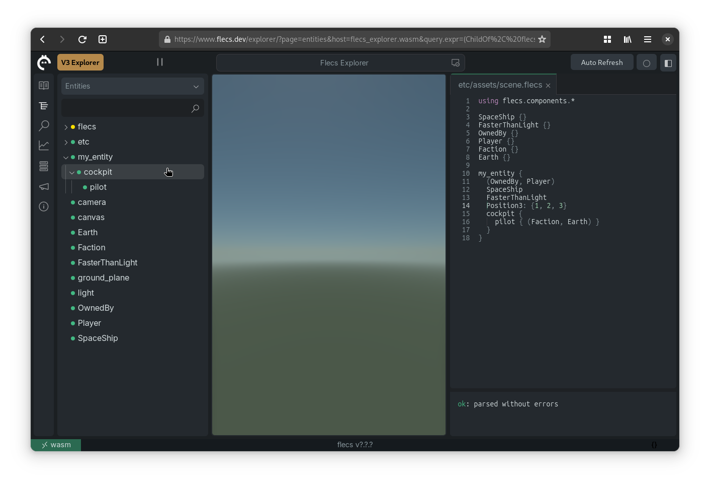
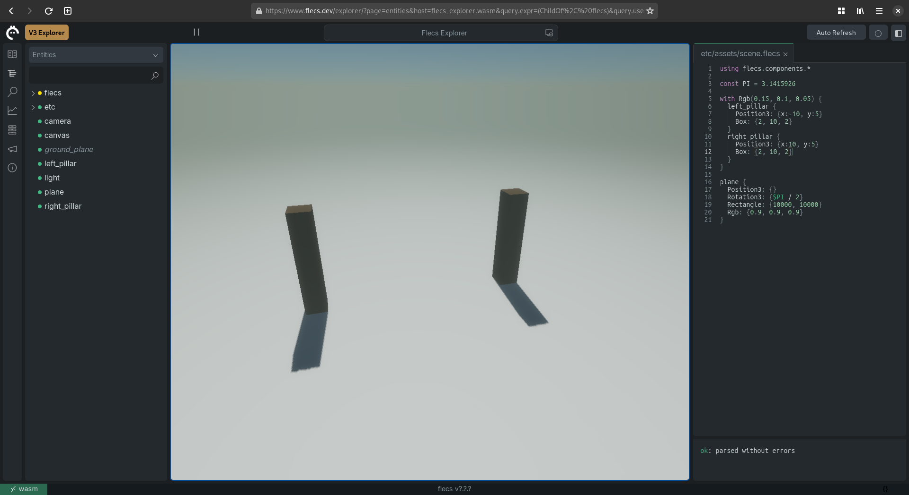
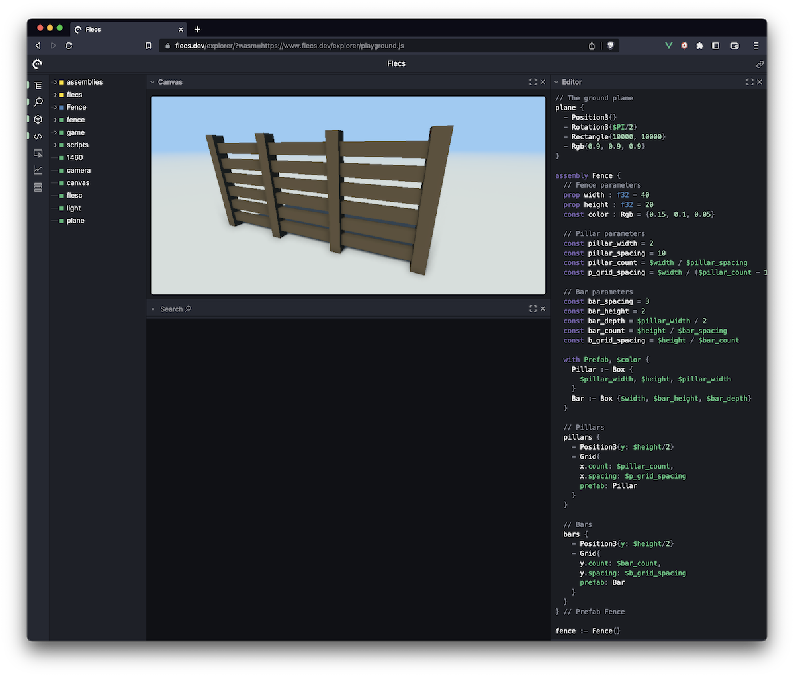

This tutorial hasn't been updated for v4 yet! Use the [Script Manual](FlecsScript.md) for now.

# Flecs Script Tutorial
This tutorial shows you how to use Flecs script, which is a declarative language for creating entities without having to write and compile code. Flecs script can be used for different things, such as building scenes, assets, or as a language for configuration files.

In this tutorial we will be designing a simple fence asset from scratch, and make it parameterizable so it can be easily reused across scenes. By the end of the tutorial we'll have an asset that looks like this:

[](https://www.flecs.dev/explorer/?local=true&wasm=https://www.flecs.dev/explorer/playground.js&script=using%20flecs.components.*%0Ausing%20flecs.meta%0Ausing%20flecs.game%0A%0Aconst%20PI%20%3D%203.1415926%0A%0Aplane%20%7B%0A%20%20-%20Position3%7B%7D%0A%20%20-%20Rotation3%7B%24PI%20%2F%202%7D%0A%20%20-%20Rectangle%7B10000%2C%2010000%7D%0A%20%20-%20Rgb%7B0.9%2C%200.9%2C%200.9%7D%0A%7D%0A%0Atemplate%20Fence%20%7B%0A%20%20%2F%2F%20Fence%20parameters%0A%20%20prop%20width%20%3A%20f32%20%3D%2040%0A%20%20prop%20height%20%3A%20f32%20%3D%2020%0A%20%20prop%20color%20%3A%20Rgb%20%3D%20%7B0.15%2C%200.1%2C%200.05%7D%0A%0A%20%20%2F%2F%20Pillar%20parameters%0A%20%20const%20pillar_width%20%3D%202%0A%20%20const%20pillar_spacing%20%3D%2010%0A%20%20const%20pillar_count%20%3D%20%24width%20%2F%20%24pillar_spacing%0A%20%20const%20p_grid_spacing%20%3D%20%24width%20%2F%20(%24pillar_count%20-%201)%0A%20%0A%20%20%2F%2F%20Bar%20parameters%0A%20%20const%20bar_spacing%20%3D%203%0A%20%20const%20bar_height%20%3D%202%0A%20%20const%20bar_depth%20%3D%20%24pillar_width%20%2F%202%0A%20%20const%20bar_count%20%3D%20%24height%20%2F%20%24bar_spacing%0A%20%20const%20b_grid_spacing%20%3D%20%24height%20%2F%20%24bar_count%0A%20%20%20%0A%20%20with%20Prefab%2C%20%24color%20%7B%0A%20%20%20%20Pillar%20%3A-%20Box%20%7B%0A%20%20%20%20%20%20%24pillar_width%2C%20%24height%2C%20%24pillar_width%0A%20%20%20%20%7D%0A%20%20%20%20Bar%20%3A-%20Box%20%7B%24width%2C%20%24bar_height%2C%20%24bar_depth%7D%0A%20%20%7D%20%20%20%20%0A%20%20%0A%20%20%2F%2F%20Pillars%0A%20%20pillars%20%7B%0A%20%20%20%20-%20Position3%7By%3A%20%24height%2F2%7D%0A%20%20%20%20-%20Grid%7B%0A%20%20%20%20%20%20x.count%3A%20%24pillar_count%2C%0A%20%20%20%20%20%20x.spacing%3A%20%24p_grid_spacing%0A%20%20%20%20%20%20prefab%3A%20Pillar%20%20%20%20%0A%20%20%20%20%7D%0A%20%20%7D%0A%0A%20%20%2F%2F%20Bars%0A%20%20bars%20%7B%0A%20%20%20%20-%20Position3%7By%3A%20%24height%2F2%7D%0A%20%20%20%20-%20Grid%7B%0A%20%20%20%20%20%20y.count%3A%20%24bar_count%2C%0A%20%20%20%20%20%20y.spacing%3A%20%24b_grid_spacing%0A%20%20%20%20%20%20prefab%3A%20Bar%20%20%20%20%0A%20%20%20%20%7D%0A%20%20%7D%0A%7D%20%2F%2F%20template%20Fence%0A%0A%0Atemplate%20Enclosing%20%7B%0A%20%20prop%20width%3A%20f32%20%3D%2040%0A%20%20prop%20height%3A%20f32%20%3D%2010%0A%20%20prop%20depth%3A%20f32%20%3D%2040%0A%20%20prop%20color%3A%20Rgb%20%3D%20%7B0.15%2C%200.1%2C%200.05%7D%0A%20%20%0A%20%20const%20width_half%20%3D%20%24width%20%2F%202%0A%20%20const%20depth_half%20%3D%20%24depth%20%2F%202%0A%20%20const%20PI%20%3D%203.1415926%0A%0A%20%20left%20%7B%0A%20%20%20%20-%20Position3%7Bx%3A%20-%24width_half%7D%0A%20%20%20%20-%20Rotation3%7By%3A%20%24PI%20%2F%202%7D%0A%20%20%20%20-%20Fence%7Bwidth%3A%20%24depth%2C%20height%3A%24%2C%20color%3A%24%7D%0A%20%20%7D%0A%20%20right%20%7B%0A%20%20%20%20-%20Position3%7Bx%3A%20%24width_half%7D%0A%20%20%20%20-%20Rotation3%7By%3A%20%24PI%20%2F%202%7D%0A%20%20%20%20-%20Fence%7Bwidth%3A%20%24depth%2C%20height%3A%24%2C%20color%3A%24%7D%0A%20%20%7D%0A%20%20back%20%7B%0A%20%20%20%20-%20Position3%7Bz%3A%20-%24depth_half%7D%0A%20%20%20%20-%20Fence%7Bwidth%3A%20%24width%2C%20height%3A%24%2C%20color%3A%24%7D%0A%20%20%7D%0A%20%20front%20%7B%0A%20%20%20%20-%20Position3%7Bz%3A%20%24depth_half%7D%0A%20%20%20%20-%20Fence%7Bwidth%3A%20%24width%2C%20height%3A%24%2C%20color%3A%24%7D%0A%20%20%7D%0A%7D%20%2F%2F%20template%20Enclosing%0A%0Afence_a%20%7B%0A%20%20-%20Enclosing%7B%7D%0A%7D%0A%0Acamera%20%7B%0A%20%20-%20Position3%7B21%2C%2019%2C%20-37%7D%0A%20%20-%20Rotation3%7B-0.42%2C%20-0.52%7D%0A%7D%0A)

Note: in order to use Flecs script an app needs to be built with the `FLECS_SCRIPT` addon.

## Getting Started with the Explorer
The Flecs explorer is a web-based application that lets us write scripts and see the results directly. In the tutorial we will use the explorer in combination with the Flecs playground, which has a rendering canvas and comes preloaded with a number of modules and assets.

Go to this URL to open the explorer with the playground:
https://www.flecs.dev/explorer/?wasm=https://www.flecs.dev/explorer/playground.js

The page should look similar to this:
[](https://www.flecs.dev/explorer/?wasm=https://www.flecs.dev/explorer/playground.js)

The panel on the left is the entity treeview, which shows all of the entities in our scene. The center view is the canvas, which shows us the renderable entities of our scene (more on that later). Finally, the pane on the right is the editor, where we can write flecs scripts.

At any point in time you can disable panels by clicking on the "x" in the top-right corner. Panels can be brought back by pressing on their button in the menu bar on the left.

One other important thing is the link button in the top-right of the screen. You can use that button to obtain a link to your content, which is a good way to save progress, or to share what you've created with other people.

## The Basics
Currently the explorer is showing the default scene. Let's clear it by removing all code from the editor. You should now see an empty canvas:


Lets create an entity by typing its name into the editor:

```js
my_entity
```

Notice that as we are typing the entity shows up in the treeview:
[](https://www.flecs.dev/explorer/?wasm=https://www.flecs.dev/explorer/playground.js&script=%0Amy_entity%0A)

Entities are automatically created if they did not exist yet. Try entering the same entity twice:

```js
my_entity
my_entity
```

Only one entity shows up in the treeview. The second time `my_entity` was parsed it already existed, so nothing needed to be done.

## Adding Components
Now that we have an entity, let's add a few components and tags to it. Change the text in the editor to this, to create an entity with a tag called `SpaceShip`:

```js
my_entity :- SpaceShip
```

Note that we didn't have to explicitly declare `SpaceShip` in advance, and that it also shows up as entity in the treeview. We can add multiple things to an entity this way:

```js
my_entity :- SpaceShip
my_entity :- FasterThanLight
```

To avoid repeating the entity name many times, we can use the `{}` operators to open a scope for the entity. Inside the scope we can list components for the entity by prefixing them with a dash (`-`):

```js
my_entity {
  - SpaceShip
  - FasterThanLight
}
```

We can inspect the entity and its contents by opening it in the entity inspector. To do this, click on the entity in the treeview. You should now see this:

[](https://www.flecs.dev/explorer/?local=true&wasm=https://www.flecs.dev/explorer/playground.js&script=%0Amy_entity%20%7B%0A%20%20-%20SpaceShip%0A%20%20-%20FasterThanLight%0A%7D%0A&entity=my_entity)

Note how the `SpaceShip` and `FasterThanLight` tags show up in the editor. There is also a `Script: main` tag, which exists for Flecs to keep track of which entities got created by our script.

Adding a component is similar to adding tag with a value. Let's add the `Position3` component from the `flecs.components.transform` module which comes preloaded with the playground. Note how it also shows up in the inspector when we add this code:

```js
my_entity {
  - SpaceShip
  - FasterThanLight
  - flecs.components.transform.Position3{1, 2, 3}
}
```

Having to type the full module name each time we want to use the `Position3` component would be annoying. Add this line to the top of the script:

```js
using flecs.components.*
```

We can now use the component without the module name, which looks much cleaner:

```js
my_entity {
  - SpaceShip
  - FasterThanLight
  - Position3{1, 2, 3}
}
```

If all went well, the playground should now look like this:

[](https://www.flecs.dev/explorer/?local=true&wasm=https://www.flecs.dev/explorer/playground.js&script=using%20flecs.components.*%0A%0Amy_entity%20%7B%0A%20%20-%20SpaceShip%0A%20%20-%20FasterThanLight%0A%20%20-%20Position3%7B1%2C%202%2C%203%7D%0A%7D%0A&entity=my_entity)

Note how after we added the `Position3` component, the inspector also shows the `Transform` and `WorldCell` components. This happens because the playground imports modules that implement world partitioning and transforms, which we get for free just by using `flecs.components.transform.Position3` component.

In addition to components and tags we can also add relationship pairs to entities. To add a pair, add this line to the scope of the entity, and note how it shows up in the inspector:

```js
  - (OwnedBy, Player)
```

Entities can be created in hierarchies. A child entity is created in the scope of an entity just like the components and tags, but without the preceding `-`. Add this to the scope of the entity:

```js
  cockpit {
    pilot :- (Faction, Earth)
  }
```

You can see the hierarchy this created in the treeview by expanding `my_entity`:

[](https://www.flecs.dev/explorer/?local=true&wasm=https://www.flecs.dev/explorer/playground.js&script=using%20flecs.components.*%0A%0Amy_entity%20%7B%0A%20%20-%20SpaceShip%0A%20%20-%20FasterThanLight%0A%20%20-%20Position3%7B1%2C%202%2C%203%7D%0A%20%20%0A%20%20cockpit%20%7B%0A%20%20%20%20pilot%20%3A-%20(Faction%2C%20Earth)%0A%20%20%7D%0A%7D%0A&entity=my_entity)

Congratulations! You now know how to create entities, hierarchies, and how to add components and tags. None of the entities we created so far are visible in the canvas however, so lets do something about that.

## Drawing Shapes
We will be building a fence asset from just primitive shapes, where each entity is a single shape (note that in a real game you would likely want to use actual meshes).

The renderer uses regular ECS queries to find the entities to render. For our entities to show up in these queries, they need to have at least three components:

- `Position3`
- `Rgb` (a color)
- `Box` or `Rectangle`

Let's start by drawing a plane. First remove all code from the editor except for this line:

```js
using flecs.components.*
```

Now add these lines into the editor to create our ground `plane`:

```js
plane {
  - Position3{}
  Rectangle: {100, 100}
  - Rgb{0.9, 0.9, 0.9}
}
```

Something happened! But it doesn't look quite right:

[](https://www.flecs.dev/explorer/?local=true&wasm=https://www.flecs.dev/explorer/playground.js&script=using%20flecs.components.*%0A%0Aplane%20%7B%0A%20%20-%20Position3%7B%7D%0A%20%20-%20Rectangle%7B100%2C%20100%7D%0A%20%20-%20Rgb%7B0.9%2C%200.9%2C%200.9%7D%0A%7D%0A)

The rectangle is rotated the wrong way for our plane. To fix this we need to rotate it 90 degrees or `π/2` radians on the x axis. First lets define `π` as a constant value in our script:

```js
const PI = 3.1415926
```

Now add this line to the scope of `plane`:

```js
  - Rotation3{$PI / 2}
```

That looks better:

[](https://www.flecs.dev/explorer/?local=true&wasm=https://www.flecs.dev/explorer/playground.js&script=using%20flecs.components.*%0A%0Aconst%20PI%20%3D%203.1415926%0A%0Aplane%20%7B%0A%20%20-%20Position3%7B%7D%0A%20%20-%20Rotation3%7B%24PI%20%2F%202%7D%0A%20%20-%20Rectangle%7B100%2C%20100%7D%0A%20%20-%20Rgb%7B0.9%2C%200.9%2C%200.9%7D%0A%7D%0A)

Let's increase the sides of the plane to `10000` so that the fog effect makes it blends in with the background, which gives the illusion of a horizon:

[](https://www.flecs.dev/explorer/?local=true&wasm=https://www.flecs.dev/explorer/playground.js&script=using%20flecs.components.*%0A%0Aconst%20PI%20%3D%203.1415926%0A%0Aplane%20%7B%0A%20%20-%20Position3%7B%7D%0A%20%20-%20Rotation3%7B%24PI%20%2F%202%7D%0A%20%20-%20Rectangle%7B10000%2C%2010000%7D%0A%20%20-%20Rgb%7B0.9%2C%200.9%2C%200.9%7D%0A%7D%0A)

Note that the `PI` variable does not show up in the treeview. Variables do not create entities, and only exist within the context of a script.

Let's now add a cube to the scene. The code for this looks similar to the plane:

```js
box {
  - Position3{}
  Box: {10, 10, 10}
  Rgb: {1, 0, 0}
}
```

The box is showing up, but it's intersecting with our plane:

[](https://www.flecs.dev/explorer/?local=true&wasm=https://www.flecs.dev/explorer/playground.js&script=using%20flecs.components.*%0A%0Aconst%20PI%20%3D%203.1415926%0A%0Aplane%20%7B%0A%20%20-%20Position3%7B%7D%0A%20%20-%20Rotation3%7B%24PI%20%2F%202%7D%0A%20%20-%20Rectangle%7B10000%2C%2010000%7D%0A%20%20-%20Rgb%7B0.9%2C%200.9%2C%200.9%7D%0A%7D%0A%0Abox%20%7B%0A%20%20-%20Position3%7B%7D%0A%20%20-%20Box%7B10%2C%2010%2C%2010%7D%0A%20%20-%20Rgb%7B1%2C%200%2C%200%7D%0A%7D%0A)

To fix this, we can move it up by setting the `y` member of `Position3` to half its size:

```js
box {
  - Position3{y: 5}
  Box: {10, 10, 10}
  Rgb: {1, 0, 0}
}
```

Now the entire cube is visible, and should look like this:

[](https://www.flecs.dev/explorer/?local=true&wasm=https://www.flecs.dev/explorer/playground.js&script=using%20flecs.components.*%0A%0Aconst%20PI%20%3D%203.1415926%0A%0Aplane%20%7B%0A%20%20-%20Position3%7B%7D%0A%20%20-%20Rotation3%7B%24PI%20%2F%202%7D%0A%20%20-%20Rectangle%7B10000%2C%2010000%7D%0A%20%20-%20Rgb%7B0.9%2C%200.9%2C%200.9%7D%0A%7D%0A%0Abox%20%7B%0A%20%20-%20Position3%7By%3A%205%7D%0A%20%20-%20Box%7B10%2C%2010%2C%2010%7D%0A%20%20-%20Rgb%7B1%2C%200%2C%200%7D%0A%7D%0A)

We now have all of the basic knowledge to start drawing a fence! Note that if you want to move the camera around, first click on the canvas to give it focus. You can now move the camera around. To release focus from the canvas, click on it again (the green border should disappear).

## Drawing a Fence
To draw a fence we just need to combine differently sized boxes together. First remove the code for the cube from the editor.

Before drawing the boxes, lets first make sure they're all created with the same color. We could add a color component with the same values to each entity, but that gets tedious if we want to change the color. Instead, we can use the `with` statement:

```js
with Rgb{0.15, 0.1, 0.05} {
  // Boxes go here
}
```

Inside the `with` statement we can now create two box entities for the left and right pillar of the fence:

```js
with Rgb{0.15, 0.1, 0.05} {
  left_pillar {
    - Position3{x: -10, y: 5}
    Box: {2, 10, 2}
  }
  right_pillar {
    - Position3{x: 10, y: 5}
    Box: {2, 10, 2}
  }
}
```

The playground should now look like this:

[](https://www.flecs.dev/explorer/?local=true&wasm=https://www.flecs.dev/explorer/playground.js&script=using%20flecs.components.*%0A%0Aconst%20PI%20%3D%203.1415926%0A%0Aplane%20%7B%0A%20%20-%20Position3%7B%7D%0A%20%20-%20Rotation3%7B%24PI%20%2F%202%7D%0A%20%20-%20Rectangle%7B10000%2C%2010000%7D%0A%20%20-%20Rgb%7B0.9%2C%200.9%2C%200.9%7D%0A%7D%0A%0Awith%20Rgb%7B0.15%2C%200.1%2C%200.05%7D%20%7B%0A%20%20left_pillar%20%7B%0A%20%20%20%20-%20Position3%7Bx%3A%20-10%2C%20y%3A%205%7D%0A%20%20%20%20-%20Box%7B2%2C%2010%2C%202%7D%0A%20%20%7D%0A%20%20right_pillar%20%7B%0A%20%20%20%20-%20Position3%7Bx%3A%2010%2C%20y%3A%205%7D%0A%20%20%20%20-%20Box%7B2%2C%2010%2C%202%7D%0A%20%20%7D%0A%7D%0A)

That works, but the code is starting to look a bit unwieldy. There are lots of magic numbers which will become difficult to maintain as our asset gets more complex. Let's see if we can clean this up a bit.

First lets define two variables for the color and box shape of the pillars. We already saw an example of a variable when we defined `PI`. These looks similar, except that because they are composite values, we also define their type:

```js
const color = Rgb: {0.15, 0.1, 0.05}
const pillar_box : Box = {2, 10, 2}
```

This is better, but `pillar_box` still contains values that we have to update each time we want to change the shape of our fence. Instead we can do this, which is a bit more typing now but will be easier to maintain later:

```js
const height = 10
const color = Rgb: {0.15, 0.1, 0.05}

const pillar_width = 2
const pillar_box : Box = {
  $pillar_width, 
  $height, 
  $pillar_width
}
```

Let's also add an additional `width` variable which stores the width of the fence (or the distance between two pillars):

```js
const width = 20
```

We can now update the code that creates the pillars to this:

```js
with $color, $pillar_box {
  left_pillar {
    - Position3{x: -$width/2, y: $height/2}
  }
  right_pillar {
    - Position3{x: $width/2, y: $height/2}
  }
}
```

This will reproduce the exact same scene, but we can now tweak the variables to change the shape of our fence. Try playing around with the values of the different variables to see their effect!

[](https://www.flecs.dev/explorer/?local=true&wasm=https://www.flecs.dev/explorer/playground.js&script=using%20flecs.components.*%0A%0Aconst%20PI%20%3D%203.1415926%0A%0Aplane%20%7B%0A%20%20-%20Position3%7B%7D%0A%20%20-%20Rotation3%7B%24PI%20%2F%202%7D%0A%20%20-%20Rectangle%7B10000%2C%2010000%7D%0A%20%20-%20Rgb%7B0.9%2C%200.9%2C%200.9%7D%0A%7D%0A%0Aconst%20width%20%3D%2010%0Aconst%20height%20%3D%2015%0Aconst%20color%20%3A%20Rgb%20%3D%20%7B0.15%2C%200.1%2C%200.05%7D%0A%0Aconst%20pillar_width%20%3D%204%0Aconst%20pillar_box%20%3A%20Box%20%3D%20%7B%0A%20%20%24pillar_width%2C%20%0A%20%20%24height%2C%20%0A%20%20%24pillar_width%0A%7D%0A%0Awith%20%24color%2C%20%24pillar_box%20%7B%0A%20%20left_pillar%20%7B%0A%20%20%20%20-%20Position3%7Bx%3A%20-%24width%2F2%2C%20y%3A%20%24height%2F2%7D%0A%20%20%7D%0A%20%20right_pillar%20%7B%0A%20%20%20%20-%20Position3%7Bx%3A%20%24width%2F2%2C%20y%3A%20%24height%2F2%7D%0A%20%20%7D%0A%7D%0A)

This is no fence yet. We're still missing the crossbars. Let's add another entity to see what it looks like:

```js
bar {
  - Position3{y: $height / 2}
  Box: {$width, 2, 1}
  - $color  
}
```

[](https://www.flecs.dev/explorer/?local=true&wasm=https://www.flecs.dev/explorer/playground.js&script=using%20flecs.components.*%0A%0Aconst%20PI%20%3D%203.1415926%0A%0Aplane%20%7B%0A%20%20-%20Position3%7B%7D%0A%20%20-%20Rotation3%7B%24PI%20%2F%202%7D%0A%20%20-%20Rectangle%7B10000%2C%2010000%7D%0A%20%20-%20Rgb%7B0.9%2C%200.9%2C%200.9%7D%0A%7D%0A%0Aconst%20width%20%3D%2020%0Aconst%20height%20%3D%2010%0Aconst%20color%20%3A%20Rgb%20%3D%20%7B0.15%2C%200.1%2C%200.05%7D%0A%0Aconst%20pillar_width%20%3D%202%0Aconst%20pillar_box%20%3A%20Box%20%3D%20%7B%0A%20%20%24pillar_width%2C%20%0A%20%20%24height%2C%20%0A%20%20%24pillar_width%0A%7D%0A%0Awith%20%24color%2C%20%24pillar_box%20%7B%0A%20%20left_pillar%20%7B%0A%20%20%20%20-%20Position3%7Bx%3A%20-%24width%2F2%2C%20y%3A%20%24height%2F2%7D%0A%20%20%7D%0A%20%20right_pillar%20%7B%0A%20%20%20%20-%20Position3%7Bx%3A%20%24width%2F2%2C%20y%3A%20%24height%2F2%7D%0A%20%20%7D%0A%7D%0A%0Abar%20%7B%0A%20%20-%20Position3%7By%3A%20%24height%20%2F%202%7D%0A%20%20-%20Box%7B%24width%2C%202%2C%201%7D%0A%20%20-%20%24color%20%20%0A%7D%0A)

Let's add a second entity and space the two entities out a bit so they don't overlap. Also make sure to give both entities a different name, or else we'll end up overwriting the previous values:

```js
top_bar {
  - Position3{y: $height/2 + 2}
  Box: {$width, 2, 1}
  - $color  
}
bottom_bar {
  - Position3{y: $height/2 - 2}
  Box: {$width, 2, 1}
  - $color  
}
```

[](https://www.flecs.dev/explorer/?local=true&wasm=https://www.flecs.dev/explorer/playground.js&script=using%20flecs.components.*%0A%0Aconst%20PI%20%3D%203.1415926%0A%0Aplane%20%7B%0A%20%20-%20Position3%7B%7D%0A%20%20-%20Rotation3%7B%24PI%20%2F%202%7D%0A%20%20-%20Rectangle%7B10000%2C%2010000%7D%0A%20%20-%20Rgb%7B0.9%2C%200.9%2C%200.9%7D%0A%7D%0A%0Aconst%20width%20%3D%2020%0Aconst%20height%20%3D%2010%0Aconst%20color%20%3A%20Rgb%20%3D%20%7B0.15%2C%200.1%2C%200.05%7D%0A%0Aconst%20pillar_width%20%3D%202%0Aconst%20pillar_box%20%3A%20Box%20%3D%20%7B%0A%20%20%24pillar_width%2C%20%0A%20%20%24height%2C%20%0A%20%20%24pillar_width%0A%7D%0A%0Awith%20%24color%2C%20%24pillar_box%20%7B%0A%20%20left_pillar%20%7B%0A%20%20%20%20-%20Position3%7Bx%3A%20-%24width%2F2%2C%20y%3A%20%24height%2F2%7D%0A%20%20%7D%0A%20%20right_pillar%20%7B%0A%20%20%20%20-%20Position3%7Bx%3A%20%24width%2F2%2C%20y%3A%20%24height%2F2%7D%0A%20%20%7D%0A%7D%0A%0Atop_bar%20%7B%0A%20%20-%20Position3%7By%3A%20%24height%2F2%20%2B%202%7D%0A%20%20-%20Box%7B%24width%2C%202%2C%201%7D%0A%20%20-%20%24color%20%20%0A%7D%0Abottom_bar%20%7B%0A%20%20-%20Position3%7By%3A%20%24height%2F2%20-%202%7D%0A%20%20-%20Box%7B%24width%2C%202%2C%201%7D%0A%20%20-%20%24color%20%20%0A%7D%0A)

That starts to look more like a fence! Just like before however, we have a bunch of magic values and redundancies, but we now know how to fix that. First, let's define a `bar_sep` variable to specify how far apart the bars should be separated:

```js
const bar_sep = 4
```

Let's also create a variable for the bar shape and bar height, similar to what we did before. Let's make the bar thickness scale with the width of a pillar:

```js
const bar_height = 2
const bar_depth = $pillar_width/2
const bar_box : Box = {$width, $bar_height, $bar_depth}
```

With that in place, we can cleanup the entity code for the bars:

```js
with $color, $bar_box {
  top_bar {
    - Position3{y: $height/2 + $bar_sep/2}
  }
  bottom_bar {
    - Position3{y: $height/2 - $bar_sep/2}
  }
}
```

We now have our fence, which we can fully tweak with by changing the values of the variables! There are a few problems with the current code however:

- The code is not packaged in a way that we can easily use
- We can make the fence very wide or very high, but it will end up looking weird. Ideally we increase the number of pillars and bars as we scale up the fence.

The code is also growing. To make sure you don't lose track of what you're doing you can add comments:

```js
// Create two bar entities
with $color, $bar_box {
  top_bar {
    - Position3{y: $height/2 + $bar_sep/2}
  }
  bottom_bar {
    - Position3{y: $height/2 - $bar_sep/2}
  }
}
```

## Prefabs
We have the basic structure of a fence, but what if we wanted two fences? We could of course duplicate all of the code, but that would be impractical. Instead we can package up what we have in a _prefab_.

Turning the existing code into a prefab is easy. Simply add these lines around the fence code:

```js
Prefab Fence {
  // fence code goes here
}
```

This creates an entity `Fence` with the tag `Prefab`, and stores all entities we created so far as children of the `Fence` entity. This is the same as running the following code, but a bit more convenient:

```js
Fence {
  - Prefab

  // fence code goes here
}
```

Once you put the fence entities inside the prefab scope, you'll notice a few things:
- The fence disappears from the canvas
- The fence entities now show up under `Fence` in the treeview

[](https://www.flecs.dev/explorer/?local=true&wasm=https://www.flecs.dev/explorer/playground.js&script=using%20flecs.components.*%0A%0Aconst%20PI%20%3D%203.1415926%0A%0Aplane%20%7B%0A%20%20-%20Position3%7B%7D%0A%20%20-%20Rotation3%7B%24PI%20%2F%202%7D%0A%20%20-%20Rectangle%7B10000%2C%2010000%7D%0A%20%20-%20Rgb%7B0.9%2C%200.9%2C%200.9%7D%0A%7D%0A%0APrefab%20Fence%20%7B%0A%0Aconst%20width%20%3D%2020%0Aconst%20height%20%3D%2010%0Aconst%20color%20%3A%20Rgb%20%3D%20%7B0.15%2C%200.1%2C%200.05%7D%0A%0Aconst%20pillar_width%20%3D%202%0Aconst%20pillar_box%20%3A%20Box%20%3D%20%7B%0A%20%20%24pillar_width%2C%20%0A%20%20%24height%2C%20%0A%20%20%24pillar_width%0A%7D%0A%0Awith%20%24color%2C%20%24pillar_box%20%7B%0A%20%20left_pillar%20%7B%0A%20%20%20%20-%20Position3%7Bx%3A%20-%24width%2F2%2C%20y%3A%20%24height%2F2%7D%0A%20%20%7D%0A%20%20right_pillar%20%7B%0A%20%20%20%20-%20Position3%7Bx%3A%20%24width%2F2%2C%20y%3A%20%24height%2F2%7D%0A%20%20%7D%0A%7D%0A%0Aconst%20bar_sep%20%3D%204%0Aconst%20bar_height%20%3D%202%0Aconst%20bar_depth%20%3D%20%24pillar_width%2F2%0Aconst%20bar_box%20%3A%20Box%20%3D%20%7B%0A%20%20%24width%2C%20%0A%20%20%24bar_height%2C%20%0A%20%20%24bar_depth%0A%7D%0A%0Awith%20%24color%2C%20%24bar_box%20%7B%0A%20%20top_bar%20%7B%0A%20%20%20%20-%20Position3%7By%3A%20%24height%2F2%20%2B%20%24bar_sep%2F2%7D%0A%20%20%7D%0A%20%20bottom_bar%20%7B%0A%20%20%20%20-%20Position3%7By%3A%20%24height%2F2%20-%20%24bar_sep%2F2%7D%0A%20%20%7D%0A%7D%0A%7D%20%2F%2F%20Prefab%20Fence%0A)

The reason that the fence disappears is that `Prefab` is a builtin tag that is by default ignored by queries, and as a result also by the renderer. Children of a prefab also become prefabs, so they also get ignored.

That seems a bit underwhelming, but what we can now do is create an entity that _inherits_ from the `Fence` prefab, by adding this line to the bottom of the script:

```
my_fence : Fence
```

[](https://www.flecs.dev/explorer/?local=true&wasm=https://www.flecs.dev/explorer/playground.js&script=using%20flecs.components.*%0A%0Aconst%20PI%20%3D%203.1415926%0A%0Aplane%20%7B%0A%20%20-%20Position3%7B%7D%0A%20%20-%20Rotation3%7B%24PI%20%2F%202%7D%0A%20%20-%20Rectangle%7B10000%2C%2010000%7D%0A%20%20-%20Rgb%7B0.9%2C%200.9%2C%200.9%7D%0A%7D%0A%0APrefab%20Fence%20%7B%0A%20%20const%20width%20%3D%2020%0A%20%20const%20height%20%3D%2010%0A%20%20const%20color%20%3A%20Rgb%20%3D%20%7B0.15%2C%200.1%2C%200.05%7D%0A%20%20%0A%20%20const%20pillar_width%20%3D%202%0A%20%20const%20pillar_box%20%3A%20Box%20%3D%20%7B%0A%20%20%20%20%24pillar_width%2C%20%0A%20%20%20%20%24height%2C%20%0A%20%20%20%20%24pillar_width%0A%20%20%7D%0A%20%20%0A%20%20with%20%24color%2C%20%24pillar_box%20%7B%0A%20%20%20%20left_pillar%20%7B%0A%20%20%20%20%20%20-%20Position3%7Bx%3A%20-%24width%2F2%2C%20y%3A%20%24height%2F2%7D%0A%20%20%20%20%7D%0A%20%20%20%20right_pillar%20%7B%0A%20%20%20%20%20%20-%20Position3%7Bx%3A%20%24width%2F2%2C%20y%3A%20%24height%2F2%7D%0A%20%20%20%20%7D%0A%20%20%7D%0A%20%20%0A%20%20const%20bar_sep%20%3D%204%0A%20%20const%20bar_height%20%3D%202%0A%20%20const%20bar_depth%20%3D%20%24pillar_width%2F2%0A%20%20const%20bar_box%20%3A%20Box%20%3D%20%7B%0A%20%20%20%20%24width%2C%20%0A%20%20%20%20%24bar_height%2C%20%0A%20%20%20%20%24bar_depth%0A%20%20%7D%0A%20%20%0A%20%20with%20%24color%2C%20%24bar_box%20%7B%0A%20%20%20%20top_bar%20%7B%0A%20%20%20%20%20%20-%20Position3%7By%3A%20%24height%2F2%20%2B%20%24bar_sep%2F2%7D%0A%20%20%20%20%7D%0A%20%20%20%20bottom_bar%20%7B%0A%20%20%20%20%20%20-%20Position3%7By%3A%20%24height%2F2%20-%20%24bar_sep%2F2%7D%0A%20%20%20%20%7D%0A%20%20%7D%0A%7D%20%2F%2F%20Prefab%20Fence%0A%0Amy_fence%20%3A%20Fence%0A)

Great, the fence is back! Even better, we can now create two fences simply by instantiating the prefab twice. Just make sure to give both instances different positions:

```js
fence_a : Fence {
  - Position3{-10}
}
fence_b : Fence {
  - Position3{10}
}
```

[](https://www.flecs.dev/explorer/?local=true&wasm=https://www.flecs.dev/explorer/playground.js&script=using%20flecs.components.*%0A%0Aconst%20PI%20%3D%203.1415926%0A%0Aplane%20%7B%0A%20%20-%20Position3%7B%7D%0A%20%20-%20Rotation3%7B%24PI%20%2F%202%7D%0A%20%20-%20Rectangle%7B10000%2C%2010000%7D%0A%20%20-%20Rgb%7B0.9%2C%200.9%2C%200.9%7D%0A%7D%0A%0APrefab%20Fence%20%7B%0A%20%20const%20width%20%3D%2020%0A%20%20const%20height%20%3D%2010%0A%20%20const%20color%20%3A%20Rgb%20%3D%20%7B0.15%2C%200.1%2C%200.05%7D%0A%20%20%0A%20%20const%20pillar_width%20%3D%202%0A%20%20const%20pillar_box%20%3A%20Box%20%3D%20%7B%0A%20%20%20%20%24pillar_width%2C%20%0A%20%20%20%20%24height%2C%20%0A%20%20%20%20%24pillar_width%0A%20%20%7D%0A%20%20%0A%20%20with%20%24color%2C%20%24pillar_box%20%7B%0A%20%20%20%20left_pillar%20%7B%0A%20%20%20%20%20%20-%20Position3%7Bx%3A%20-%24width%2F2%2C%20y%3A%20%24height%2F2%7D%0A%20%20%20%20%7D%0A%20%20%20%20right_pillar%20%7B%0A%20%20%20%20%20%20-%20Position3%7Bx%3A%20%24width%2F2%2C%20y%3A%20%24height%2F2%7D%0A%20%20%20%20%7D%0A%20%20%7D%0A%20%20%0A%20%20const%20bar_sep%20%3D%204%0A%20%20const%20bar_height%20%3D%202%0A%20%20const%20bar_depth%20%3D%20%24pillar_width%2F2%0A%20%20const%20bar_box%20%3A%20Box%20%3D%20%7B%0A%20%20%20%20%24width%2C%20%0A%20%20%20%20%24bar_height%2C%20%0A%20%20%20%20%24bar_depth%0A%20%20%7D%0A%20%20%0A%20%20with%20%24color%2C%20%24bar_box%20%7B%0A%20%20%20%20top_bar%20%7B%0A%20%20%20%20%20%20-%20Position3%7By%3A%20%24height%2F2%20%2B%20%24bar_sep%2F2%7D%0A%20%20%20%20%7D%0A%20%20%20%20bottom_bar%20%7B%0A%20%20%20%20%20%20-%20Position3%7By%3A%20%24height%2F2%20-%20%24bar_sep%2F2%7D%0A%20%20%20%20%7D%0A%20%20%7D%0A%7D%20%2F%2F%20Prefab%20Fence%0A%0Afence_a%20%3A%20Fence%20%7B%0A%20%20-%20Position3%7B-10%7D%0A%7D%0Afence_b%20%3A%20Fence%20%7B%0A%20%20-%20Position3%7B10%7D%0A%7D%0A)

We could save this script as is, load it into our game, and instantiate the prefab from regular C/C++ code. This is what that would look like:

```c
// In C
ecs_script_run_file(world, "fence.flecs");

ecs_entity_t fence = ecs_lookup(world, "Fence");
ecs_entity_t fence_a = ecs_new_w_pair(world, EcsIsA, fence);
ecs_entity_t fence_b = ecs_new_w_pair(world, EcsIsA, fence);

ecs_set(world, fence_a, EcsPosition3, {-10});
ecs_set(world, fence_b, EcsPosition3, {10});
```
```cpp
// In C++
using namespace flecs::components::transform;

ecs_script_run_file(world, "fence.flecs");

auto fence = world.lookup("Fence");
auto fence_a = world.entity().is_a(fence);
auto fence_b = world.entity().is_a(fence);

fence_a.set<Position3>({-10});
fence_b.set<Position3>({10});
```

We still have some problems, which we'll address in the next section:
- Our prefab is static, we cannot change the parameters of the fence
- The pillars and bars don't increase when the fence size increases

## Templates
Prefabs are static collections of entities and components that we can instantiate multiple times. Templates are _prefab compositions_ that can be parameterized. In other words, templates let us to create our Fence, while also specifying the width and height.

Changing the above code into an template is easy. Just change this line:

```js
Prefab Fence {
  // fence code
}
```

into this:

```js
template Fence {
  // fence code
}
```

The editor will throw the following error:

```
template 'Fence' has no properties
```

[](https://www.flecs.dev/explorer/?local=true&wasm=https://www.flecs.dev/explorer/playground.js&script=using%20flecs.components.*%0A%0Aconst%20PI%20%3D%203.1415926%0A%0Aplane%20%7B%0A%20%20-%20Position3%7B%7D%0A%20%20-%20Rotation3%7B%24PI%20%2F%202%7D%0A%20%20-%20Rectangle%7B10000%2C%2010000%7D%0A%20%20-%20Rgb%7B0.9%2C%200.9%2C%200.9%7D%0A%7D%0A%0Atemplate%20Fence%20%7B%0A%20%20const%20width%20%3D%2020%0A%20%20const%20height%20%3D%2010%0A%20%20const%20color%20%3A%20Rgb%20%3D%20%7B0.15%2C%200.1%2C%200.05%7D%0A%20%20%0A%20%20const%20pillar_width%20%3D%202%0A%20%20const%20pillar_box%20%3A%20Box%20%3D%20%7B%0A%20%20%20%20%24pillar_width%2C%20%0A%20%20%20%20%24height%2C%20%0A%20%20%20%20%24pillar_width%0A%20%20%7D%0A%20%20%0A%20%20with%20%24color%2C%20%24pillar_box%20%7B%0A%20%20%20%20left_pillar%20%7B%0A%20%20%20%20%20%20-%20Position3%7Bx%3A%20-%24width%2F2%2C%20y%3A%20%24height%2F2%7D%0A%20%20%20%20%7D%0A%20%20%20%20right_pillar%20%7B%0A%20%20%20%20%20%20-%20Position3%7Bx%3A%20%24width%2F2%2C%20y%3A%20%24height%2F2%7D%0A%20%20%20%20%7D%0A%20%20%7D%0A%20%20%0A%20%20const%20bar_sep%20%3D%204%0A%20%20const%20bar_height%20%3D%202%0A%20%20const%20bar_depth%20%3D%20%24pillar_width%2F2%0A%20%20const%20bar_box%20%3A%20Box%20%3D%20%7B%0A%20%20%20%20%24width%2C%20%0A%20%20%20%20%24bar_height%2C%20%0A%20%20%20%20%24bar_depth%0A%20%20%7D%0A%20%20%0A%20%20with%20%24color%2C%20%24bar_box%20%7B%0A%20%20%20%20top_bar%20%7B%0A%20%20%20%20%20%20-%20Position3%7By%3A%20%24height%2F2%20%2B%20%24bar_sep%2F2%7D%0A%20%20%20%20%7D%0A%20%20%20%20bottom_bar%20%7B%0A%20%20%20%20%20%20-%20Position3%7By%3A%20%24height%2F2%20-%20%24bar_sep%2F2%7D%0A%20%20%20%20%7D%0A%20%20%7D%0A%7D%20%2F%2F%20Prefab%20Fence%0A%0Afence_a%20%3A%20Fence%20%7B%0A%20%20-%20Position3%7B-10%7D%0A%7D%0Afence_b%20%3A%20Fence%20%7B%0A%20%20-%20Position3%7B10%7D%0A%7D%0A)

What does this mean? Templates, unlike prefabs, need _properties_, which are like the inputs to the template. For our fence, these could be `width` and `height` values.

To add properties to the template, we can take some of our existing `const` variables, and change `const` to `prop`. This will make the variables visible to the outside. Another thing we must do for properties is explicitly specify their type.

Let's take the existing `width`, `height` and `color` variables, and change them to properties. It is also good practice to put the props at the top of the template code, so it's easy to see which inputs it has:

```js
template Fence {
  prop width = flecs.meta.f32: 20
  prop height = flecs.meta.f32: 10
  prop color = Rgb: {0.15, 0.1, 0.05}

  // fence code
}
```

We can get rid of the `flecs.meta.` prefix by adding this to the top of our script:

```js
using flecs.meta
```

The code can now be changed to this:

```js
template Fence {
  prop width = f32: 20
  prop height = f32: 10
  prop color = Rgb: {0.15, 0.1, 0.05}

  // fence code
}
```

Note that while we were doing this, the fence disappeared again from the canvas. This happened because while we _inherit_ a prefab, we _assign_ an template. To make the fences visible again, change the code that creates the fences to this:

```js
fence_a {
  - Fence{}
  - Position3{-10}
}
fence_b {
  - Fence{}
  - Position3{10}
}
```

The fences are back, with the default values we provided to our props. But we now have a new power! Try changing it to this:

```js
fence_a {
  Fence: {width: 10, height: 20}
  - Position3{-10}
}
fence_b {
  Fence: {width: 25, height: 10}
  - Position3{10}
}
```

[](https://www.flecs.dev/explorer/?local=true&wasm=https://www.flecs.dev/explorer/playground.js&script=using%20flecs.components.*%0Ausing%20flecs.meta%0A%0Aconst%20PI%20%3D%203.1415926%0A%0Aplane%20%7B%0A%20%20-%20Position3%7B%7D%0A%20%20-%20Rotation3%7B%24PI%20%2F%202%7D%0A%20%20-%20Rectangle%7B10000%2C%2010000%7D%0A%20%20-%20Rgb%7B0.9%2C%200.9%2C%200.9%7D%0A%7D%0A%0Atemplate%20Fence%20%7B%0A%20%20prop%20width%20%3A%20f32%20%3D%2020%0A%20%20prop%20height%20%3A%20f32%20%3D%2010%0A%20%20prop%20color%20%3A%20Rgb%20%3D%20%7B0.15%2C%200.1%2C%200.05%7D%0A%20%20%0A%20%20const%20pillar_width%20%3D%202%0A%20%20const%20pillar_box%20%3A%20Box%20%3D%20%7B%0A%20%20%20%20%24pillar_width%2C%20%0A%20%20%20%20%24height%2C%20%0A%20%20%20%20%24pillar_width%0A%20%20%7D%0A%20%20%0A%20%20with%20%24color%2C%20%24pillar_box%20%7B%0A%20%20%20%20left_pillar%20%7B%0A%20%20%20%20%20%20-%20Position3%7Bx%3A%20-%24width%2F2%2C%20y%3A%20%24height%2F2%7D%0A%20%20%20%20%7D%0A%20%20%20%20right_pillar%20%7B%0A%20%20%20%20%20%20-%20Position3%7Bx%3A%20%24width%2F2%2C%20y%3A%20%24height%2F2%7D%0A%20%20%20%20%7D%0A%20%20%7D%0A%20%20%0A%20%20const%20bar_sep%20%3D%204%0A%20%20const%20bar_height%20%3D%202%0A%20%20const%20bar_depth%20%3D%20%24pillar_width%2F2%0A%20%20const%20bar_box%20%3A%20Box%20%3D%20%7B%0A%20%20%20%20%24width%2C%20%0A%20%20%20%20%24bar_height%2C%20%0A%20%20%20%20%24bar_depth%0A%20%20%7D%0A%20%20%0A%20%20with%20%24color%2C%20%24bar_box%20%7B%0A%20%20%20%20top_bar%20%7B%0A%20%20%20%20%20%20-%20Position3%7By%3A%20%24height%2F2%20%2B%20%24bar_sep%2F2%7D%0A%20%20%20%20%7D%0A%20%20%20%20bottom_bar%20%7B%0A%20%20%20%20%20%20-%20Position3%7By%3A%20%24height%2F2%20-%20%24bar_sep%2F2%7D%0A%20%20%20%20%7D%0A%20%20%7D%0A%7D%20%2F%2F%20Prefab%20Fence%0A%0Afence_a%20%7B%0A%20%20-%20Fence%7Bwidth%3A%2010%2C%20height%3A%2020%7D%0A%20%20-%20Position3%7B-10%7D%0A%7D%0Afence_b%20%7B%0A%20%20-%20Fence%7Bwidth%3A%2025%2C%20height%3A%2010%7D%0A%20%20-%20Position3%7B10%7D%0A%7D%0A)

We are now well on our way to define a procedural fence. Note how similar assigning an template looks to assigning a component. This is no coincidence: an template is translated to a component, where each property becomes a member of that component.

This is something we can exploit in C/C++ code to make assigning templates to entities as easy as assigning a component:

```c
// In C
typedef struct {
  float width;
  float height;
  EcsRgb color;
} Fence;

// Register a regular component
ECS_COMPONENT(world, Fence);

// Because the Fence template has the same name as the
// component it will "bind" to it.
ecs_script_run_file(world, "fence.flecs");

// Set the component as usual
ecs_entity_t fence_a = ecs_insert(world, ecs_value(Fence, {10, 20}));
ecs_entity_t fence_b = ecs_insert(world, ecs_value(Fence, {25, 10}));

ecs_set(world, fence_a, EcsPosition3, {-10});
ecs_set(world, fence_b, EcsPosition3, {10});
```
```cpp
// In C++
using namespace flecs::components::transform;

struct Fence {
  float width;
  float height;
  flecs::components::graphics::Rgb color;
}

// Because the Fence template has the same name as the
// component it will "bind" to it.
ecs_script_run_file(world, "fence.flecs");

auto fence_a = world.entity().set<Fence>({10, 20});
auto fence_b = world.entity().set<Fence>({25, 10});

fence_a.set<Position3>({-10});
fence_b.set<Position3>({10});
```

For this to work, we have to make sure that the types and ordering of the properties in the script match up with the types and ordering of members in the component type.

## Grids
Let's now see if we can change the number of pillars and bars depending on the fence width and height.

At first glance this sounds like something that would require loops, and those are not supported in Flecs script. There is a way around this however, which is to use a `Grid` component that does the instantiating for us.

The `Grid` component is provided by the `flecs.game` module, so before using it lets add this to the top of the script:

```js
using flecs.game
```

The implementation for the `Grid` component can be found [here](https://github.com/flecs-hub/flecs-game/blob/main/src/main.c). We only use it in the tutorial for demonstration purposes. In practice we could create many different components that handle layout for us.

The grid component lets us create multiple instances of an entity that are laid out in a 1, 2 or 3 dimensional grid. Let's apply this to the number of pillars, which we want to scale with the width of our fence. For this we need two things:

- The width of the fence
- The minimum spacing between pillars

We already have the fence width. Let's create another variable for the spacing:

```js
const pillar_spacing = 10
```

We can now calculate the number of pillars we want:

```js
const pillar_count = $width / $pillar_spacing
```

The `Grid` component can't consume the pillar code directly. Instead it accepts a prefab, so lets turn the existing pillars code into a prefab:

```js
Prefab Pillar {
  - $color
  - $pillar_box
}
```

Note how we left out `Position3`, as this will be set by the `Grid` component. Without further ado, let's create a row of pillars:

```js
  pillars {
    - Position3{y: $height/2}
    - Grid{
      x.count: $pillar_count
      x.spacing: $pillar_spacing
      prefab: Pillar    
    }
  }
```

Let's dissect what this code does:
- Create a `pillars` entity
- Create it at position `y: $height/2` so pillars don't sink into the ground
- With `$pillar_count` pillars on the x axis
- Spaced `$pillar_spacing` apart
- Using `Pillar` as prefab to instantiate the entities

Let's also change the code that instantiates our two fences to just one:

```
fence :- Fence{}
```

And increase the `width` of the fence to `60`:

```js
  prop width = f32: 60
```

We now get a number of pillars that matches the fence length:

[](https://www.flecs.dev/explorer/?local=true&wasm=https://www.flecs.dev/explorer/playground.js&script=using%20flecs.components.*%0Ausing%20flecs.meta%0Ausing%20flecs.game%0A%0Aconst%20PI%20%3D%203.1415926%0A%0Aplane%20%7B%0A%20%20-%20Position3%7B%7D%0A%20%20-%20Rotation3%7B%24PI%20%2F%202%7D%0A%20%20-%20Rectangle%7B10000%2C%2010000%7D%0A%20%20-%20Rgb%7B0.9%2C%200.9%2C%200.9%7D%0A%7D%0A%0Atemplate%20Fence%20%7B%0A%20%20prop%20width%20%3A%20f32%20%3D%2060%0A%20%20prop%20height%20%3A%20f32%20%3D%2010%0A%20%20prop%20color%20%3A%20Rgb%20%3D%20%7B0.15%2C%200.1%2C%200.05%7D%0A%20%20%0A%20%20const%20pillar_width%20%3D%202%0A%20%20const%20pillar_spacing%20%3D%2010%0A%20%20const%20pillar_count%20%3D%20%24width%20%2F%20%24pillar_spacing%0A%20%20const%20pillar_box%20%3A%20Box%20%3D%20%7B%0A%20%20%20%20%24pillar_width%2C%20%0A%20%20%20%20%24height%2C%20%0A%20%20%20%20%24pillar_width%0A%20%20%7D%0A%20%20%0A%20%20Prefab%20Pillar%20%7B%0A%20%20%20%20-%20%24color%0A%20%20%20%20-%20%24pillar_box%0A%20%20%7D%0A%20%20%20%20%0A%20%20pillars%20%7B%0A%20%20%20%20-%20Position3%7By%3A%20%24height%2F2%7D%0A%20%20%20%20-%20Grid%7B%0A%20%20%20%20%20%20x.count%3A%20%24pillar_count%0A%20%20%20%20%20%20x.spacing%3A%20%24pillar_spacing%0A%20%20%20%20%20%20prefab%3A%20Pillar%20%20%20%20%0A%20%20%20%20%7D%0A%20%20%7D%20%20%0A%20%20%0A%20%20const%20bar_sep%20%3D%204%0A%20%20const%20bar_height%20%3D%202%0A%20%20const%20bar_depth%20%3D%20%24pillar_width%2F2%0A%20%20const%20bar_box%20%3A%20Box%20%3D%20%7B%0A%20%20%20%20%24width%2C%20%0A%20%20%20%20%24bar_height%2C%20%0A%20%20%20%20%24bar_depth%0A%20%20%7D%0A%20%20%0A%20%20with%20%24color%2C%20%24bar_box%20%7B%0A%20%20%20%20top_bar%20%7B%0A%20%20%20%20%20%20-%20Position3%7By%3A%20%24height%2F2%20%2B%20%24bar_sep%2F2%7D%0A%20%20%20%20%7D%0A%20%20%20%20bottom_bar%20%7B%0A%20%20%20%20%20%20-%20Position3%7By%3A%20%24height%2F2%20-%20%24bar_sep%2F2%7D%0A%20%20%20%20%7D%0A%20%20%7D%0A%7D%20%2F%2F%20Prefab%20Fence%0A%0Afence%20%3A-%20Fence%7B%7D%0A)

There's still something off though, which is that the pillars don't exactly line up with the ends up of the fence. We can fix this with a simple calculation that takes the number of pillars, and uses that to recompute the grid spacing.

```js
  const grid_spacing = $width / ($pillar_count - 1)
```

Note that this takes into account that there is one more pillar than there are spaces between pillars. When we replace `pillar_spacing` in the grid with `grid_spacing`, we get the correct pillar alignment:

[](https://www.flecs.dev/explorer/?local=true&wasm=https://www.flecs.dev/explorer/playground.js&script=using%20flecs.components.*%0Ausing%20flecs.meta%0Ausing%20flecs.game%0A%0Aconst%20PI%20%3D%203.1415926%0A%0Aplane%20%7B%0A%20%20-%20Position3%7B%7D%0A%20%20-%20Rotation3%7B%24PI%20%2F%202%7D%0A%20%20-%20Rectangle%7B10000%2C%2010000%7D%0A%20%20-%20Rgb%7B0.9%2C%200.9%2C%200.9%7D%0A%7D%0A%0Atemplate%20Fence%20%7B%0A%20%20prop%20width%20%3A%20f32%20%3D%2060%0A%20%20prop%20height%20%3A%20f32%20%3D%2010%0A%20%20prop%20color%20%3A%20Rgb%20%3D%20%7B0.15%2C%200.1%2C%200.05%7D%0A%20%20%0A%20%20const%20pillar_width%20%3D%202%0A%20%20const%20pillar_spacing%20%3D%2010%0A%20%20const%20pillar_count%20%3D%20%24width%20%2F%20%24pillar_spacing%0A%20%20const%20grid_spacing%20%3D%20%24width%20%2F%20(%24pillar_count%20-%201)%0A%20%20const%20pillar_box%20%3A%20Box%20%3D%20%7B%0A%20%20%20%20%24pillar_width%2C%20%0A%20%20%20%20%24height%2C%20%0A%20%20%20%20%24pillar_width%0A%20%20%7D%0A%20%20%0A%20%20Prefab%20Pillar%20%7B%0A%20%20%20%20-%20%24color%0A%20%20%20%20-%20%24pillar_box%0A%20%20%7D%0A%20%20%20%20%0A%20%20pillars%20%7B%0A%20%20%20%20-%20Position3%7By%3A%20%24height%2F2%7D%0A%20%20%20%20-%20Grid%7B%0A%20%20%20%20%20%20x.count%3A%20%24pillar_count%0A%20%20%20%20%20%20x.spacing%3A%20%24grid_spacing%0A%20%20%20%20%20%20prefab%3A%20Pillar%20%20%20%20%0A%20%20%20%20%7D%0A%20%20%7D%20%20%0A%20%20%0A%20%20const%20bar_sep%20%3D%204%0A%20%20const%20bar_height%20%3D%202%0A%20%20const%20bar_depth%20%3D%20%24pillar_width%2F2%0A%20%20const%20bar_box%20%3A%20Box%20%3D%20%7B%0A%20%20%20%20%24width%2C%20%0A%20%20%20%20%24bar_height%2C%20%0A%20%20%20%20%24bar_depth%0A%20%20%7D%0A%20%20%0A%20%20with%20%24color%2C%20%24bar_box%20%7B%0A%20%20%20%20top_bar%20%7B%0A%20%20%20%20%20%20-%20Position3%7By%3A%20%24height%2F2%20%2B%20%24bar_sep%2F2%7D%0A%20%20%20%20%7D%0A%20%20%20%20bottom_bar%20%7B%0A%20%20%20%20%20%20-%20Position3%7By%3A%20%24height%2F2%20-%20%24bar_sep%2F2%7D%0A%20%20%20%20%7D%0A%20%20%7D%0A%7D%20%2F%2F%20Prefab%20Fence%0A%0Afence_a%20%7B%0A%20%20-%20Fence%7B%7D%0A%20%20-%20Position3%7B-10%7D%0A%7D%0A)

We can do the same thing for the bars. I'll skip right to the result since it involves very similar steps:

[](https://www.flecs.dev/explorer/?local=true&wasm=https://www.flecs.dev/explorer/playground.js&script=using%20flecs.components.*%0Ausing%20flecs.meta%0Ausing%20flecs.game%0A%0Aconst%20PI%20%3D%203.1415926%0A%0A%2F%2F%20The%20ground%20plane%0Aplane%20%7B%0A%20%20-%20Position3%7B%7D%0A%20%20-%20Rotation3%7B%24PI%2F2%7D%0A%20%20-%20Rectangle%7B10000%2C%2010000%7D%0A%20%20-%20Rgb%7B0.9%2C%200.9%2C%200.9%7D%0A%7D%0A%0Atemplate%20Fence%20%7B%0A%20%20%2F%2F%20Fence%20parameters%0A%20%20prop%20width%20%3A%20f32%20%3D%2040%0A%20%20prop%20height%20%3A%20f32%20%3D%2020%0A%20%20const%20color%20%3A%20Rgb%20%3D%20%7B0.15%2C%200.1%2C%200.05%7D%0A%0A%20%20%2F%2F%20Pillar%20parameters%0A%20%20const%20pillar_width%20%3D%202%0A%20%20const%20pillar_spacing%20%3D%2010%0A%20%20const%20pillar_count%20%3D%20%24width%20%2F%20%24pillar_spacing%0A%20%20const%20p_grid_spacing%20%3D%20%24width%20%2F%20(%24pillar_count%20-%201)%0A%20%0A%20%20%2F%2F%20Bar%20parameters%0A%20%20const%20bar_spacing%20%3D%203%0A%20%20const%20bar_height%20%3D%202%0A%20%20const%20bar_depth%20%3D%20%24pillar_width%20%2F%202%0A%20%20const%20bar_count%20%3D%20%24height%20%2F%20%24bar_spacing%0A%20%20const%20b_grid_spacing%20%3D%20%24height%20%2F%20%24bar_count%0A%20%20%20%0A%20%20with%20Prefab%2C%20%24color%20%7B%0A%20%20%20%20Pillar%20%3A-%20Box%20%7B%0A%20%20%20%20%20%20%24pillar_width%2C%20%24height%2C%20%24pillar_width%0A%20%20%20%20%7D%0A%20%20%20%20Bar%20%3A-%20Box%20%7B%24width%2C%20%24bar_height%2C%20%24bar_depth%7D%0A%20%20%7D%20%20%20%20%0A%20%20%0A%20%20%2F%2F%20Pillars%0A%20%20pillars%20%7B%0A%20%20%20%20-%20Position3%7By%3A%20%24height%2F2%7D%0A%20%20%20%20-%20Grid%7B%0A%20%20%20%20%20%20x.count%3A%20%24pillar_count%2C%0A%20%20%20%20%20%20x.spacing%3A%20%24p_grid_spacing%0A%20%20%20%20%20%20prefab%3A%20Pillar%20%20%20%20%0A%20%20%20%20%7D%0A%20%20%7D%0A%0A%20%20%2F%2F%20Bars%0A%20%20bars%20%7B%0A%20%20%20%20-%20Position3%7By%3A%20%24height%2F2%7D%0A%20%20%20%20-%20Grid%7B%0A%20%20%20%20%20%20y.count%3A%20%24bar_count%2C%0A%20%20%20%20%20%20y.spacing%3A%20%24b_grid_spacing%0A%20%20%20%20%20%20prefab%3A%20Bar%20%20%20%20%0A%20%20%20%20%7D%0A%20%20%7D%0A%7D%20%2F%2F%20template%20Fence%0A%0Afence%20%3A-%20Fence%7B%7D)

The values got tweaked a bit to get a more aesthetically pleasing result when scaling up. Feel free to tune the variables to values that produce something you like!

We're almost done! There is only one thing left, which is to combine the fence template in a nested template so we can create an enclosing.

## Nested Templates
Now that we have our Fence template ready to go, we can build a higher level templates which reuses existing the `Fence` template. One typical thing we could do is instantiate a `Fence` four times, so that it creates an enclosed space.

The code for this doesn't introduce anything beyond what we've already learned. Let's first setup a new template at the bottom of our script.
Inside the template, lets create `width` and `depth` properties, so we can define a rectangular area. Let's also add a `color` and `height` property that we can passthrough to our `Fence` template.

When put together, this is what it looks like:

```js
template Enclosing {
  prop width = f32: 40
  prop height = f32: 10
  prop depth = f32: 40
  prop color = Rgb: {0.15, 0.1, 0.05}
  
  // enclosing code goes here
}
```

Now we need to instantiate `Fence` four times, for each side of the rectangle. We'll also add a few convenience variables so we don't end
up writing the same divisions multiple times.

```js
  const width_half = $width / 2
  const depth_half = $depth / 2
  const PI = 3.1415926

  left {
    - Position3{x: -$width_half}
    - Rotation3{y: $PI/2}
    Fence: {width: $depth, height:$, color:$}
  }
  right {
    - Position3{x: $width_half}
    - Rotation3{y: $PI/2}
    Fence: {width: $depth, height:$, color:$}
  }
  back {
    - Position3{z: -$depth_half}
    Fence: {width: $width, height:$, color:$}
  }
  front {
    - Position3{z: $depth_half}
    Fence: {width: $width, height:$, color:$}
  }
```

Note how the passthrough parameters are specified as `height:$`. This is a shorthand notation for `height: $height`, and can save a lot of typing when working with nested templates.

Let's now use our new `Enclosing` template by changing

```js
fence :- Fence{}
```

to

```
enclosing :- Enclosing{}
```

Here is what that looks like. You might need to zoom out a bit with the camera to see the full fence. Remember that you can do this by first clicking on the canvas to give it focus, then using the WASD keys to move the camera around. Don't forget to click on the canvas again to give focus back to the explorer.

[](https://www.flecs.dev/explorer/?local=true&wasm=https://www.flecs.dev/explorer/playground.js&script=using%20flecs.components.*%0Ausing%20flecs.meta%0Ausing%20flecs.game%0A%0Aconst%20PI%20%3D%203.1415926%0A%0Aplane%20%7B%0A%20%20-%20Position3%7B%7D%0A%20%20-%20Rotation3%7B%24PI%20%2F%202%7D%0A%20%20-%20Rectangle%7B10000%2C%2010000%7D%0A%20%20-%20Rgb%7B0.9%2C%200.9%2C%200.9%7D%0A%7D%0A%0Atemplate%20Fence%20%7B%0A%20%20%2F%2F%20Fence%20parameters%0A%20%20prop%20width%20%3A%20f32%20%3D%2040%0A%20%20prop%20height%20%3A%20f32%20%3D%2020%0A%20%20prop%20color%20%3A%20Rgb%20%3D%20%7B0.15%2C%200.1%2C%200.05%7D%0A%0A%20%20%2F%2F%20Pillar%20parameters%0A%20%20const%20pillar_width%20%3D%202%0A%20%20const%20pillar_spacing%20%3D%2010%0A%20%20const%20pillar_count%20%3D%20%24width%20%2F%20%24pillar_spacing%0A%20%20const%20p_grid_spacing%20%3D%20%24width%20%2F%20(%24pillar_count%20-%201)%0A%20%0A%20%20%2F%2F%20Bar%20parameters%0A%20%20const%20bar_spacing%20%3D%203%0A%20%20const%20bar_height%20%3D%202%0A%20%20const%20bar_depth%20%3D%20%24pillar_width%20%2F%202%0A%20%20const%20bar_count%20%3D%20%24height%20%2F%20%24bar_spacing%0A%20%20const%20b_grid_spacing%20%3D%20%24height%20%2F%20%24bar_count%0A%20%20%20%0A%20%20with%20Prefab%2C%20%24color%20%7B%0A%20%20%20%20Pillar%20%3A-%20Box%20%7B%0A%20%20%20%20%20%20%24pillar_width%2C%20%24height%2C%20%24pillar_width%0A%20%20%20%20%7D%0A%20%20%20%20Bar%20%3A-%20Box%20%7B%24width%2C%20%24bar_height%2C%20%24bar_depth%7D%0A%20%20%7D%20%20%20%20%0A%20%20%0A%20%20%2F%2F%20Pillars%0A%20%20pillars%20%7B%0A%20%20%20%20-%20Position3%7By%3A%20%24height%2F2%7D%0A%20%20%20%20-%20Grid%7B%0A%20%20%20%20%20%20x.count%3A%20%24pillar_count%2C%0A%20%20%20%20%20%20x.spacing%3A%20%24p_grid_spacing%0A%20%20%20%20%20%20prefab%3A%20Pillar%20%20%20%20%0A%20%20%20%20%7D%0A%20%20%7D%0A%0A%20%20%2F%2F%20Bars%0A%20%20bars%20%7B%0A%20%20%20%20-%20Position3%7By%3A%20%24height%2F2%7D%0A%20%20%20%20-%20Grid%7B%0A%20%20%20%20%20%20y.count%3A%20%24bar_count%2C%0A%20%20%20%20%20%20y.spacing%3A%20%24b_grid_spacing%0A%20%20%20%20%20%20prefab%3A%20Bar%20%20%20%20%0A%20%20%20%20%7D%0A%20%20%7D%0A%7D%20%2F%2F%20template%20Fence%0A%0A%0Atemplate%20Enclosing%20%7B%0A%20%20prop%20width%3A%20f32%20%3D%2040%0A%20%20prop%20height%3A%20f32%20%3D%2010%0A%20%20prop%20depth%3A%20f32%20%3D%2040%0A%20%20prop%20color%3A%20Rgb%20%3D%20%7B0.15%2C%200.1%2C%200.05%7D%0A%20%20%0A%20%20const%20width_half%20%3D%20%24width%20%2F%202%0A%20%20const%20depth_half%20%3D%20%24depth%20%2F%202%0A%20%20const%20PI%20%3D%203.1415926%0A%0A%20%20left%20%7B%0A%20%20%20%20-%20Position3%7Bx%3A%20-%24width_half%7D%0A%20%20%20%20-%20Rotation3%7By%3A%20%24PI%20%2F%202%7D%0A%20%20%20%20-%20Fence%7Bwidth%3A%20%24depth%2C%20height%3A%24%2C%20color%3A%24%7D%0A%20%20%7D%0A%20%20right%20%7B%0A%20%20%20%20-%20Position3%7Bx%3A%20%24width_half%7D%0A%20%20%20%20-%20Rotation3%7By%3A%20%24PI%20%2F%202%7D%0A%20%20%20%20-%20Fence%7Bwidth%3A%20%24depth%2C%20height%3A%24%2C%20color%3A%24%7D%0A%20%20%7D%0A%20%20back%20%7B%0A%20%20%20%20-%20Position3%7Bz%3A%20-%24depth_half%7D%0A%20%20%20%20-%20Fence%7Bwidth%3A%20%24width%2C%20height%3A%24%2C%20color%3A%24%7D%0A%20%20%7D%0A%20%20front%20%7B%0A%20%20%20%20-%20Position3%7Bz%3A%20%24depth_half%7D%0A%20%20%20%20-%20Fence%7Bwidth%3A%20%24width%2C%20height%3A%24%2C%20color%3A%24%7D%0A%20%20%7D%0A%7D%20%2F%2F%20template%20Enclosing%0A%0Afence_a%20%7B%0A%20%20-%20Enclosing%7B%7D%0A%7D%0A%0Acamera%20%7B%0A%20%20-%20Position3%7B21%2C%2019%2C%20-37%7D%0A%20%20-%20Rotation3%7B-0.42%2C%20-0.52%7D%0A%7D%0A)

We can now easily modify our enclosing by passing in parameters for width and height:

```
enclosing { Enclosing: {width: 100, height: 30} }
```

[](https://www.flecs.dev/explorer/?local=true&wasm=https://www.flecs.dev/explorer/playground.js&script=using%20flecs.components.*%0Ausing%20flecs.meta%0Ausing%20flecs.game%0A%0Aconst%20PI%20%3D%203.1415926%0A%0A%2F%2F%20The%20ground%20plane%0Aplane%20%7B%0A%20%20-%20Position3%7B%7D%0A%20%20-%20Rotation3%7B%24PI%2F2%7D%0A%20%20-%20Rectangle%7B10000%2C%2010000%7D%0A%20%20-%20Rgb%7B0.9%2C%200.9%2C%200.9%7D%0A%7D%0A%0Atemplate%20Fence%20%7B%0A%20%20%2F%2F%20Fence%20parameters%0A%20%20prop%20width%20%3A%20f32%20%3D%2040%0A%20%20prop%20height%20%3A%20f32%20%3D%2020%0A%20%20const%20color%20%3A%20Rgb%20%3D%20%7B0.15%2C%200.1%2C%200.05%7D%0A%0A%20%20%2F%2F%20Pillar%20parameters%0A%20%20const%20pillar_width%20%3D%202%0A%20%20const%20pillar_spacing%20%3D%2010%0A%20%20const%20pillar_count%20%3D%20%24width%20%2F%20%24pillar_spacing%0A%20%20const%20p_grid_spacing%20%3D%20%24width%20%2F%20(%24pillar_count%20-%201)%0A%20%0A%20%20%2F%2F%20Bar%20parameters%0A%20%20const%20bar_spacing%20%3D%203%0A%20%20const%20bar_height%20%3D%202%0A%20%20const%20bar_depth%20%3D%20%24pillar_width%20%2F%202%0A%20%20const%20bar_count%20%3D%20%24height%20%2F%20%24bar_spacing%0A%20%20const%20b_grid_spacing%20%3D%20%24height%20%2F%20%24bar_count%0A%20%20%20%0A%20%20with%20Prefab%2C%20%24color%20%7B%0A%20%20%20%20Pillar%20%3A-%20Box%20%7B%0A%20%20%20%20%20%20%24pillar_width%2C%20%24height%2C%20%24pillar_width%0A%20%20%20%20%7D%0A%20%20%20%20Bar%20%3A-%20Box%20%7B%24width%2C%20%24bar_height%2C%20%24bar_depth%7D%0A%20%20%7D%20%20%20%20%0A%20%20%0A%20%20%2F%2F%20Pillars%0A%20%20pillars%20%7B%0A%20%20%20%20-%20Position3%7By%3A%20%24height%2F2%7D%0A%20%20%20%20-%20Grid%7B%0A%20%20%20%20%20%20x.count%3A%20%24pillar_count%2C%0A%20%20%20%20%20%20x.spacing%3A%20%24p_grid_spacing%0A%20%20%20%20%20%20prefab%3A%20Pillar%20%20%20%20%0A%20%20%20%20%7D%0A%20%20%7D%0A%0A%20%20%2F%2F%20Bars%0A%20%20bars%20%7B%0A%20%20%20%20-%20Position3%7By%3A%20%24height%2F2%7D%0A%20%20%20%20-%20Grid%7B%0A%20%20%20%20%20%20y.count%3A%20%24bar_count%2C%0A%20%20%20%20%20%20y.spacing%3A%20%24b_grid_spacing%0A%20%20%20%20%20%20prefab%3A%20Bar%20%20%20%20%0A%20%20%20%20%7D%0A%20%20%7D%0A%7D%20%2F%2F%20Prefab%20Fence%0A%0Atemplate%20Enclosing%20%7B%0A%20%20prop%20width%3A%20f32%20%3D%2040%0A%20%20prop%20height%3A%20f32%20%3D%2010%0A%20%20prop%20depth%3A%20f32%20%3D%2040%0A%20%20prop%20color%3A%20Rgb%20%3D%20%7B0.15%2C%200.1%2C%200.05%7D%0A%20%20%0A%20%20const%20width_half%20%3D%20%24width%20%2F%202%0A%20%20const%20depth_half%20%3D%20%24depth%20%2F%202%0A%20%20const%20PI%20%3D%203.1415926%0A%0A%20%20left%20%7B%0A%20%20%20%20-%20Position3%7Bx%3A%20-%24width_half%7D%0A%20%20%20%20-%20Rotation3%7By%3A%20%24PI%20%2F%202%7D%0A%20%20%20%20-%20Fence%7Bwidth%3A%20%24depth%2C%20height%3A%24%7D%0A%20%20%7D%0A%20%20right%20%7B%0A%20%20%20%20-%20Position3%7Bx%3A%20%24width_half%7D%0A%20%20%20%20-%20Rotation3%7By%3A%20%24PI%20%2F%202%7D%0A%20%20%20%20-%20Fence%7Bwidth%3A%20%24depth%2C%20height%3A%24%7D%0A%20%20%7D%0A%20%20back%20%7B%0A%20%20%20%20-%20Position3%7Bz%3A%20-%24depth_half%7D%0A%20%20%20%20-%20Fence%7Bwidth%3A%20%24width%2C%20height%3A%24%7D%0A%20%20%7D%0A%20%20front%20%7B%0A%20%20%20%20-%20Position3%7Bz%3A%20%24depth_half%7D%0A%20%20%20%20-%20Fence%7Bwidth%3A%20%24width%2C%20height%3A%24%7D%0A%20%20%7D%0A%7D%0A%0Apasture%20%3A-%20Enclosing%7B%0A%20%20width%3A%20100%2C%20%0A%20%20depth%3A%20100%0A%20%20height%3A%2030%0A%7D%0A%0Acamera%20%7B%0A%20%20-%20Position3%7B52%2C%2041%2C%20-82%7D%0A%20%20-%20Rotation3%7B-0.45%2C%20-0.54%7D%0A%7D%0A)

Congratulations! You now know how to create assets in Flecs Script! If you'd like to see more examples of how templates can be used to create complex compositions of assets, take a look at the templates in the Flecs playground project:

https://github.com/flecs-hub/playground/tree/main/etc/assets

Additionally you can also try instantiating one of the assets that come preloaded in the playground. Try replacing the editor content with:

```js
using flecs.components.*
using templates

const PI = 3.1415926

plane {
  - Position3{}
  - Rotation3{$PI / 2}
  Rectangle: {10000, 10000}
  - Rgb{0.9, 0.9, 0.9}
}

town :- Town{}
```

[](https://www.flecs.dev/explorer/?show=flecs script,explorer_canvas&local=true&wasm=https://www.flecs.dev/explorer/playground.js&script=using%20flecs.components.*%0Ausing%20templates%0A%0Aconst%20PI%20%3D%203.1415926%0A%0Aplane%20%7B%0A%20%20-%20Position3%7B%7D%0A%20%20-%20Rotation3%7B%24PI%20%2F%202%7D%0A%20%20-%20Rectangle%7B10000%2C%2010000%7D%0A%20%20-%20Rgb%7B0.9%2C%200.9%2C%200.9%7D%0A%7D%0A%0Atown%20%3A-%20Town%7B%7D)

That's all for this tutorial. Have fun creating, and don't hesitate to share the results in the `#showcase` channel on Discord! (link: https://discord.gg/caR2WmY)
