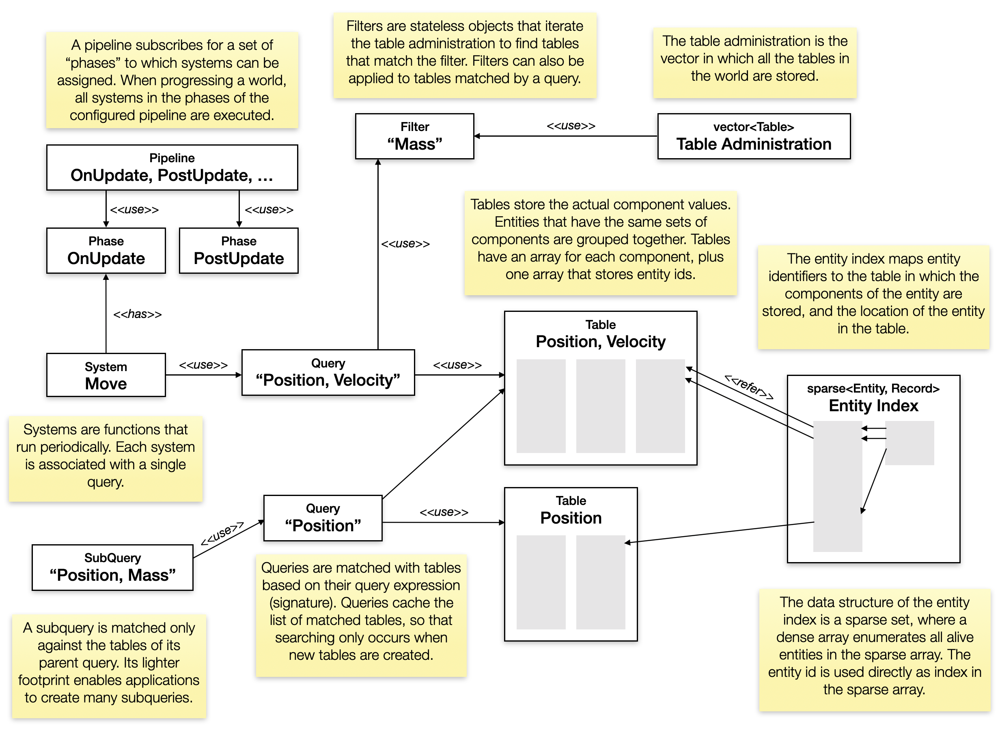
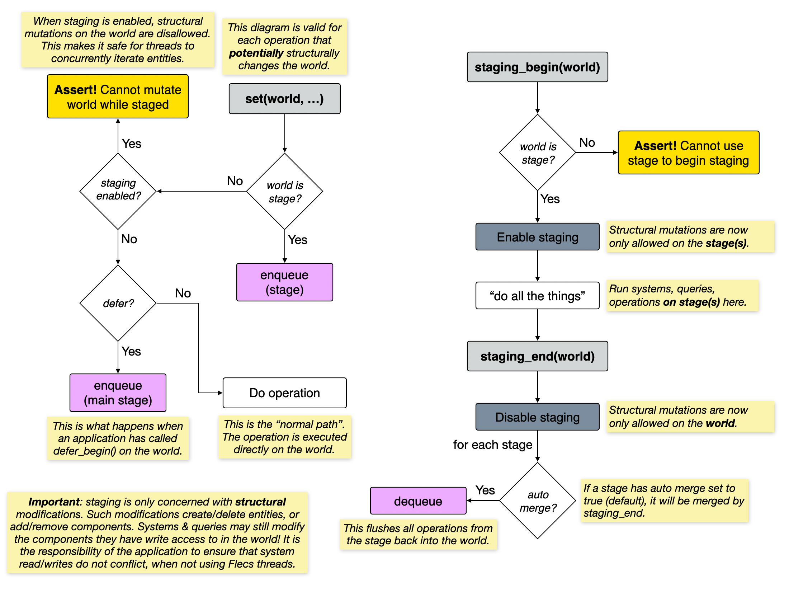

# Flecs Manual

## Introduction
Nobody likes to read manuals, and you should be able to get up and running with Flecs by using the quickstart, by looking at examples and by checking the documentation in the flecs header files. However, if you truly want to know how something works, or why it works that way, the manual is the right place to go. With that said, the manual is not exhaustive, and it complements the other sources of documentation.

## Design Goals

### 1. Performance
Flecs is designed from the ground up to provide blazing fast iteration speeds in systems that can be vectorized by default, while minimizing cache misses. In addition, Flecs has a unique graph-based storage engine that allows for extremely fast add, remove and bulk operations. These features, amongst others, ensure that applications can get the most out of the underlying hardware.

### 2. Portability
Flecs has been implemented in C99 and features an external interface that is C89 compatible to ensure it is portable to a wide range of platforms. The framework contains a flexible operating system abstraction API that enables an application to easily port the library to new platforms.

### 3. Reusability
ECS has the potential for being a platform for the development of reusable, loosely coupled, plug and play features like input, physics and rendering. Flecs modules enable such features to be packaged in a loosely coupled way so that applications can simply import them, while guaranteeing a correct execution order. In addition, Flecs has features like time management that ensure a consistent baseline across modules.

### 4. Usability
Flecs is designed first and foremost to be a framework that simplifies the development of games and simulations. Rather than just providing a vanilla ECS implementation, Flecs provides many features that are commonly found in game development frameworks such as hierarchies, prefabs and time management, all integrated seamlessly with the core ECS system.

### 5. Extensibility
Flecs is used with other frameworks and game engines, and as such not all of its features are useful in each application. For that reason Flecs has a modular design, so that applications can easily remove features from the core that they do not need. Additionally, since many features are built on top of the ECS core, applications can easily extend or reimplement them.

### 6. Have fun!
There are few things as satisfying as building games. If nothing else, Flecs has been built to enable creative visions both big and small. I'm having a lot of fun building Flecs, I hope you will have fun using it, and that your users will have fun playing your games :)

## Concepts
This section describes the high level concepts of Flecs.

### World
The world is the container in which a simulation lives. It stores all of the simulation data, metadata and systems required to run the simulation. An application can have one or more worlds.

### Entity
An entity is a unique, 64-bit identifier that represents a single thing or object in your game. Entities have no behavior, and strictly speaking do not even have a lifecycle. Rather, you should see an entity as a numeric "primary key" that is associated with data in the store. In Flecs, the entity type (`ecs_entity_t`) is just that, a 64-bit integer.

### Component
A component is a datatype that is registered with the world. They can be added to, and removed from an entity. An entity can contain at most a single instance of a component, and can have an infinite number of components (in theory). Flecs internally stores component metadata on an entity, which is why component handles are of type `ecs_entity_t`.

### Tag
A tag is similar to a component, but is not associated with a data type. Just like components, tags are stored as an entity, which is why tag handles are of type `ecs_entity_t`.

### Query
A query allows for high performance iteration of entities that match a certain signature. The signature at a minimum contains information about which components an entity needs to have in order to be matched. Signatures can however be much more complex, and can exclude components, optionally match with components, match with components from specific sources and more.

### System
A system is a function that iterates over entities that, just like queries, match a signature. Systems can either be standalone or part of a _pipeline_, in which case they are executed periodically as part of running the main loop. Flecs internally stores system metadata on an entity, which is why system handles are of type `ecs_entity_t`.

### Phase
A phase identifies a moment in a frame when a system should be executed. A system can only be associated with a single phase. A phase is implemented as a tag, which is why phase handles are of type `ecs_entity_t`. A system can be made part of a phase by adding the phase to the system entity.

### Pipeline
A pipeline contains all the phases that should be executed by the world when a frame is computed. Flecs has a builtin pipeline which contains builtin phase tags, but applications can define their own custom pipelines. Flecs stores pipelin metadata on an entity, which is why pipeline handles are of type `ecs_entity_t`.

### Monitor
A monitor is a special kind of system that is executed when an entity goes from not matching the signature to matching the signature. Monitors can be used to monitor whether an entity has a specific set of entities.

### Set systems
Set systems are a special kind of system that are executed when one or more components are set or unset. Set systems are a reliable way of getting notified when the value of a component changes.

### Trigger
A trigger is a function that is executed when a component is added or removed. Triggers are simpler than systems, and can only be registered for a single component. Flecs stores triggers internally as an entity which is why trigger handles are of type `ecs_entity_t`.

### Type
A type is a collection (vector) of entity identifiers (`ecs_entity_t`) that can describe anything from a set of components, systems and tags, to plain entities. Every entity is associated with exactly one type that describes which components, tags, or other it has.

### Type role
A type role is a flag that indicates which role an entity fulfills in a type. By default this flag is `0`, indicating that the entity should be interpreted as component or tag. Type roles are most commonly used in applications for switch types (`ECS_SWITCH` and `ECS_CASE`)

### Scope
A scope is a virtual container that contains all of the child entities for a specific parent entity. Scopes are not recursive. Scopes are identified by their parent, which is why scope handles are of type `ecs_entity_t`.

### Namespace
Namespace is a different word for scope, and the terms may be used interchangeably. Typically the term namespace is used in relationship to components, systems and modules, whereas the term scope is used in relation to regular entities.

### Module
A module groups components, systems and more into reusable units that can be imported by an application. Contents of a module are by default stored in the scope (or namespace) of the module. Modules can import other modules. A module is only loaded once, regardless of how many times an application imports it.

### Stage
A stage is a temporary storage where structural changes to entities (new, add, remove, delete) are stored while an application is iterating. Flecs systems access raw C arrays, and this ensures that these arrays are not modified as the application is iterating over them. Data in a stage is merged at least once per frame, or more when necessary.

## Diagrams

### High level architecture
This diagram provides an overview of how entiies, components, tables, queries, filters and systems are wired together.


### Component add flow
This diagram provides an overview of the different steps that occur when adding a component to an entity. The diagram shows when component lifecycle callbacks, OnAdd triggers, OnSet systems, UnSet systems and monitors are invoked. Additionally the diagram shows how the defer mechanism is integrated with the listed Flecs operations.


### Component remove flow
This diagram provides an overview of the different steps that occur when removing a component from an entity. The diagram shows when component lifecycle callbacks, OnRemove triggers, OnSet systems, UnSet systems and monitors are invoked. Additionally the diagram shows how the defer mechanism is integrated with the listed Flecs operations.


### Staging flow
This diagram provides an overview of what happens when an application uses staging. Staging is a lockless mechanism that lets threads concurrently read & perform structural changes on the store. Changes are temporarily stored in a command queue per stage, which can be merged with the store when convenient.


## Building
The easiest way to add Flecs to a project is to add [flecs.c](https://raw.githubusercontent.com/SanderMertens/flecs/master/flecs.c) and [flecs.h](https://raw.githubusercontent.com/SanderMertens/flecs/master/flecs.h) to your source code. These files can be added to both C and C++ projects (the C++ API is embedded in flecs.h). Alternatively you can also build Flecs as a library by using the cmake, meson, bazel or bake buildfiles.

### Custom builds
Whether you're looking for a minimal ECS library or a full-fledged system runtime, customizable builds let you remove Flecs features you don't need. By default all features are included. To customize a build, follow these steps:

- define `FLECS_CUSTOM_BUILD`. This removes all optional features from the build.
- define constants for the features you want to include (see below)
- remove the files of the features you don't need

Features are split up in addons and modules. Addons implement a specific Flecs feature, like snapshots. Modules are like addons but register their own components and systems, and therefore need to be imported.

#### Addons
Addons are located in the `src/addons` and `include/addons` folders. The following addons are available:

Addon         | Description                                      | Constant            |
--------------|--------------------------------------------------|---------------------|
Bulk          | Efficient operations that run on many entities   | FLECS_BULK          |
Dbg           | Debug API for inspection of internals            | FLECS_DBG           |
Stats         | Collect statistics on entities and systems       | FLECS_STATS         |
Direct Access | Low-level API for direct access to component data| FLECS_DIRECT_ACCESS |
Module        | Organize components and systems in modules       | FLECS_MODULE        | 
Queue         | A queue data structure                           | FLECS_QUEUE         |
Snapshot      | Take a snapshot that can be restored  afterwards | FLECS_SNAPSHOT      |

#### Builtin modules
Modules are located in the `src/modules` and `include/modules` folders. The following modules are available:

Module        | Description                                      | Constant            |
--------------|--------------------------------------------------|---------------------|
System        | Support for systems, monitors and triggers       | FLECS_SYSTEM        | 
Pipeline      | Run systems each frame and/or multithreaded      | FLECS_PIPELINE      |
Timer         | Run systems at intervals, timeouts or fixed rate | FLECS_TIMER         | 

## API design

### Naming conventions

```c
// Component names ('Position') use PascalCase
typedef struct Position {
    float x;
    float y; // Component members ('y') use snake_case
} Position;

typedef struct Velocity {
    float x;
    float y;
} Velocity;

// System names ('Move') use PascalCase. API types use snake_case_t
void Move(ecs_iter_t *it) {
    // Functions use snake_case
    Position *p = ecs_term(it, Position, 1);
    Velocity *v = ecs_term(it, Velocity, 2);
    
    for (int i = 0; i < it->count; i ++) {
        p[i].x += v[i].x;
        p[i].y += v[i].y;
    }
}

int main(int argc, char *argv[]) {
    ecs_world_t *world = ecs_init();
    
    // Declarative function-style macro's use SCREAMING_SNAKE_CASE
    ECS_COMPONENT(world, Position);
    ECS_COMPONENT(world, Velocity);
    
    // Module names are PascalCase
    ECS_IMPORT(world, MyModule);

    // Enumeration constants ('EcsOnUpdate') use PascalCase
    ECS_SYSTEM(world, Move, EcsOnUpdate, Position, Velocity);

    // Function wrapper macro's use snake_case
    ecs_entity_t e = ecs_new(world, 0);

    // Builtin entities use PascalCase
    ecs_add(world, EcsWorld, Position);
    
    return ecs_fini(world);
}
```

### Idempotence
Many operations in the Flecs API are idempotent, meaning that invoking an operation once has the same effect as invoking an operation multiple times with the same parameters. For example:

```c
ecs_add(world, e, Position);
```

Has the same effect as:

```c
ecs_add(world, e, Position);
ecs_add(world, e, Position);
```

This simplifies application code as it can be written in a declarative style, where the only thing that matters is that after the operation has been invoked, the post condition of the operation is satisfied.

Some operations are idempotent but have side effects, like `ecs_set`:

```c
ecs_set(world, e, Position, {10, 20});
ecs_set(world, e, Position, {10, 20});
```

The effect of invoking this operation once is the same as invoking the operation multiple times, but both invocations can trigger an OnSet system which can introduce side effects.

All declarative macro's (`ECS_COMPONEN`, `ECS_SYSTEM`, ...) are idempotent:

```c
{
    ECS_COMPONENT(world, Position);
}
{
    ECS_COMPONENT(world, Position);
}
```

The second time the `ECS_COMPONENT` macro is evaluated, the first instance will be found and returned. Note that because these macro's may declare variables, they cannot be defined twice in the same C scope.

### Error handling
As a result of the idempotent design of many operations, the API has a very small error surface. There are essentially two conditions under which an operation is unable to fulfill its postcondition:

- The application provides invalid inputs to an operation
- The operating system is unable to fulfill a request, like a failure to allocate memory

When either of those conditions occur, the library will throw an assertion in debug mode (the source is not compiled with `NDEBUG`). Except for errors caused by the OS, errors are almost always caused by the invocation of a single operation, which makes applications easy to debug. 

This approach has several advantages. Application code does not need to check for errors. If an error occurs, the assertion will cause application execution to halt. As a result of this, application code is cleaner and more robust, as it is impossible to forget to handle an error condition. 

### Memory ownership
Most of the API is handle based, as many API constructs are implemented using entities. There are a few instances where an application will interface with memory managed by the framework, or when an application needs to provide memory it manages to the API. In these scenarios there are four rules:

- If an operation accepts a `const T*`, the application retains ownership of the memory
- If an operation accepts a `T*`, ownership is transferred from application to framework
- If an operation returns a `const T*`, the framework retains ownership of the memory
- If an operation returns a `T*`, ownership is transferred from framework to application

The `ecs_get_name` operation is an example where the framework retains ownership:

```c
const char *name = ecs_get_name(world, e);
```

The `ecs_get_fullpath` operation is an example where the ownership is transferred to the application:

```c
char *path = ecs_get_fullpath(world, e);
```

Memory for which ownership has been transferred to the application will need to be freed by the application. This should be done by the `ecs_os_free` operation:

```c
ecs_os_free(path);
```

### Entity names
An application can assign names to entities. Names can be assigned at entity creation, with the `ecs_entity_init` function:

```c
ecs_entity_t e = ecs_entity_init(world, &(ecs_entity_desc_t) {
    .name = "MyEntity"
});
```

Alternatively, names can be assigned afterwards with the `ecs_set_name` function:

```c
ecs_set_name(world, e, "MyEntity");
```

The `ecs_set_name` function may be used as a shortcut to create a new named entity by providing 0 for the entity argument:

```c
ecs_entity_t e = ecs_set_name(world, 0, "MyEntity");
```

The name of an entity can be retrieved with the `ecs_get_name` function:

```c
printf("Name = %s\n", ecs_get_name(world, e));
```

The entity name is stored in the `EcsName` component, which can be retrieved like any component with `ecs_get`:

```c
const EcsName *name = ecs_get(world, e, EcsName);
printf("Name = %s\n", name->value);
```

Names can be used to lookup entities:

```c
ecs_entity_t e = ecs_lookup(world, "MyEntity");
```

When an entity is part of a hierarchy, names can be used to form a path:

```c
ecs_entity_t parent = ecs_new_id(world);
ecs_entity_t child = ecs_new_w_pair(world, EcsChildOf, parent);
ecs_entity_t grandchild = ecs_new_w_pair(world, EcsChildOf, child);

ecs_set_name(world, parent, "Parent");
ecs_set_name(world, child, "Child");
ecs_set_name(world, grandchild, "GrandChild");

char *path = ecs_get_fullpath(world, grandchild);
printf("Path = %s\n", path); // prints Parent.Child.GrandChild
ecs_os_free(path);
```

A path can be created relative to a parent:

```c
char *path = ecs_get_path(world, parent, grandchild);
printf("Path = %s\n", path); // prints Child.GrandChild
ecs_os_free(path);
```

Paths can be used to lookup an entity:

```c
ecs_entity_t e = ecs_lookup_fullpath(world, "Parent.Child.GrandChild");
```

Path lookups may be relative:

```c
ecs_entity_t e = ecs_lookup_path(world, parent, "Child.GrandChild");
```

### Macro's
The C99 API heavily relies on function-style macro's, probably more than you would see in other libraries. The number one reason for this is that an ECS framework needs to work with user-defined types, and C does not provide out of the box support for generics. A few strategies have been employed in the API to improve its overall ergonomics, type safety and readability. Let's start with a simple example:

```c
typedef struct Position {
    float x;
    float y;
} Position;

ECS_COMPONENT(world, Position);

ecs_entity_t e = ecs_new(world, Position);
```

From a readability perspective this code looks fine as we can easily tell what is happening here. Though if we take a closer look, we can see that a typename is used where we expect an expression, and that is not possible in plain C. So what is going on?

Let's first remove the `ECS_COMPONENT` macro and replace it with equivalent code (details are omitted for brevity):

```c
ecs_entity_t ecs_id(Position) = ecs_component_init(world, &(ecs_component_desc_t){
    .entity.name = "Position", 
    .size = sizeof(Position),
    .alignment = ECS_ALIGNOF(Position)
});
ecs_type_t ecs_type(Position) = ecs_type_from_id(world, ecs_id(Position));
```

The first line actually registers the component with Flecs, and captures its name and size. The result is stored in a variable with name `ecs_id(Position)`. Here, `ecs_entity` is a macro that translates the typename of the component to a variable name. The actual name of the variable is:

```c
FLECS__EPosition
```

The second thing that happens is that a type variable is declared with the name `ecs_type(Position)`, which translates to `FLECS__TPosition`. A type is a vector of components. In this case, the type only contains the component id for `Position`. We will see in a moment why this is necessary.

The next statement creates a new entity with the `Position` component. The `ecs_new` function is a macro in disguise, and when it is replaced with the actual code, it looks like this:

```c
ecs_entity_t e = ecs_new_w_type(world, ecs_type(Position));
```

We can see that the actual plain C function that is called is `ecs_new_w_type`, and that the macro is passing in the type variable into the function. When creating a new entity, it can be initialized with multiple components which is why it accepts a type. Other operations, like `ecs_get` only accept a single component, and use the entity variable:

```c
Position *p = ecs_get(world, e, Position);
```

Translates into:

```c
Position *p = (Position*)ecs_get_id(world, e, ecs_id(Position));
```

As you can see, the `ecs_get` macro casts the result of the function to the correct type, so a compiler will throw a warning when an application tries to assign the result of the operation to a variable of the wrong type.

Similarly, `ecs_set` is a macro that ensures that anything we pass into it is of the right type:

```c
ecs_set(world, e, Position, {10, 20});
```

Translates into:

```c
ecs_set_id
    (world, e, ecs_id(Position), sizeof(Position), 
    &(Position){10, 20});
```

In addition to casting the value to the right type and passing in the component, this macro also captures the size of the type, which saves Flecs from having to do a component data lookup.

Understanding how the macro's work will go a long way in being able to write effective code in Flecs, and will lead to less surprises when debugging the code.

## Good practices
Writing code for an Entity Component System is different from object oriented code, and while the concepts are not very complex, it can be counter intuitive if you have never used one. This section provides a couple of guidelines on how to write code for ECS and Flecs specifically to get you started.

### ECS guidelines
The following guidelines apply to ECS in general.

- When building a new feature, start with the components. Spend time thinking about how the components will be used: how often are they written/read, who owns them, how many instances etc.

- Design components so that they have a single purpose. It is much easier / cheaper to combine two components in a query than it is to split up components, which causes a lot of refactoring.

- Don't over-generalize. If your code has lots of branches it is possible that you're trying to do too much with a single component. Consider splitting up components. It's ok to have multiple components with the same fields, if this makes your business logic simpler.

- Minimize the number of branches (`if`, `while`, `for`) in a system. Branches are expensive and prevent vectorization of code.

- Think twice before adding collections to components. Collections are OK if the contents of the collection are meant to be interpreted as an atomic unit, but if the individual elements must be interpreted in a standalone way, consider creating separate entities instead.

- Avoid dependencies / direct interaction between systems. Components are the only things that should be used for inter-system communication.

- Don't store function pointers in components. If you need to provide different (mutually exclusive) implementations for a component, use systems & tags.

- Don't feel like you should store everything in ECS. ECS is great for iterating large sets of entities linearly, but things more specialized than that (like spatial data structures) are better implemented separately. You can always cross-reference entity handles from your specialized data structure.

### Performance guidelines
When starting with ECS, it is important to build intuition around how expensive different operations are in ECS. Here are a few general observations. Note that these may vary across ECS implementations:

- Iteration over large sets of similar entities is super fast

- Random access (`ecs_get`) is comparatively slow

- Entity creation / destruction is cheap when compared with OOP

- Adding/removing components is comparable to creation/deletion

- Creating systems and queries is slow, evaluating systems and queries is very fast

- Creating a filter is fast, evaluating a filter is slow when compared to a query

### Flecs guidelines
The following guidelines apply to Flecs specifically. Following these guidelines will ensure that your applications perform well, are well organized and that their systems can be reused in multiple projects.

- Write periodic logic in systems. Systems provide a unified mechanism for running logic in the main loop and make features like time management available to the application. Writing logic in systems makes it easy to organize features in composable units.

- Always use `delta_time` in simulation systems to progress component values. Aside from making sure the execution of logic is decoupled from the number of frames per second, an application may want to pause or slow down the simulation, which is only possible if all simulation systems consistently use `delta_time`.

- Use POD (plain old data) components wherever possible. 

- Use component lifecycle actions for managing memory owned by a component.

- Preallocate memory where possible with `ecs_dim` and `ecs_dim_type`, as this makes application performance more predictable.

- Decide what your pipeline looks like. A pipeline defines the phases your main loop will go through, and determines where your systems should run. You can use the Flecs builtin pipeline, which enables you to use the flecs module ecosystem, or you can define your own.

- Understand how different components are accessed in each phase of the pipeline. This will help you determine how to assign systems to different pipelines.

- Annotate system signatures with `[in]` and `[out]` where possible. This will not only make it easier for someone to reason about dataflow in an application, but will also allow Flecs to optimize system execution. The default is `[inout]`.

- Organize high level features into modules. Features are often implemented with multiple systems and components, and keeping them together in a module makes it easier to import features, while keeping code organized in large applications.

- Put components that are not specific to any feature in particular (for example: `Position`) in a their own module. Component-only modules provide the bedrock for an ecosystem where different modules can coexist while working on the same data.

- Build declarative, component-driven APIs where possible. Flecs allows applications to define behavior when a component value changes. Using components instead of normal functions enables external tools to introspect and configure your applications, especially when used in combination with modules like `flecs.meta` and `flecs.dash`.

- Use `ecs_progress` to run the main loop. This will make it possible to plug & play new features into application by importing modules from the Flecs ecosystem, and also enable applications to use automatic FPS control, time management and multithreading.

- Use component references (`ecs_get_ref`) when repeatedly accessing the same component. This is a faster alternative to `ecs_get`, with as only downside that a little bit of state has to be stored.

## Entities
Entities are uniquely identifiable objects in a game or simulation. In a real time strategy game, there may be entities for the different units, buildings, UI elements and particle effects, but also for exmaple the camera, world and player. An entity does not contain any state, and is not of a particular type. In a traditional OOP-based game, you may expect a tank in the game is of class "Tank". In ECS, an entity is simply a unique identifier, and any data and behavior associated with that entity is implemented with components and systems.

In Flecs, an entity is represented by a 64 bit integer, which is also how it is exposed on the API:

```c
typedef uint64_t ecs_entity_t;
```

Zero indicates an invalid entity. Applications can create new entities with the `ecs_new` operation:

```c
ecs_entity_t e = ecs_new(world, 0);
```

This operation guarantees to return an unused entity identifier. The first entity returned is not 1, as Flecs creates a number of builtin entities during the intialization of the world. The identifier of the first returned entity is stored in the `EcsFirstUserEntityId` constant.

### Id recycling
Entity identifiers are reused when deleted. The `ecs_new` operation will first attempt to recycle a deleted identifier before producing a new one. If no identifier can be recycled, it will return the last issued identifier + 1. 

Entity identifiers can only be recycled if they have been deleted with `ecs_delete`. When `ecs_delete` is invoked, the generation count of the entity is increased. The generation is encoded in the entity identifier, which means that any existing entity identifiers with the old generation encoded in it will be considered not alive. Calling a delete multiple times on an entity that is not alive has no effect.

When using multiple threads, the `ecs_new` operation guarantees that the returned identifiers are unique, by using atomic increments instead of a simple increment operation. New ids generated from a thread will not be recycled ids, since this would require taking a lock on the administration. While this does not represent a memory leak, it could cause ids to rise over time. If this happens and is an issue, an application should precreate the ids.

### Generations
When an entity is deleted, the generation count for that entity id is increased. The entity generation count enables an application to test whether an entity is still alive or whether it has been deleted, even after the id has been recycled. Consider:

```c
ecs_entity_t e = ecs_new(world, 0);
ecs_delete(world, e); // Increases generation

e = ecs_new(world, 0); // Recycles id, but with new generation
```

The generation is encoded in the entity id, which means that even though the base id is the same in the above example, the value returned by the second `ecs_new` is different than the first.

To test whether an entity is alive, an application can use the `ecs_is_alive` call:

```c
ecs_entity_t e1 = ecs_new(world, 0);
ecs_delete(world, e1);

ecs_entity_t e2 = ecs_new(world, 0);
ecs_is_alive(world, e1); // false
ecs_is_alive(world, e2); // true
```

It is not allowed to invoke operations on an entity that is not alive, and doing so may result in an assert. The only operation that is allowed on an entity that is not alive is `ecs_delete`. Calling delete multiple times on an entity that is not alive will not increase the generation. Additionally, it is also not allowed to add child entities to an entity that is not alive. This will also result in an assert.

There are 16 bits reserved for generation in the entity id, which means that an application can delete the same id 65536 times before the generation resets to 0. To get the current generation of an entity, applications can use the `ECS_GENERATION` macro. To extract the entity id without the generation, an application can apply the `ECS_ENTITY_MASK` with a bitwise and:

```c
ecs_entity_t generation = ECS_GENERATION(e);
ecs_entity_t id = e & ECS_ENTITY_MASK;
```

### Manual id generation
Applications do not have to rely on `ecs_new` and `ecs_delete` to create and delete entity identifiers. Entity ids may be used directly, like in this example:

```c
ecs_add(world, 42, Position);
```

This is particularly useful when the lifecycle of an entity is managed by another data source (like a multiplayer server) and prevents networking code from having to check whether the entity exists. This also allows applications to reuse existing identifiers, as long as these fit inside a 64 bit integer.

When not using manual ids, id recycling mechanisms are bypassed as these are only invoked by the `ecs_new` and `ecs_delete` operations. Combining manual ids with `ecs_new` and `ecs_delete` can result in unexpected behavior, as `ecs_new` may return an identifier that an application has already used.

### Id ranges
An application can instruct Flecs to issue ids from a specific offset and up to a certain limit with the `ecs_set_entity_range` operation. This example ensures that id generation starts from id 5000:

```c
ecs_set_entity_range(world, 5000, 0);
```

If the last issued id was higher than 5000, the operation will not cause the last id to be reset to 5000. An application can also specify the highest id that can be generated:

```c
ecs_set_entity_range(world, 5000, 10000);
```

If invoking `ecs_new` would result in an id higher than `10000`, the application would assert. If `0` is provided for the maximum id, no uppper bound will be enforced.

It is possible for an application to enforce that entity operations (`ecs_add`, `ecs_remove`, `ecs_delete`) are only allowed for the configured range with the `ecs_enable_range_check` operation:

```c
ecs_enable_range_check(world, true);
```

This can be useful for enforcing that an application is not modifying entities that are owned by another datasource.


## Types

### Basic usage
A type is typically used to describe the contents (components) of an entity. A simple example:

```c
// Create entity with type Position
ecs_entity_t e = ecs_new(world, Position);

// Add Velocity to the entity
ecs_add(world, e, Velocity);
```

After running this code, the type can be printed:

```c
// Print the type of the entity
ecs_type_t type = ecs_get_type(world, e);
char *str = ecs_type_str(world, type);
```

Which will produce:

```
Position, Velocity
```

Types can be used to add multiple components in one operation:

```c
ecs_entity_t e2 = ecs_new_w_type(world, type);
```

Alternatively, the `ECS_TYPE` macro can be used to create a type:

```c
ECS_TYPE(world, MyType, Position, Velocity);

ecs_entity_t e = ecs_new(world, MyType);
```

### Advanced usage
A type is stored as a vector of identifiers. Because components are stored as entities in Flecs, a type is defined as (pseudo, not actual definition):

```cpp
typedef vector<ecs_entity_t> ecs_type_t;
```

As a result, an application is able to do this:

```c
ecs_entity_t tag_1 = ecs_new(world, 0);
ecs_entity_t tag_2 = ecs_new(world, 0);

ecs_entity_t e = ecs_new(world, 0);
ecs_add_id(world, e, tag_1);
ecs_add_id(world, e, tag_2);
```

Printing the contents of the type of `e` now would produce something similar to:

```
256, 257
```

When the type contained components the names of the components were printed. This is because the component entities contained an `EcsName` component. The following  example sets the names for `tag_1` and `tag_2`:

```c
ecs_set_name(world, tag_1, "tag_1");
ecs_set_name(world, tag_2, "tag_2");
```

Printing the type again will now produce:

```
tag_1, tag_2
```

### Type roles
Type roles are flags that can be added to an identifier which provide information to how components should behave and be stored. A feature that uses type roles is switch types:

```c
ECS_TAG(world, Running);
ECS_TAG(world, Walking);
ECS_TYPE(world, Movable, Running, Walking);

ecs_entity_t entity = ecs_new_w_id(world, ECS_SWITCH | Movable);
```

Here, `ECS_SWITCH` is the type role. This is an overview of the different roles:

| Flag | Description |
|------|-------------|
| ECS_SWITCH | The entity is a switch type |
| ECS_CASE | The entity is a case belonging to a switch type |
| ECS_OWNED | The entity is a component for which ownership is enforced |

Entities with type roles can be dynamically added or removed:

```c
ecs_add_id(world, entity, ECS_SWITCH | Movable);
ecs_remove_id(world, entity, ECS_SWITCH | Movable);
```

Additionally, type roles can also be used inside of type and signature expressions, such as in the `ECS_TYPE` and `ECS_ENTITY` macro's:

```c
ECS_TAG(world, Running);
ECS_TAG(world, Walking);
ECS_TYPE(world, Movement, Running, Walking);
ECS_ENTITY(world, Parent, Position, SWITCH | Movement, CASE | Running);
```

Note that when used inside a type expression, there is no need to provide the `ECS` prefix.

### Type constraints
Type constraints are special type roles that allow an application to put constraints on what entities a type can contain. Type constraints apply to type
entities, typically created with the `ECS_TYPE` macro. An example:

```c
// Sandwich toppings
ECS_TAG(world, Bacon);
ECS_TAG(world, Lettuce);
ECS_TAG(world, Tomato);

// A type that contains all sandwich toppings
ECS_TYPE(world, Toppings, Bacon, Lettuce, Tomato);

// Create a sandwich entity, enforce it has at least one topping
ECS_ENTITY(world, Sandwich, Bacon, Lettuce, OR | Toppings);
```

The `Sandwich` entity contains an `OR` type constraint that is applied to the `Toppings` type. This enforces that the entity must have _at least one_ of the entities in the `Toppings` type in its type. An overview of the constraints:

| Constraint | Description |
|------|-------------|
| ECS_AND | Entity must have all entities from provided type |
| ECS_OR | Entity must have at least one entity from provided type |
| ECS_NOT | Entity must have no entities from provided type | 
| ECS_XOR | Entity must have exactly one entity from provided type |

Type constraints can be added and removed like other type roles:

```c
ecs_add_id(world, child, ECS_OR | Toppings);
ecs_remove_id(world, child, ECS_OR | Toppings);
```

## Components
A component is a plain datatype that can be attached to an entity. An entity can contain any number of components, and each component can be added only once per entity. Components are registered with a world using the `ECS_COMPONENT` macro, after which they can be added and removed to and from entities. Components can be of any datatype. The following example shows how to register and use components:

```c
// Components can be defined from regular types
typedef struct Position {
    float x, y;
} Position;

int main() {
    ecs_world_t *world = ecs_init();

    // Register the component with the world
    ECS_COMPONENT(world, Position);

    // Create a new entity with the component
    ecs_entity_t e = ecs_new(world, Position);

    // Remove the component from the entity
    ecs_remove(world, e, Position);

    // Add the component again
    ecs_add(world, e, Position);
}
```

Component values can be set with the `ecs_set` operation. If the entity did not yet have the component, it will be added:

```c
ecs_set(world, e, Position, {10, 20});
```

Applications can get the value of a component with the `ecs_get` function:

The value of a component can be requested with `ecs_get`, which will return `NULL` if the entity does not have the component:

```c
const Position *p = ecs_get(world, e, Position);
```

The `ecs_get` operation returns a const pointer which should not be modified by the application. An application can obtain a mutable pointer with `ecs_get_mut`. The `ecs_get_mut` operation ensures that, even when using multiple threads, an application obtains a pointer to a component that can be safely modified, whereas the `ecs_get` operation might return a pointer to memory that is shared between threads. When an application modified a component obtained with `ecs_get_mut`, it should invoke `ecs_modified` to let the framework know the component value was changed. An example:

```c
Position *p = ecs_get_mut(world, e, Position);
p->x ++;
ecs_modified(world, p, Position);
```

### Component handles
In order to be able to add, remove and set components on an entity, the API needs access to the component handle. A component handle uniquely identifies a component and is passed to API functions. There are two types of handles that are accepted by API functions, a type handle and an entity handle. These handles are automatically defined as variables by the `ECS_COMPONENT` macro. If an application wants to use the component in another scope, the handle will have to be either declared globally or passed to that scope explicitly.

#### Global component handles
To globally declare a component, an application can use the `ECS_COMPONENT_DECLARE` and `ECS_COMPONENT_DEFINE` macro's:

```c
// Declare component variable in the global scope
ECS_COMPONENT_DECLARE(Position);

// Function that uses the global component variable
ecs_entity_t create_entity(ecs_world_t *world) {
    return ecs_new(world, Position);
}

int main(int argc, char *argv[]) {
    ecs_world_t *world = ecs_init();

    // Register component, assign id to the global component variable
    ECS_COMPONENT_DEFINE(world, Position);

    ecs_entity_t e = create_entity(world);

    return ecs_fini(world);
}
```

To make a component available for other source files, an application can use the regular `extern` keyword:

```c
extern ECS_COMPONENT_DECLARE(Position);
```

Declaring components globally works with multiple worlds, as the second time a component is registered it will use the same id. There is one caveat: an application should not define a component in world 2 that is not defined in world 1 _before_ defining the shared components. The reason for this is that if world 2 does not know that the shared component exists, it may assign its id to another component, which can cause a conflict.

If this is something you cannot guarantee in an application, a better (though more verbose) way is to use local component handles.

#### Local component handles
When an application cannot declare component handles globally, it can pass component handles manually. Manually passing component handles takes the variables that are declared by the `ECS_COMPONENT` macro and passes them to other functions. This section describes how to pass those handles around.

Some operations can process multiple components in a single operation, like `ecs_add` and `ecs_remove`. Such operations require a handle of `ecs_type_t`. The `ECS_COMPONENT` macro defines a variable of `ecs_type_t` that contains only the id of the component. The variable defined by `ECS_COMPONENT` can be accessed with `ecs_type(ComponentName)`. This escapes the component name, which is necessary as it would otherwise conflict with the C type name. The following example shows how to pass a type handle to another function:

```c
typedef struct Position {
    float x, y;
} Position;

void new_w_position(ecs_world_t *t, ecs_type_t ecs_type(Position)) {
    // ecs_new uses an ecs_type_t
    ecs_new(world, Position);
}

int main() {
    ecs_world_t *world = ecs_init();

    ECS_COMPONENT(world, Position);

    new_w_position(world, ecs_type(Position));

    ecs_fini(world);
}
```

The `ecs_new`, `ecs_add` and `ecs_remove` (not exhaustive) functions are wrapper macro's arround functions functions that accept a type. The following code is equivalent to the previous example:

```c
typedef struct Position {
    float x, y;
} Position;

void new_w_position(ecs_world_t *t, ecs_type_t p_handle) {
    // Use plain variable name with the ecs_new_w_type operation
    ecs_new_w_type(world, p_handle); 
}

int main() {
    ecs_world_t *world = ecs_init();

    ECS_COMPONENT(world, Position);

    new_w_position(world, ecs_type(Position));

    ecs_fini(world);
}
```

There are also operations which operate on a single component at a time, like `ecs_get` and `ecs_set`. These operations require a component handle of type `ecs_entity_t`. The `ECS_COMPONENT` macro defines a variable of type `ecs_entity_t`that contains the id of the component. The variable defined by `ECS_COMPONENT` can be accessed by the application with `ecs_id(ComponentName)`. The following example shows how to pass an entity handle to another function:

```c
typedef struct Position {
    float x, y;
} Position;

void set_position(ecs_world_t *t, ecs_entity_t ecs_id(Position)) {
    ecs_entity_t e = ecs_new(world, 0);
    ecs_set(world, e, Position, {10, 20});
}

int main() {
    ecs_world_t *world = ecs_init();

    ECS_COMPONENT(world, Position);

    set_position(world, ecs_id(Position));

    ecs_fini(world);
}
```

The `ecs_set`, `ecs_get` (not exhaustive) functions are wrapper macro's arround functions functions that accept a type. The following code shows how to use the underlying function for `ecs_get`, `ecs_get_id`:

```c
typedef struct Position {
    float x, y;
} Position;

const Position* get_position(ecs_world_t *t, ecs_entity_t e, ecs_entity_t p_handle) {
    return ecs_get_id(world, e, p_handle);
}

int main() {
    ecs_world_t *world = ecs_init();

    ECS_COMPONENT(world, Position);

    ecs_entity_t e = ecs_new(world, Position);

    Position *p = get_position(world, e, ecs_id(Position));

    ecs_fini(world);
}
```

### Component disabling
Components can be disabled, which prevents them from being matched with queries. Contrary to removing a component, disabling a component does not remove it from an entity. When a component is enabled after disabling it, the original value of the component is restored.

To enable or disable a component, use the `ecs_enable_component` function:

```c
typedef struct Position {
    float x, y;
} Position;

int main() {
    ecs_world_t *world = ecs_init();

    ECS_COMPONENT(world, Position);

    ecs_entity_t e = ecs_new(world, Position);

    /* Component is enabled by default */

    /* Disable the component */
    ecs_enable_component(world, e, Position, false);

    /* Will return false */
    printf("%d\n", ecs_is_component_enabled(world, e, Position));

    /* Re-enable the component */
    ecs_enable_component(world, e, Position, true);

    ecs_fini(world);
}
```

Component disabling works by maintaining a bitset alongside the component array. When a component is enabled or disabled, the bit that corresponds with the entity is set to 1 or 0. Bitsets are not created by default. Only after invoking the `ecs_enable_component` operation for an entity will be entity be moved to a table that keeps track of a bitset for that component.

When a query is matched with a table that has a bitset for a component, it will automatically use the bitset to skip disabled values. If an entity contains multiple components tracked by a bitset, the query will evaluate each bitset and only yield entities for which all components are enabled. To ensure optimal performance, the query will always return the largest range of enabled components. Nonetheless, iterating a table with a bitset is slower than a regular table.

If a query is matched with a table that has one or more bitsets, but the query does not match with components tracked by a bitset, there is no performance penalty.

Component disabling can be used to temporarily suspend and resume a component value. It can also be used as a faster alternative to `ecs_add`/`ecs_remove`. Since the operation only needs to set a bit, it is a significantly faster alternative to adding/removing components, at the cost of a slightly slower iteration speed. If a component needs to be added or removed frequently, enabling/disabling is recommended.

#### Limitations
Component disabling does not work for components not matched with the entity. If a query matches with a component from a base (prefab) or parent entity and the component is disabled for that entity, the query will not take this into account. If entities with disabled components from a base or parent entity need to be skipped. a query should manually check this.

Because component disabling is implemented with a type role, it cannot be used together with other type roles. This means that it is not possible to disable, for example, tags with `SWITCH` or `CASE` roles. Additionally since relationships rely on a role, it is currently not possible to disable relationships such as `(ChildOf, parent)` or `(IsA, prefab)`.

Another limitation is that currently the query NOT (!) operator does not take into account disabled entities. The optional operator (?) technically works, but a query is unable to see whether a component has been set or not as both the enabled and disabled values are returned to the application in a single array.

## Tagging
Tags are much like components, but they are not associated with a data type. Tags are typically used to add a flag to an entity, for example to indicate that an entity is an Enemy:

```c
int main() {
    ecs_world_t *world = ecs_init();

    // Register the tag with the world. There is no Enemy type
    ECS_TAG(world, Enemy);

    // Add the Enemy tag
    ecs_add(world, e, Enemy);

    // Remove the Enemy tag
    ecs_remove(world, e, Enemy);    
}
```

### Tag handles
Just like components, the API needs a handle to a tag before it can use it, and just like `ECS_COMPONENT`, the `ECS_TAG` macro defines two variables, one of type `ecs_type_t` and one of `ecs_entity_t`. Passing a handle of an `ecs_type_t` into a function looks similar to a component:

```c
void new_w_tag(ecs_world_t *t, ecs_type_t ecs_type(Tag)) {
    // ecs_new uses an ecs_type_t
    ecs_new(world, Tag);
}

int main() {
    ecs_world_t *world = ecs_init();

    ECS_TAG(world, Tag);

    new_w_tag(world, ecs_type(Tag));

    ecs_fini(world);
}
```

For functions that require an `ecs_entity_t` handle, the tag variable names are not escaped, since they do not clash with a C type name. An example:

```c
void add_tag(ecs_world_t *t, ecs_entity_t e, ecs_entity_t Tag) {
    ecs_add_id(world, e, Tag);
}

int main() {
    ecs_world_t *world = ecs_init();

    ECS_TAG(world, Tag);

    ecs_entity_t e = ecs_new(world, 0);
    add_tag(world, e, Tag);

    ecs_fini(world);
}
```

Anyone who paid careful attention to this example will notice that the `ecs_add_id` operation accepts two regular entities. 

### Switchable tags
Switchable tags are sets of regular tags that can be added to an entity, except that only one of the set can be active at the same time. This is particularly useful when storing state machines. Consider the following example:

```c
/* Create a Movement switch machine with 3 cases */
ECS_TAG(world, Standing);
ECS_TAG(world, Walking);
ECS_TAG(world, Running);
ECS_TYPE(world, Movement, Standing, Walking, Running); 

/* Create a few entities with various state combinations */
ecs_entity_t e = ecs_new(world, 0);

/* Add the switch to the entity. This lets Flecs know that only one of the tags
 * in the Movement type may be active at the same time. */
ecs_add_id(world, e, ECS_SWITCH | Movement);

/* Add the Standing case to the entity */
ecs_add_id(world, e, ECS_CASE | Standing);

/* Add the Walking case to the entity. This removes Standing */
ecs_add_id(world, e, ECS_CASE | Walking);

/* Add the Running case to the entity. This removes Walking */
ecs_add_id(world, e, ECS_CASE | Running);
```

Switchable tags aren't just convenient, they are also very fast, as changing a case does not move the entity between archetypes like regular tags do. This makes switchable components particularly useful for fast-changing data, like states in a state machine. Systems can query for switchable tags by using the `SWITCH` and `CASE` roles:

```c
/* Subscribe for all entities that are Walking, and have the switch Direction */
ECS_SYSTEM(world, Walk, EcsOnUpdate, CASE | Walking, SWITCH | Direction);
```

See the [switch example](https://github.com/SanderMertens/flecs/blob/master/examples/c/44_switch/src/main.c) for more details.

## Queries
Queries allow an application to iterate entities that match a component expression, called a signature (see "Signatures"). Queries are stateful, in that they are registered with the world, and keep track of a list of entities (archetypes) that they match with. Whenever a new combination of entities is introduced (usually through an `ecs_add` or `ecs_remove` operation) it will be matched with the system, and if it matches, stored in a list with matched tables. This continuous matching process means that when an application starts iterating the query, it does not need to evaluate the query signature, which makes queries the most performant way to iterate entities.

A query can be used like this:

```c
// Create a query for all entities with Position, Velocity
ecs_query_t *query = ecs_query_new(world, "Position, Velocity");

// Create iterator for query
ecs_iter_t it = ecs_query_iter(query);

// Iterate all the matching archetypes
while (ecs_query_next(&it)) {
    // Get the component arrays
    Position *p = ecs_term(&it, Position, 1);
    Velocity *v = ecs_term(&it, Velocity, 2);

    // Iterate the entities in the archetype
    for (int i = 0; i < it.count, i ++) {
        p[i].x += v[i].x;
        p[i].y += v[i].y;
    }
}
```

When an application is iterating the query, it can obtain pointers to the component arrays using the `ecs_term` function, which accepts the iterator, component name and the index of the component in the signature, which is offset by one. In the above example, `1` points to `Position`, which is the first component in the signature. and `2` points to `Velocity` which is the second.

Each time the `ecs_query_next` function returns true, the iterator contains entities that all have the same set of components, or belong to the same archetype, or table. The `count` member of the iterator contains the number of entities in the current table. An application can access the entity identifiers being iterated over with the `entities` member of the iterator:

```c
while (ecs_query_next(&it)) {
    for (int i = 0; i < it.count, i ++) {
        printf("Entity %s\n", ecs_get_name(world, it.entities[i]));
    }
}
```

### Change tracking
An application is able to see whether the entities and components matched with a query have changed since the last iteration with the `ecs_query_changed` function. When this function is invoked for the first time for a query it will always return true. The function should be invoked before obtaining an iterator to the query, as obtaining an iterator resets the state required for change tracking. An example:

```c
if (ecs_query_changed(q)) {
    ecs_iter_t it = ecs_query_iter(q);
    while (ecs_query_next(&it)) {
        // ...
    }
}
```

#### Entity
A query can request a component from a named entity directly as is shown in the following example:

```c
// Shortcut to creating a new named entity
ecs_entity_t e = ecs_set_name(world, 0, "MyEntity");
ecs_set(world, e, Velocity, {1, 2});

ecs_query_t *q = ecs_query_new(world, "Position, MyEntity:Velocity");

ecs_iter_t it = ecs_query_iter(query);

while (ecs_query_next(&it)) {
    Position *p = ecs_term(&it, Position, 1);
    Velocity *v = ecs_term(&it, Velocity, 2);

    for (int i = 0; i < it.count; i ++) {
      p[i].x += v->x;
      p[i].y += v->y;      
    }
}
```

If the named entity does not have the specified component, the query will not match anything.

#### Singleton
The singleton modifier matches a component from a singleton entity. Singletons are entities that are both a component and an entity with an instance of the component. An application can set a singleton component by using the singleton API:

```c
ecs_singleton_set(world, Game, { .max_speed = 100 });
```

Alternatively the regular API can also be used:

```c
ecs_set(world, ecs_id(Game), Game, { .max_speed = 100 });
```

Singleton components can be retrieved from queries like this:

```c
ecs_query_t *query = ecs_query_new(world, "Position, $Game");

ecs_iter_t it = ecs_query_iter(query);

while (ecs_query_next(&it)) {
    Position *p = ecs_term(&it, Position, 1);
    Game *g = ecs_term(&it, Game, 2);

    for (int i = 0; i < it.count; i ++) {
      p[i].x += g->max_speed;
    }
}
```

If the singleton does not exist, the query will not match anything.

#### Nothing
The nothing modifier does not get the component from an entity, but instead just passes its identifier to a query or system. An example:

```c
ecs_query_t *query = ecs_query_new(world, "Position, :Velocity");

ecs_iter_t it = ecs_query_iter(query);

while (ecs_query_next(&it)) {
    Position *p = ecs_term(&it, Position, 1);

    // Get component identifier from column
    ecs_entity_t vel_id = ecs_term_id(&it, 2);
}
```

### Operators
Signatures may contain operators, which allow queries to make more granular selections of entities. The following operators are avaialble:

Operator | Symbol | Description
---------|--------|------------
And      | `,`    | All elements in AND expression must match
Or       | `||`   | At least one components in OR expression must match
Not      | `!`    | Entity should not have component
Optional | `?`    | Entity may have component

Operators can be combined with source modifiers:

```
Position, !PARENT:Velocity
```

#### AND
And is the most common operator, and allows a query to request a set of components that an entity must have in order to be matched. The AND operator takes lowest precedence, and elements in an AND expression may contain other operators. An example of a signature with an `AND` operator is:

```
Position, Velocity
```

#### OR
OR expressions allow a signature to match with one of the components in the OR expression. An example of a signature with an `OR` operator is:

```
Position, Velocity || Speed
```

In this example, any entity that has `Position`, and `Velocity` OR `Speed` will match the signature. Components in an OR expression may contain SOURCE modifiers, but the source modifier must be the same for all elements:

```
Position, PARENT:Velocity || PARENT:Speed
```

#### NOT
Not expressions allow a signature to exclude entities that have a component. An example of a signature with a `NOT` operator is:

```
Position, !Velocity
```

This signature matches all entities that have `Position`, but not have `Velocity`. An expression with a `NOT` column does not pass any data into a system, which means that the `ecs_term` function is guaranteed to return `NULL` for a column.

#### Optional
The optional operator allows a signature to both match entities with and without a specific component. An example with an optional operator is:

```
Position, ?Velocity
```

A query with an optional column should test if the component is set before using it:

```c
ecs_query_t *query = ecs_query_new(world, "Position, CASCADE:Position");

ecs_iter_t it = ecs_query_iter(query);

while (ecs_query_next(&it)) {
    Position *p = ecs_term(&it, Position, 1);
    Velocity *v = ecs_term(&it, Velocity, 2);

    if (v) {
        for (int i = 0; i < it.count, i ++) {
            p[i].x += v[i].x
            p[i].y += v[i].y
        }
    }
}
```

### Access modifiers
A signature can contain access modifiers, which lets the framework know whether a system or query will read or write the component. The following access modifiers are supported:

Modifier | Description
---------|------------
in       | The component is read only
out      | The component is write only
inout    | The component can both be read and written

Access modifiers are added to a signature using angular brackets:

```
[out] Position, [in] Velocity
```

The default access modifier is `[inout]`, which by default allows a system to read and write a component, but also means Flecs cannot make optimizations in, for example, how systems can be executed in parallel. For this reason, while not mandatory, applications are encouraged to add access modifiers to systems where possible.

## Sorting
Applications are able to access entities in order, by using sorted queries. Sorted queries allow an application to specify a component that entities should be sorted on. Sorting is enabled with the `ecs_query_order_by` function:

```c
ecs_query_t q = ecs_query_new(world, "Position");
ecs_query_order_by(world, q, ecs_id(Position), compare_position);
```

This will sort the query by the `Position` component. The function also accepts a compare function, which looks like this:

```c
int compare_position(ecs_entity_t e1, Position *p1, ecs_entity_t e2, Position *p2) {
    return p1->x - p2->x;
}
```

Once sorting is enabled for a query, the data will remain sorted, even after the underlying data changes. The query keeps track of any changes that have happened to the data, and if changes could have invalidated the ordering, data will be resorted. Resorting does not happen when the data is modified, which means that sorting will not decrease performance of regular operations. Instead, the sort will be applied when the application obtains an iterator to the query:

```c
ecs_entity_t e = ecs_new(world, Position); // Does not reorder
ecs_set(world, e, Position, {10, 20}); // Does not reorder
ecs_iter_t it = ecs_query_iter(q); // Reordering happens here
```

The following operations mark data dirty can can trigger a reordering:
- Creating a new entity with the ordered component
- Deleting an entity with the ordered component
- Adding the ordered component to an entity
- Removing the ordered component from an entity
- Setting the ordered component
- Running a system that writes the ordered component (through an [out] column)

Applications iterate a sorted query in the same way they would iterate a regular query:

```c
while (ecs_query_next(&it)) {
    Position *p = ecs_term(&it, Position, 1);

    for (int i = 0; i < it.count; i ++) {
        printf("{%f, %f}\n", p[i].x, p[i].y); // Values printed will be in order
    }
}
```

### Sorting algorithm
The algorithm used for the sort is a quicksort. Each table that is matched with the query will be sorted using a quicksort. As a result, sorting one query affects the order of entities in another query. However, just sorting tables is not enough, as the list of ordered entities may have to jump between tables. For example:

Entitiy | Components (table) | Value used for sorting
--------|--------------------|-----------------------
E1      | Position           | 1
E2      | Position           | 3
E3      | Position           | 4
E4      | Position, Velocity | 5
E5      | Position, Velocity | 7
E6      | Position, Mass     | 8
E7      | Position           | 10
E8      | Position           | 11

To make sure a query iterates the entities in the right order, it will iterate entities in the ordered tables to determine the largest slice of ordered entities in each table, which the query will iterate in order. Slices are precomputed during the sorting step, which means that the performance of query iteration is similar to a regular iteration. For the above set of entities, these slices would look like this:

Table              | Slice
-------------------|-------
Position           | 0..2
Position, Velocity | 3..4
Position, Mass     | 5
Position           | 6..7

This process is transparent for applications, except that the slicing will result in smaller contiguous arrays being iterated by the application.

### Sorting by entity id
Instead of sorting by a component value, applications can sort by entity id by not specifying a component to the `ecs_query_order_by` function:

```c
ecs_query_order_by(world, q, 0, compare_entity);
```

The compare function would look like this:

```c
int compare_position(ecs_entity_t e1, Position *p1, ecs_entity_t e2, Position *p2) {
    return e1 - e2;
}
```

When no component is provided in the `ecs_query_order_by` function, no reordering will happen as a result of setting components or running a system with `[out]` columns.

## Filters
Filters allow an application to iterate through matching entities in a way that is similar to queries. Contrary to queries however, filters are not prematched, which means that a filter is evaluated as it is iterated over. Filters are therefore slower to evaluate than queries, but they have less overhead and are (much) cheaper to create. This makes filters less suitable for repeated-, but useful for ad-hoc searches where the application doesn't know beforehand which set of entities it will need.

A filter can be used like this:

```cpp
ECS_COMPONENT(world, Position);

/* Create filter */
ecs_filter_t filter = {
    .include = ecs_type(Position),
    .include_kind = EcsMatchAll
};

/* Create iterator to filter */
ecs_iter_t it = ecs_filter_iter(world, &filter);

while (ecs_filter_next(&it)) {
    /* Because a filter does not have a signature, we need to get the component
     * array by finding it in the current table */
    ecs_type_t table_type = ecs_iter_type(&it);

    /* First Retrieve the column index for Position */
    int32_t p_index = ecs_type_index_of(table_type, 0, ecs_id(Position));

    /* Now use the column index to get the Position array from the table */
    Position *p = ecs_table_column(&it, p_index);

    /* Iterate as usual */
    for (int i = 0; i < it.count; i ++) {
        printf("{%f, %f}\n", p[i].x, p[i].y);
    }
}
```

A filter can provide an `include` and an `exclude` type, where the `include` type specifies the components the entities must have in order to match the filter, and the `exclude` type specifies the components the entity should not have. In addition to these two fields, the filter provides a `kind` field for both `include` and `exclude` types which can be one of these values:

Option          | Description
----------------|------------------------------------------------------------------------
EcsMatchDefault | Default matching: ECsMatchAny for include, and EcsMatchAll for exclude
EcsMatchAll     | The type must include/excldue all components
EcsMatchAny     | The type must include/exclude one of the components
EcsMatchExact   | The type must match exactly with the components of the entity

## Systems
Systems allow the application to run logic that is matched with a set of entities every frame, periodically or as the result of some event. An example of a simple system definition is:

```c
ECS_SYSTEM(world, Move, EcsOnUpdate, Position, Velocity);
```

In this definition, `Move` is the name of the system and also fo the function that will be registered with the system. `EcsOnUpdate` is the system "phase" which indicates when the system is ran in a frame (see "Pipelines"). The part that follows is the system expression, which follows the rules as described in "Signatures").

A system implementation is a function with the following signature:

```c
void Move(ecs_iter_t *it) { }
```

The implementation of a system is a regular query iteration:

```c
Position *p = ecs_term(it, Position, 1);
Velocity *v = ecs_term(it, Velocity, 2);

for (int i = 0; i < it->count, i ++) {
    p[i].x += v[i].x;
    p[i].y += v[i].y;
}
```

### Using delta_time
A system provides a `delta_time` which contains the time passed since the last frame:

```c
Position *p = ecs_term(it, Position, 1);
Velocity *v = ecs_term(it, Velocity, 2);

for (int i = 0; i < it->count, i ++) {
    p[i].x += v[i].x * it->delta_time;
    p[i].y += v[i].y * it->delta_time;
}
```

This is the value passed into `ecs_progress`:

```c
ecs_progress(world, delta_time);
```

If 0 was provided for `delta_time`, flecs will automatically measure the time passed between the last frame and the current. 

A system may also use the `delta_system_time` member, which is the time elapsed since the last time the system was invoked. This can be useful when a system is not invoked each frame, for example when using a timer.

### Systems and tables
A system may be invoked multiple times per frame. The reason this happens is because entities are stored in different "tables", where each table stores entities of a specific set of components. For example, all entities with components `Position, Velocity` will be stored in table A, where all entities with components `Position, Mass` are stored in table B. Tables ensure that component data is stored in contiguous arrays, and that the same index can be used for a particular entity in all component arrays. Because systems iterate component arrays directly, and because a component can be stored in more than one array, systems need to be invoked once for each table.

The total number of tables a system will iterate over is stored in the `table_count` member of the iterator. Additionally, the `table_offset` member contains the current table being iterated over, so that a system can keep track of where it is in the iteration:

```c
void Move(ecs_iter_t *it) { 
    printf("Iterating table %d / %d\n", it->table_offset, it->table_count);
    // ...
}
```

### Monitors
A monitor is a special kind of system that is executed once when a condition becomes true. A monitor is created just like a regular system, but with the `EcsMonitor` tag:

```c
ECS_SYSTEM(world, OnPV, EcsMonitor, Position, Velocity);
```

This example illustrates when the monitor is invoked:

```c
// Condition is not true: monitor is not invoked
ecs_entity_t e = ecs_new(world, Position);

// Condition is true for the first time: monitor is invoked!
ecs_add(world, e, Velocity);

// Condition is still true: monitor is not invoked
ecs_add(world, e, Mass);

// Condition is no longer true: monitor is not invoked
ecs_remove(world, e, Position);

// Condition is true again: monitor is invoked!
ecs_add(world, e, Position);
```

Note that monitors are never invoked by `ecs_progress`.

An monitor is implemented the same way as a regular system:

```c
void OnPV(ecs_iter_t *it) {
    Position *p = ecs_term(it, Position, 1);
    Velocity *v = ecs_term(it, Velocity, 2);

    for (int i = 0; i < it->count; i ++) {
        /* Monitor code. Note that components may not have
         * been initialized when the monitor is invoked */
    }
}
```

### OnSet Systems
OnSet systems are ran whenever the value of one of the components the system subscribes for changes. An OnSet system is created just like a regular system, but with the `EcsOnSet` tag:

```c
ECS_SYSTEM(world, OnSetPV, EcsOnSet, Position, Velocity);
```

This example illustrates when the monitor is invoked:

```c
ecs_entity_t e = ecs_new(world, 0);

// The entity does not have Velocity, so system is not invoked
ecs_set(world, e, Position, {10, 20});

// The entity has both components, but Velocity is not set
ecs_add(world, e, Velocity);

// The entity has both components, so system is invoked!
ecs_set(world, e, Velocity, {1, 2});

// The entity has both components, so system is invoked!
ecs_set(world, e, Position, {11, 22});
```

An OnSet system is implemented the same way as a regular system:

```c
void OnSetPV(ecs_iter_t *it) {
    Position *p = ecs_term(it, Position, 1);
    Velocity *v = ecs_term(it, Velocity, 2);

    for (int i = 0; i < it->count; i ++) {
        /* Trigger code */
    }
}
```

The opposite of an `EcsOnSet` system is an `EcsUnSet` system:

```c
ECS_SYSTEM(world, UnSetP, EcsUnSet, Position);
```

An UnSet system is invoked when an entity no longer has a value for the specified component:

```c
ecs_entity_t e = ecs_set(world, 0, Position, {10, 20});

// The UnSet system is invoked
ecs_remove(world, e, Position);
```

OnSet and UnSet systems are typically invoked when components are set and removed, but there are two edge cases:

- A component is removed but the entity inherits a value for the component from a base entity. In this case OnSet is invoked, because the value for the component changed.
- The entity does not have the component, but the base that has the component is removed. In this case UnSet is invoked, since the entity no longer has the component.

## Triggers
Triggers are callbacks that are executed when a component is added or removed from an entity. Triggers are similar to systems, but unlike systems they can only match a single component. This is an example of a trigger that is executed when the Position component is added:

```c
ECS_TRIGGER(world, AddPosition, EcsOnAdd, Position);
```

The implementation of the trigger looks similar to a system:

```c
void AddPosition(ecs_iter_t *it) {
    Position *p = ecs_term(it, Position, 1);

    for (int i = 0; i < it->count; i ++) {
        p[i].x = 10;
        p[i].y = 20;
        printf("Position added\n");
    }
}
```

## Modules
Modules allow an application to split up systems and components into separate decoupled units. The purpose of modules is to make it easier to organize systems and components for large projects. Additionally, modules also make it easier to split off functionality into separate compilation units.

A module consists out of a few parts:

- A module type (struct) that stores handles to the contents in the modules
- A macro to declare module contents as local variables in the scope where it is imported
- An import function that loads the module contents for a world

The module type and macro are typically located in the a separate module header file, and look like this for a module named "Vehicles":

```c
typedef struct Car {
    float speed;
} Car;

typedef struct Bus {
    float speed;
} Bus;

typedef struct MotorCycle {
    float speed;
} MotorCycle;

typedef struct Vehicles {
    /* Components are declared with ECS_DECLARE_COMPONENT */
    ECS_DECLARE_COMPONENT(Car);
    ECS_DECLARE_COMPONENT(Bus);
    ECS_DECLARE_COMPONENT(MotorCycle);

    /* Tags are declared with ECS_DECLARE_ENTITY */
    ECS_DECLARE_ENTITY(Moving);

    /* Systems are also declared with ECS_DECLARE_ENTITY */
    ECS_DECLARE_ENTITY(Move);
};

/* Forward declaration to the import function */
void VehiclesImport(ecs_world_t *world);

/* The ImportHandles macro mimics the module struct */
#define VehiclesImportHandles(handles)\
    ECS_IMPORT_COMPONENT(handles, Car);\
    ECS_IMPORT_COMPONENT(handles, Bus);\
    ECS_IMPORT_COMPONENT(handles, MotorCycle);\
    ECS_IMPORT_ENTITY(handles, Moving);\
    ECS_IMPORT_ENTITY(handles, Move);
```

The import function for this module would look like this:

```c
void VehiclesImport(ecs_world_t *world) {
    /* Define the module */
    ECS_MODULE(world, Vehicles);

    /* Declare components, tags and systems as usual */
    ECS_COMPONENT(world, Car);
    ECS_COMPONENT(world, Bus);
    ECS_COMPONENT(world, MotorCycle);
    ECS_TAG(world, Moving);
    ECS_SYSTEM(world, Move, EcsOnUpdate, Car, Moving);

    /* Export them so that they are assigned to the module struct */
    ECS_EXPORT_COMPONENT(world, Car);
    ECS_EXPORT_COMPONENT(world, Bus);
    ECS_EXPORT_COMPONENT(world, Motorcycle);
    ECS_EXPORT_ENTITY(world, Moving);
    ECS_EXPORT_ENTITY(world, Move);
}
```

After the module has been defined, it can be imported in an application like this:

```c
ecs_world_t *world = ecs_init();

/* Import module, which invokes the module import function */
ECS_IMPORT(world, Vehicles);

/* The module contents can now be used */
ecs_entity_t e = ecs_new(world, Car);
```

Module contents are namespaced, which means that the identifiers of the contenst of the module (components, tags, systems) are stored in the scope of the module. For the above example module, everything would be stored in the `vehicles` scope. To resolve the `Car` component by name, an application would have to do:

```c
ecs_entity_t car_entity = ecs_lookup_fullpath(world, "vehicles.Car");
```

Note that even though the module name is specified with uppercase, the name is stored with lowercase. This is because the naming convention for modules in C is PascalCase, whereas the stored identifiers use snake_case. If a module name contains several uppercase letters, this will be translated to a nested module. For example, the C module name `MySimpleModule` will be translated to `my.simple.module`.

### Modules in C++
A module in C++ is defined as a class where the module contents are defined in the constructor. The above Vehicles module would look like this in C++:

```cpp
/* In C++ it is more convenient to define tags as empty structs */
struct Moving { };

/* Module implementation */
class vehicles {
public:
    vehicles(flecs::world& world) {
        flecs::module<Vehicles>(world, "vehicles");

        m_car = flecs::component<Car>(world, "Car");
        m_bus = flecs::component<Bus>(world, "Bus");
        m_motor_cycle = flecs::component<MotorCycle>(world, "MotorCycle");

        m_moving = flecs::component<Moving>(world, "Moving");
        m_move = flecs::system<Car, Moving>(world, "Move")
            .each([](flecs::entity e, Car &car, Moving&) {
                /* System implementation */
            });
    }

    flecs::entity m_car;
    flecs::entity m_bus;
    flecs::entity m_motor_cycle;
    flecs::entity m_moving;
    flecs::entity m_move;
}
```

An application can import the module in C++ like this:

```cpp
flecs::world world;
flecs::import<vehicles>(world);
```

## Hierarchies
Entities in Flecs can be organized in hierarchies, which is useful when for example constructing a scene graph. To create hierarchies, applications can add `ChildOf` relationships to entities. This creates a relationship between a parent entity and a child entity that the application can later traverse. This is an example of a simple hierarchy:

```c
ecs_entity_t parent = ecs_new(world, 0);
ecs_entity_t child = ecs_new_w_pair(world, EcsChildOf, parent);
```

`ChildOf` relationships can be added and removed dynamically, similar to how components can be added and removed:

```c
ecs_add_pair(world, child, EcsChildOf, parent);
ecs_remove_pair(world, child, EcsChildOf, parent);
```

`ChildOf` relationships can also be created through the `ECS_ENTITY` macro:

```c
ECS_ENTITY(world, parent, 0);
ECS_ENTITY(world, child, (ChildOf, parent));
```

### Iteration
Applications can iterate hierarchies breadth first with the `ecs_scope_iter` API in C, and the `children()` iterator in C++. This example shows how to iterate all the children of an entity:

```cpp
ecs_iter_t it = ecs_scope_iter(world, parent);

while(ecs_scope_next(&it)) {
    for (int i = 0; i < it.count; i ++) {
        ecs_entity_t child = it.entities[i];
        char *path = ecs_get_fullpath(world, child);
        printf(" - %s\n", path);
        free(path);
    }
}
```

Additionally, applications can request all children that have a specific set of components, by adding a filter to the scope iterator:

```c
ecs_filter_t f = {
    .include = ecs_type(Position)
};

// Iterate all children that have Position
ecs_iter_t it = ecs_scope_iter_w_filter(world, parent, &f);
```

### Hierarchical queries
Queries and systems can request data from parents of the entity being iterated over with the `PARENT` modifier:

```c
// Iterate all entities with Position that have a parent that also has Position
ecs_query_t *q = ecs_query_new(world, "PARENT:Position, Position");
```

Additionally, a query can iterate the hierarchy in breadth-first order by providing the `CASCADE` modifier:

```c
// Iterate all entities with Position that have a parent that also has Position
ecs_query_t *q = ecs_query_new(world, "CASCADE:Position, Position");
```

This does two things. First, it will iterate over all entities that have Position and that _optionally_ have a parent that has `Position`. By making the parent component optional, it is ensured that if an application is iterating a tree of entities, the root is also included. Secondly, the query iterates over the children in breadth-first order. This is particularly useful when writing transform systems, as they require parent entities to be transformed before child entities.

See the [Signatures](Signatures) section for more details.

### Path identifiers
When entities in a hierarchy have names assigned to them, they can be looked up with path expressions. A path expression is a list of entity names, separated by a scope separator character (by default a `.`, and `::` in the C++ API). This example shows how to request the path expression from an entity:

```c
ECS_ENTITY(world, parent, 0);
ECS_ENTITY(world, child, (ChildOf, parent));

char *path = ecs_get_fullpath(world, child);
printf("%s\n", path); // Prints  "parent.child"
free(path);
```

To lookup an entity using a path, use `ecs_lookup_fullpath`:

```c
ecs_entity_t e = ecs_lookup_fullpath(world, "parent.child");
```

Applications can also lookup entities using a relative path expression:

```c
ecs_entity_t e = ecs_lookup_path(world, parent, "child.grand_child");
```

Additionally, applications can specify a custom path separator when looking up or requesting paths:

```c
// Lookup child::grand_child relative to parent
ecs_entity_t e = ecs_lookup_path_w_sep(
    world, parent, "child::grand_child", "::", "::");

// Get path of child relative to parent
char *path = ecs_get_path_w_sep(world, parent, child, "::", "::");
```

Note that the path separator is provided twice, once for the prefix and once for the separator. This lets the API correctly handle expressions like `::parent::child::grand_child"`.

### Scoping
Applications can set a default scope with the `ecs_set_scope` function, so that all operations are evaluated relative to a scope. The scope is set on a stage, which makes it thread safe when executed from within a flecs worker thread. This example shows how to set the scope:

```c
ecs_entity_t parent = ecs_new(world, 0);

// Set the current scope to the parent
ecs_entity_t prev_scope = ecs_set_scope(world, parent);

// This entity is created as child of parent
ecs_entity_t child = ecs_new(world, 0);

// Look for "child" relative to parent
ecs_entity_t e = ecs_lookup_fullpath(world, "child");

// It's good practice to restore the previous scope
ecs_set_scope(prev_scope);
```

Modules automatically set the scope to the module itself, so that the module acts as a namespace for its contents.

### Paths and signatures
When referencing entities or components in a signature or type expression that are not stored in the root, an application will have to provide the path. Signatures and type expressions always use the dot (`.`) as separator. For example, if a component "Position" is defined in the module "transform", a system subscribing for the component would have to be defined like this:

```c
ECS_SYSTEM(world, Move, EcsOnUpdate, transform.Position);
```

The same goes for other parts of the API that accept a type expression, like `ECS_ENTITY` or `ECS_TYPE`:

```c
ECS_TYPE(world, Movable, transform.Position);
```

If the system would be defined in the same scope as the `Position` component, it would not need to specify the path:

```c
ECS_ENTITY(world, transform, 0);

ecs_entity_t prev_scope = ecs_set_scope(world, transform);

ECS_COMPONENT(world, Position);

// System is in the same scope, no need to add "transform"
ECS_SYSTEM(world, MoveInScope, EcsOnUpdate, Position);

ecs_set_scope(world, prev_scope);

// This system is not in the same scope, and needs to add transform
ECS_SYSTEM(world, MoveNotInScope, EcsOnUpdate, transform.Position);
```

## Inheritance
Inheritance is the ability to share components between entities by _inheriting_ from them, by using the `IsA` relation. This is a simple example in the C API:

```c
// Create a base entity
ecs_entity_t base = ecs_new(world, 0);
ecs_set(world, base, Position, {10, 20});

// Derive from base
ecs_entity_t e = ecs_new_w_pair(world, EcsIsA, base);

// e now shares Position with base
ecs_get(world, base, Position) == ecs_get(world, e, Position); // 1
```

`IsA` relationships can be added and removed dynamically, similar to how components can be added and removed:

```c
ecs_add_id(world, e, (IsA, base));
ecs_remove_id(world, e, (IsA, base));
```

`IsA` relationships can also be created through the `ECS_ENTITY` macro:

```c
ECS_ENTITY(world, base, Position);
ECS_ENTITY(world, e, (IsA, base));
```

`IsA` relationships can be nested:

```c
ecs_entity_t base = ecs_new(world, 0);
ecs_set(world, base, Position, {10, 20});

ecs_entity_t derived = ecs_new_w_pair(world, EcsIsA, base);

// Derive from "derived" which is itself derived from base
ecs_entity_t e = ecs_new_w_pair(world, EcsIsA, derived);

// All three entities now share Position
ecs_get(world, base, Position) == ecs_get(world, e, Position); // 1
ecs_get(world, base, Position) == ecs_get(world, derived, Position);  // 1
```

### Overriding
Derived entities can override components from their base by adding the component as they would normally. When overriding a component, the value of the base component is copied to the entity. This example shows how a derived entity overrides the Position component:

```c
// Shortcut for creating a base entity and setting Position
ecs_entity_t base = ecs_set(world, 0, Position, {10, 20});

// Derive from the base
ecs_entity_t e = ecs_new_w_pair(world, EcsIsA, base);

// Override Position
ecs_add(world, e, Position);

// Position component no longer matches with base
ecs_get(world, base, Position) != ecs_get(world, e, Position); // 1

// Prints {10, 20}
const Position *p = ecs_get(world, e, Position);
printf("{%f, %f}\n", p->x, p->y); 
```

When an entity shared a component from a base entity, we say that the component is "shared". If the component is not shared, it is "owned". After an entity overrides a component, it will own the component.

It is possible to remove an override, in which case the component will be shared with the base entity again:

```c
// Removes override on Position
ecs_remove(world, e, Position);

// Position is again shared with base
ecs_get(world, base, Position) == ecs_get(world, e, Position); // 1
```

Overrides work with nested `IsA` relationships:

```c
// Shortcut for creating a base entity and setting Position
ecs_entity_t base = ecs_new(world, 0);
ecs_set(world, base, Position, {10, 20});
ecs_set(world, base, Velocity, {1, 1});

// Create derived entity, override Position
ecs_entity_t derived = ecs_new_w_pair(world, EcsIsA, base);
ecs_add(world, base, Position);

// Derive from 'derived', which is derived from base
ecs_entity_t e = ecs_new_w_pair(world, EcsIsA, derived);

// The entity now shares Position from derived, and Velocity from base
```

### Automatic overriding
In some scenarios it is desirable that an entity is initialized with a specific set of values, yet does not share the components from the base entity. In this case the derived entity can override each component individually, but this can become hard to maintain as components are added or removed to the base. This can be achieved by marking components as owned. Consider the following example:

```c
// Create a base. Simply deriving the base will share the component, but not override it.
ecs_entity_t Base = ecs_set(world, 0, Position, {10, 20});

// Mark as OWNED. This ensures that when base is derived from, Position is overridden
ecs_add_id(world, world, Base, ECS_OWNED | ecs_id(Position));

// Create entity from BaseType. This adds the IsA relationship in addition 
// to overriding Position, effectively initializing the Position component for the entity.
ecs_entity_t e = ecs_new_w_pair(world, EcsIsA, Base);
```

The combination of instancing, overriding and OWNED is one of the fastest and easiest ways to create an entity with a set of initialized components. The OWNED relationship can also be specified inside type expressions. The following example is equivalent to the previous one:

```c
ECS_ENTITY(world, Base, Position, OWNED | Position);

ecs_set(world, Base, Position, {10, 20});

ecs_entity_t e = ecs_new_w_pair(world, EcsIsA, Base);
```

### Inheritance hierarchies
If a base entity has children, derived entities of that base entity will, when the `IsA` relationship is added, acquire the same set of children. Take this example:

```c
ecs_entity_t parent = ecs_new(world, 0);
ecs_entity_t child_1 = ecs_new_w_pair(world, EcsChildOf, parent);
ecs_entity_t child_2 = ecs_new_w_pair(world, EcsChildOf, parent);

// Derive from parent, two childs are added to the entity
ecs_entity_t e = ecs_new_w_pair(world, EcsIsA, parent);
```

The children that are copied to the entity will have exactly the same set of components as the children of the base. For example, if the base child has components `Position, Velocity`, the derived child will also have `Position, Velocity`. Furthermore, the values of the base child components will be copied to the entity child:

```c
ecs_entity_t parent = ecs_new(world, 0);
ecs_entity_t child = ecs_new_w_pair(world, EcsChildOf, parent);
ecs_set_name(world, child, "Child"); // Give child a name, so we can look it up
ecs_set(world, child, Position, {10, 20});

// Derive from parent, two childs are added to the derived entity
ecs_entity_t e = ecs_new_w_pair(world, EcsIsA, parent);
ecs_entity_t e_child = ecs_lookup_path(world, e, "Child");
const Position *p = ecs_get(world, e_child, Position);
printf("{%f, %f}\n", p->x, p->y); // Prints {10, 20}

// The components are not shared with the derived child!
ecs_get(world, child, Position) != ecs_get(world, e_child, Position); // 1
```

Since the children of the derived entitiy have the exact same components as the base children, their components are not shared. Component sharing between children is possible however, as `IsA` relationships are also copied over to the child of the derived entity:

```c
ecs_entity_t parent = ecs_new(world, 0);

// Create child base from which we will share components
ecs_entity_t child_base = ecs_new(world, 0);
ecs_set(world, child_base, Position, {10, 20});
ecs_set_name(world, child, "Child");

// Create actual child that inherits from the child base
ecs_entity_t child = ecs_new_w_pair(world, EcsChildOf, parent);
ecs_add_pair(world, child, EcsIsA, child_base);

// Inherit from parent, two childs are added to the entity
ecs_entity_t e = ecs_new_w_pair(world, EcsIsA, parent);
ecs_entity_t e_child = ecs_lookup_path(world, e, "Child");

// The component is now shared with the child and child_base
ecs_get(world, child, Position) == ecs_get(world, e_child, Position); // 1
```

### Prefabs
Prefabs are entities that can be used as templates for other entities. Prefabs are regular entities, except that they are not matched by default with systems. To create a prefab, add the `EcsPrefab` tag when creating an entity:

```c
ecs_entity_t prefab = ecs_new_w_id(world, EcsPrefab);
```

The `EcsPrefab` tag can also be added or removed dynamically:

```c
ecs_add_id(world, prefab, EcsPrefab);
ecs_remove_id(world, prefab, EcsPrefab);
```

Prefabs can also be created with the `ECS_PREFAB` macro:

```c
ECS_PREFAB(world, prefab, Position, Velocity);
```

To instantiate a prefab, an application can use the `IsA` relation:

```c
ecs_entity_t e = ecs_new_w_pair(world, (IsA, prefab));
```

To ensure that entities that inherit from a prefab don't also inherit the `Prefab` tag (which would cause them to not get matched with systems), the `Prefab` tag does not propagate to derived entities. This is illustrated in the following example:

```c
ECS_PREFAB(world, prefab, Position);

ecs_has(world, prefab, EcsPrefab); // true
ecs_has(world, prefab, Position); // true

ecs_entity_t e = ecs_new_w_pair(world, (IsA, prefab));
ecs_has(world, e, EcsPrefab); // false
ecs_has(world, e, Position); // true
```

## Deferred operations
Applications can defer entity with the `ecs_defer_begin` and `ecs_defer_end` functions. This records all operations that happen inside the begin - end block, and executes them when `ecs_defer_end` is called. Deferred operations are useful when an application wants to make modifications to an entity while iterating, as doing this without deferring an operation could modify the underlying data structure. An example:

```c
ecs_defer_begin(world);
    ecs_entity_t e = ecs_new(world, 0);
    ecs_add(world, e, Position);
    ecs_set(world, e, Velocity, {1, 1});
ecs_defer_end(world);
```

The effects of these operations will not be visible until the `ecs_defer_end` operation. 

There are a few things to keep in mind when deferring:
- creating a new entity will always return a new id which increases the last used id counter of the world
- `ecs_get_mut` returns a pointer initialized with the current component value, and does not take into account deferred set or get_mut operations
- if an operation is called on an entity which was deleted while deferred, the operation will ignored by `ecs_defer_end`
- if a child entity is created for a deleted parent while deferred, the child entity will be deleted by `ecs_defer_end`

## Staging
When an application is processing the world (using `ecs_progress`) the world enters a state in which all operations are automatically deferred. This ensures that systems can call regular operations while iterating entities without modifying the underlying storage. The queued operations are merged by default at the end of the frame. When using multiple threads, each thread has its own queue. Queues of different threads are processed sequentially.

By default this means that an application will not see the effects of an operation until the end of a frame. When this is undesirable, an application can add `[in]` and `[out]` anotations to a system signature to force a merging the queues mid-frame. When using multiple threads this will represent a synchronization point. Take this (somewhat contrived) example with two systems, without annotations:

```c
// Sets velocity using ecs_set
ECS_SYSTEM(world, SetVelocity, EcsOnUpdate, Position, :Velocity);

// Adds Velocity to Position
ECS_SYSTEM(world, Move, EcsOnUpdate, Position, [in] Velocity);
```

With the following implementation for `SetVelocity`:

```c
void SetVelocity(ecs_iter_t *it) {
    ecs_entity_t ecs_id(Velocity) = ecs_term_id(it, 2);

    for (int i = 0; i < it->count; i ++) {
        ecs_set(world, it->entities[i], Velocity, {1, 2});
    }
}
```

As `SetVelocity` is using `ecs_set` to set the `Velocity`, the effect of this operation will not be visible until the end of the frame, which means that the `Move` operation will use the `Velocity` value of the previous frame. An application can enforce that the queue is flushed before the `Move` system by annotating the system like this:

```
ECS_SYSTEM(world, SetVelocity, EcsOnUpdate, Position, [out] :Velocity);
```

Notice the `[out]` annotation that has been added to the `:Velocity` argument. This indicates to flecs that the system will be deferring operations that write the `Velocity` component, and as a result of that the queue will be flushed before `Velocity` is read. Since the `Move` system is reading the `Velocity` component, the queue will be flushed before the `Move` system is executed.

Note that merging is expensive, especially in multithreaded applications, and should be minimized whenever possible.

In some cases it can be difficult to predict which components a system will write. This typically happens when a system deletes an entity (all components of the entity will be "written") or when a new entity is created from a prefab and components are overridden automatically. When these operations cannot be deferred, a system can force a sync point without having to specify all possible components that can be written by using a wildcard:

```c
ECS_SYSTEM(world, DeleteEntity, EcsOnUpdate, Position, [out] :*);
```

This is interpreted as the system may write any component, and forces a sync point.

## Pipelines
A pipeline defines the different phases that are executed for each frame. By default an application uses the builtin pipeline which has the following phases:

- EcsOnLoad
- EcsPostLoad
- EcsPreUpdate
- EcsOnUpdate
- EcsOnValidate
- EcsPostUpdate
- EcsPreStore
- EcsOnStore

These phases can be provided as an argument to the `ECS_SYSTEM` macro:

```c
// System ran in the EcsOnUpdate phase
ECS_SYSTEM(world, Move, EcsOnUpdate, Position, Velocity);

// System ran in the EcsOnValidate phase
ECS_SYSTEM(world, DetectCollisions, EcsOnValidate, Position);
```

An application can create a custom pipeline, like is shown here:

```c
// Create a tag for each phase in the custom pipeline.
// The tags must be created in the phase execution order.
ECS_TAG(world, BeforeFrame);
ECS_TAG(world, OnFrame);
ECS_TAG(world, AfterFrame);

// Create the pipeline
ECS_PIPELINE(world, MyPipeline, BeforeFrame, OnFrame, AfterFrame);

// Make sure the world uses the correct pipeline
ecs_set_pipeline(world, MyPipeline);
```

Now the application can create systems for the custom pipeline:

```c
// System ran in the OnFrame phase
ECS_SYSTEM(world, Move, OnFrame, Position, Velocity);

// System ran in the AfterFrame phase
ECS_SYSTEM(world, DetectCollisions, AfterFrame, Position);

// This will now run systems in the custom pipeline
ecs_progress(world, 0);
```

## Time management

## Timers

## Snapshots

## Serialization

## Bulk operations

## Statistics

## Threading
Applications can multithread systems by configuring the number of threads for a world. The approach to multithreading is simple, but does not require locks and works well in applications that have "pure" ECS systems, that is systems that only modify the components subscribed for in their signature.

When a world has multiple threads, each thread will run all systems. Each system will ensure that it only processes a subset of the entities that is allocated to the thread. It does this by dividing up each table into slices of equal size, and assigning those slices to the threads. Since entities do not move around inbetween synchronization points, this approach ensures that each entity will always be allocated to the same thread. When systems only access components that are queried for, race conditions cannot occur without relying on locking.

Threads are created when the `ecs_set_threads` function is invoked. An application may change the number of threads by repeatedly invoking this function, as long as the world is not progressing. Threads are not recreated for each frame to reduce the overhead of multithreading. Instead threads will be signalled by the main thread when a frame starts, and the main thread will wait on the threads before ending the frame.

No structural changes (adding/removing components, or deleting an entity) are allowed while a thread is evaluating the systems. If a system does a structural change, it is deferred until the next synchronization point. During synchronization, all deferred operations will be flushed by the main thread.

By default there is only a single synchronization point at the end of the frame, and a thread will run all of its systems to completion for each frame. This parallelizes extremely well, even in the case where there are lots of systems with small workloads, as all the logic for a frame can be executed without any waiting or taking any locks. If a system has deferred structural changes that are required by a subsequent system however, a mid-frame synchronization point may be necessary. In this case an application can annotate system signatures to enforce synchronization points, as is described in (Staging)[#staging]. The advantage of this approach is that synchronization points are not explicitly created, but automatically derived, which prevents having to specify explicit dependencies between systems.

This approach does have some obvious limitations. All systems are parallelized, which can cause problems when a system's logic needs to be executed for example on the main thread (as is often the case for rendering logic). Additionally, if a system reads from component references, as is the case with systems that retrieve components from prefabs or parent entities, this approach can introduce race conditions where a component value is read while it is being updated. These are known issues, and improvements to the threading framework are scheduled for future versions.

## Tracing

## Debug API

## OS Abstraction API
