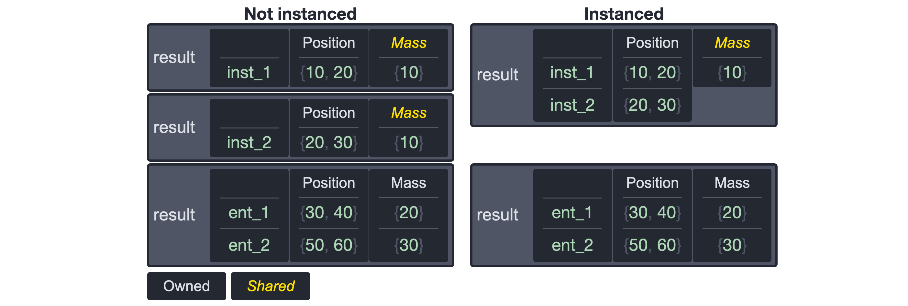

# Queries
At the core of an Entity Component System are queries, which make it possible to find entities matching a list of conditions in realtime, for example:

```
Position, Velocity
```

This query returns all entities that at least have the `Position` and `Velocity` components. Queries provide direct access to cache efficient storages of matched components, which gives applications the ability to process large numbers (think millions) of entities each frame.

## Highlights
Here are some of the highlights of Flecs queries:

- Queries can [cache results](#cached-queries), which removes search overhead from time critical game loops

- Queries can efficiently traverse [entity relationship](#Relationships) graphs, reducing the need for building custom hard to maintain data structures ([blog](https://ajmmertens.medium.com/building-games-in-ecs-with-entity-relationships-657275ba2c6c)).

- Queries can be created at runtime and match components that are created at runtime.

- Queries support `and`, `or`, `not` and `optional` [operators](#operator-overview).

- Queries can combine components from multiple [sources](#source), like a transform system that uses `Position` component from an entity and its parent.

- Queries can be observed, allowing applications to get notified when entities start or stop matching a query.

- Query results are self describing, which means iterators can be passed to generic code which can then do things like [serializing it to JSON](https://github.com/SanderMertens/flecs/blob/master/include/flecs/addons/json.h).

- Queries can be created with the regular API or by parsing a query string, making it possible to [create tools that create queries at runtime](https://www.flecs.dev/explorer/).

- Queries support [component inheritance](/examples/cpp/rules/component_inheritance).

## Definitions

| Name         | Description |
|--------------|-------------|
| Id           | An id that can be matched, added and removed |
| Component    | Id with a single element (same as an entity id) |
| Pair         | Id with two elements |
| Tag          | Component or pair not associated with data |
| Relationship | Used to refer to first element of pair |
| Target       | Used to refer to second element of pair |
| Source       | Entity on which a term is matched |
| Iterator     | Object used to iterate a query |
| Field        | A single value or array of values made available by an iterator. An iterator usually provides a field per query term. |

## Examples
Make sure to check out the code examples in the repository:

https://github.com/SanderMertens/flecs/tree/master/examples

 - [queries (C)](https://github.com/SanderMertens/flecs/tree/master/examples/c/queries)
 - [queries (C++)](https://github.com/SanderMertens/flecs/tree/master/examples/cpp/queries)
 - [rules (C)](https://github.com/SanderMertens/flecs/tree/master/examples/c/rules)
 - [rules (C++)](https://github.com/SanderMertens/flecs/tree/master/examples/cpp/rules)

## Types
Flecs has different query types, which are optimized for different kinds of use cases. This section provides a brief overview of each kind:

 ### Filters
 Filters are cheap to create, low overhead, reasonably efficient to iterate. They are good for ad-hoc queries with runtime-defined conditions. An example:
 
 ```c
 ecs_filter_t *f = ecs_filter(world, {
    .terms = {
        { ecs_id(Position) }, { ecs_id(Velocity) }
    }
});

ecs_iter_t it = ecs_filter_iter(world, f);
while (ecs_filter_next(&it)) {
    Position *p = ecs_field(&it, Position, 1);
    Velocity *v = ecs_field(&it, Velocity, 2);

    for (int i = 0; i < it.count; i ++) {
        p[i].x += v[i].x;
        p[i].y += v[i].y;
    }
}
```
```cpp
flecs::filter<Position, Velocity> f = 
    world.filter<Position, Velocity>();

f.each([](Position& p, Velocity& v) {
    p.x += v.x;
    p.y += v.y;
});
```

### Cached Queries
Cached queries cache the output of a filter. They are more expensive to create and have higher overhead, but are the fastest to iterate. Cached queries are the default for systems. An example:

```c
ecs_query_t *q = ecs_query(world, {
    .filter.terms = {
        { ecs_id(Position) }, { ecs_id(Velocity) }
    }
});

ecs_iter_t it = ecs_query_iter(world, q);
while (ecs_query_next(&it)) {
    Position *p = ecs_field(&it, Position, 1);
    Velocity *v = ecs_field(&it, Velocity, 2);

    for (int i = 0; i < it.count; i ++) {
        p[i].x += v[i].x;
        p[i].y += v[i].y;
    }
}
```
```cpp
flecs::query<Position, Velocity> q = 
    world.query<Position, Velocity>();

q.each([](Position& p, Velocity& v) {
    p.x += v.x;
    p.y += v.y;
});
```

### Rules
Rules are a constraint-based query engine capable of traversing graphs. They are more expensive to create than filters, have low overhead, and their iteration performance depends on query complexity. An example:

```c
ecs_rule_t *r = ecs_rule(world, {
    .terms = {
        { ecs_id(Position) }, { ecs_id(Velocity) }
    }
});

ecs_iter_t it = ecs_rule_iter(world, r);
while (ecs_rule_next(&it)) {
    Position *p = ecs_field(&it, Position, 1);
    Velocity *v = ecs_field(&it, Velocity, 2);

    for (int i = 0; i < it.count; i ++) {
        p[i].x += v[i].x;
        p[i].y += v[i].y;
    }
}
```
```cpp
flecs::rule<Position, Velocity> r = 
    world.rule<Position, Velocity>();

r.each([](Position& p, Velocity& v) {
    p.x += v.x;
    p.y += v.y;
});
```

For more information on how each implementation performs, see [Query Performance](#query-performance).

## Creation
This section explains how to create queries in the different language bindings and the flecs query DSL.

### Query Descriptors (C)
Query descriptors are the C API for creating queries. The API uses a type called `ecs_filter_desc_t`, to describe the structure of a query. This type is used to create all query kinds (`ecs_filter_t`, `ecs_query_t`, `ecs_rule_t`). An example:

```c
ecs_filter_t *f = ecs_filter(world, {
  .terms = {
    { ecs_id(Position) }, { ecs_id(Velocity) },
  }
});
```

The example shows the short notation, which looks like this when expanded:

```c
ecs_filter_t *f = ecs_filter_init(world, &(ecs_filter_desc_t){
  .terms = {
    { ecs_id(Position) }, { ecs_id(Velocity) },
  }
});
```

Query descriptors can also be used by the C++ API. However because C++ does not support taking the address of a temporary, and not all language revisions support designated initializers, query descriptors in C++ should be used like this:

```c
ecs_filter_desc_t desc = {}; // Zero-initialize the struct
desc.terms[0].id = ecs_id(Position);
desc.terms[1].id = ecs_id(Velocity);
ecs_filter_t *f = ecs_filter_init(world, &desc);
```

The following table provides an overview of the query types with the init/fini functions:

| Kind   | Type           | Init              | Fini              | Descriptor type     |
|--------|----------------|-------------------|-------------------|---------------------|
| Filter | `ecs_filter_t` | `ecs_filter_init` | `ecs_filter_fini` | `ecs_filter_desc_t` |
| Query  | `ecs_query_t`  | `ecs_query_init`  | `ecs_query_fini`  | `ecs_query_desc_t`  |
| Rule   | `ecs_rule_t`   | `ecs_rule_init`   | `ecs_rule_fini`   | `ecs_filter_desc_t` |

Additionally the descriptor types for systems (`ecs_system_desc_t`) and observers (`ecs_observer_desc_t`) embed the `ecs_filter_desc_t` descriptor type.

### Query Builder (C++)
Query builders are the C++ API for creating queries. The builder API is built on top of the descriptor API, and adds a layer of convenience and type safety that matches modern idiomatic C++. The builder API is implemented for all query kinds (filters, cached queries, rules). An example of a simple query:

```cpp
flecs::filter<Position, const Velocity> f = 
    world.filter<Position, const Velocity>();
```

Queries created with template arguments provide a type safe way to iterate components:

```cpp
f.each([](Position& p, const Velocity& v) {
    p.x += v.x;
    p.y += v.y;
});
```

The builder API allows for incrementally constructing queries:

```cpp
flecs::filter<Position> q = world.filter_builder<Position>();
f.term<const Velocity>();

if (add_npc) {
    f.term<Npc>(); // Conditionally add
}

f.build(); // Create query
```

The following table provides an overview of the query types with the factory functions:

| Kind   | Type            | Factory                 |
|--------|-----------------|-------------------------|
| Filter | `flecs::filter` | `world::filter_builder` |
| Query  | `flecs::query`  | `world::query_builder`  |
| Rule   | `flecs::rule`   | `world::rule_builder`   |

Additional helper methods have been added to the C++ API to replace combinations of the `term` method with other methods. They are the following:

| Term                   | Equivalent                   |
|------------------------|------------------------------|
| `.with<Component>()`   | `.term<Component>()`         |
| `.without<Component>()`| `.term<Component>().not_()`  |
| `.read<Component>()`   | `.term<Component>().read()`  |
| `.write<Component>()`  | `.term<Component>().write()` |

### Query DSL
The query DSL (domain specific language) is a string format that can represent a query. The query DSL is used by convenience macros in the C API like `ECS_SYSTEM` and `ECS_OBSERVER`, and makes it easier to create queries at runtime for tools like https://www.flecs.dev/explorer/. An example of a simple query in the DSL:

```
Position, [in] Velocity
```

An example of how the DSL is used with the `ECS_SYSTEM` convenience macro:

```c
ECS_SYSTEM(world, Move, EcsOnUpdate, Position, [in] Velocity);
```

Queries can be created from expressions with both the descriptor and builder APIs:

```c
ecs_filter_t *f = ecs_filter(world, {
  .expr = "Position, [in] Velocity"
});
```
```cpp
flecs::filter<> f = world.filter_builder()
  .expr("Position, [in] Velocity")
  .build();
```

The query DSL requires the `FLECS_PARSER` addon to be included in a build.

## Iteration
This section describes the different ways queries can be iterated. The code examples use filters, but also apply to cached queries and rules.

### Iterators (C)
In the C API an iterator object of type `ecs_iter_t` can be created for each of the query kinds, using the `ecs_filter_iter`, `ecs_query_iter` and `ecs_rule_iter` functions. This iterator can then be iterated with the respective `next` functions: `ecs_filter_next`, `ecs_query_next` and `ecs_rule_next`.

An iterator can also be iterated with the `ecs_iter_next` function which is slightly slower, but does not require knowledge about the source the iterator was created for.

An example:

```c
ecs_filter_t *f = ecs_filter(world, {
  .terms = {
    { ecs_id(Position) }, { ecs_id(Velocity) },
  }
});

ecs_iter_t it = ecs_filter_iter(world, f);

// Outer loop: matching tables
while (ecs_filter_next(&it)) {
  Position *p = ecs_field(&it, Position, 1); // 1st term
  Velocity *v = ecs_field(&it, Velocity, 2); // 2nd term

  // Inner loop: entities in table
  for (int i = 0; i < it.count; i ++) {
    p[i].x += v[i].x;
    p[i].y += v[i].y;
  }
}
```

Iteration is split up into two loops: the outer loop which iterates tables, and the inner loop which iterates the entities in that table. This approach provides direct access to component arrays, which allows compilers to do performance optimizations like auto-vectorization.

The indices provided to the `ecs_field` function must correspond with the order in which terms have been specified in the query. This index starts counting from `1`, with index `0` reserved for the array containing entity ids.

### Each (C++)
The `each` function is the default and often fastest approach for iterating a query in C++. `each` can be called directly on a `flecs::filter`, `flecs::query` and `flecs::rule`. An example:

```cpp
auto f = world.filter<Position, const Velocity>();

f.each([](Position& p, const Velocity& v) {
    p.x += v.x;
    p.y += v.y;
});
```

A `flecs::entity` can be added as first argument:

```cpp
auto f = world.filter<Position>();

f.each([](flecs::entity e, Position& p) {
    std::cout << e.name() << ": " 
              << p.x << ", " << p.y 
              << std::endl;
});
```

A `flecs::iter` and `size_t` argument can be added as first arguments. This variant of `each` provides access to the `flecs::iter` object, which contains more information about the object being iterated. The `size_t` argument contains the index of the entity being iterated, which can be used to obtain entity-specific data from the `flecs::iter` object. An example:

```cpp
auto f = world.filter_builder<Position>()
  .term(Likes, flecs::Wildcard)
  .build();

f.each([](flecs::iter& it, size_t index, Position& p) {
    flecs::entity e = it.entity(index);
    std::cout << e.name() << ": " 
              << it.id(2).str() // prints pair
              << std::endl;
});
```

When a query contains a template argument that is an empty type (a struct without any members), it should be passed by value instead of by reference:

```cpp
struct Tag { };

auto f = world.filter<Tag>();

f.each([](flecs::entity e, Tag) {
    std::cout << e.name() << std::endl;
});
```

Alternatively an empty type can be specified outside of the query type, which removes it from the signature of `each`:

```cpp
struct Tag { };

auto f = world.filter_builder()
  .term<Tag>()
  .build();

f.each([](flecs::entity e) {
    std::cout << e.name() << std::endl;
});
```

### Iter (C++)
The `iter` function has an outer and inner loop (similar to C iterators) which provides more control over how to iterate entities in a table than `each`. The `iter` function makes it possible, for example, to run code only once per table, or iterate entities multiple times.

An example:

```cpp
auto f = world.filter<Position, const Velocity>();

f.iter([](flecs::iter& it, Position *p, Velocity *v) {
    // Inner loop
    for (auto i : it) {
        p[i].x += v[i].x;
        p[i].y += v[i].y;
        std::cout << it.entity(i).name() << ": " 
            << p.x << ", " << p.y 
            << std::endl;
    }
});
```

Instead of using `flecs::iter` as iterator directly, an application can also use the `flecs::iter::count` method which provides more flexibility:

```cpp
f.iter([](flecs::iter& it, Position *p, Velocity *v) {
    // Inner loop with manual iteration
    for (size_t i = 0; i < it.count(); i ++) {
      // ...
    }
});
```

The component arguments may be omitted, and can be obtained from the iterator object:

```cpp
auto f = world.filter<Position, const Velocity>();

f.iter([](flecs::iter& it) {
    auto p = it.field<Position>(1);
    auto v = it.field<const Velocity>(2);

    for (auto i : it) {
        p[i].x += v[i].x;
        p[i].y += v[i].y;
    }
});
```

This can be combined with an untyped variant of the `field` method to access component data without having to know component types at compile time. This can be useful for generic code, like serializers:

```cpp
auto f = world.filter<Position, const Velocity>();

f.iter([](flecs::iter& it) {
    void *ptr = it.field(1);
    flecs::id type_id = it.id(1);

    // ...
});
```

### Iteration safety
Entities can be moved between tables when components are added or removed. This can cause unwanted side effects while iterating a table, like iterating an entity twice, or missing an entity. To prevent this from happening, a table is locked by the C++ `each` and `iter` functions, meaning no entities can be moved from or to it.

When an application attempts to add or remove components to an entity in a table being iterated over, this can throw a runtime assert. An example:

```cpp
auto f = world.filter<Position>();

f.each([](flecs::entity e, Position&) {
    e.add<Velocity>(); // throws locked table assert
});
```

This can be addressed by deferring operations while the query is being iterated:

```cpp
auto f = world.filter<Position>();

world.defer([&]{
    f.each([](flecs::entity e, Position&) {
        e.add<Velocity>(); // OK
    });
}); // operations are executed here
```

An application can also use the `defer_begin` and `defer_end` functions which achieve the same goal:

```cpp
auto f = world.filter<Position>();

world.defer_begin();

f.each([](flecs::entity e, Position&) {
    e.add<Velocity>(); // OK
});

world.defer_end(); // operations are executed here
```

Code ran by a system is deferred by default.

## Reference
This section goes over the different features of queries and how they can be expressed by the query descriptor API, query builder API and in the query DSL.

### Components
> *Supported by: filters, cached queries, rules*

A component is any single id that can be added to an entity. This includes tags and regular entities, which are ids that are not associated with a datatype.

To match a query, an entity must have all the requested components. An example:

```cpp
flecs::entity e1 = world.entity()
  .add<Position>();

flecs::entity e2 = world.entity()
  .add<Position>()
  .add<Velocity>();

flecs::entity e3 = world.entity()
  .add<Position>()
  .add<Velocity>()
  .add<Mass>();
```

Only entities `e2` and `e3` match the query `Position, Velocity`.

The following sections describe how to create queries for components in the different language bindings. The code examples use filter queries, but also apply to queries and rules.

#### Query Descriptor (C)
To query for a component in C, the `id` field of a term can be set:

```c
ECS_COMPONENT(world, Position);
ECS_COMPONENT(world, Velocity);

ecs_filter_t *f = ecs_filter(world, {
  .terms = {
    { .id = ecs_id(Position) }, 
    { .id = ecs_id(Velocity) }
  }
});
```

The `id` field is guaranteed to be the first member of a term, which allows the previous code to be rewritten in this shorter form:

```c
ecs_filter_t *f = ecs_filter(world, {
  .terms = {
    { ecs_id(Position) }, 
    { ecs_id(Velocity) }
  }
});
```

The `ecs_id` macro converts the component typename into the variable name that holds the component identifier. This macro is required for components created with `ECS_COMPONENT`, but not when querying for regular tags/entities:

```c
ECS_TAG(world, Npc);
ecs_entity_t Platoon_01 = ecs_new_id(world);

ecs_filter_t *f = ecs_filter(world, {
  .terms = {
    { Npc }, 
    { Platoon_01 }
  }
});
```

Components can also be queried for by name by setting the `.first.name` member in a term:

```c
ECS_COMPONENT(world, Position);
ECS_COMPONENT(world, Velocity);

ecs_filter_t *f = ecs_filter(world, {
  .terms = {
    { .first.name = "Position" }, 
    { .first.name = "Velocity" }
  }
});
```

#### Query Builder (C++)
An easy way to query for components in C++ is to pass them as template arguments to the query factory function:

```cpp
flecs::filter<Position, const Velocity> f = 
    world.filter<Position, const Velocity>();
```

This changes the returned query type, which determines the type of the function used to iterate the query:

```cpp
f.each([](Position& p, const Velocity& v) { });
```

The builder API makes it possible to add components to a query without modifying the query type:

```cpp
flecs::filter<Position> f = 
  world.filter_builder<Position>()
    .term<const Velocity>()
    .build();
```

When template arguments are mixed with the builder API, the components added by the `term` function will be placed after the components provided as template arguments.

The builder API makes it possible to query for regular entity ids created at runtime:

```cpp
flecs::entity Npc = world.entity();
flecs::entity Platoon_01 = world.entity();

flecs::filter<> f = world.filter_builder()
  .term(Npc)
  .term(Platoon_01)
  .build();
```

Components can also be queried for by name. To query for component types by name, they have to be used or registered first.

```cpp
// Register component type so we can look it up by name
world.component<Position>();

// Create entity with name so we can look it up
flecs::entity Npc = world.entity("Npc");

flecs::filter<> f = world.filter_builder()
  .term("Position")
  .term("Npc")
  .build();
```

#### Query DSL
To query for a components in the query DSL they can be specified in a comma separated list of identifiers. The rules for resolving identifiers are the same as the `ecs_lookup_fullpath` / `world.lookup` functions. An example:

```
Position, Velocity
```

Any named entity can be specified this way. Consider:

```cpp
struct Npc { };

// Register component type so we can look it up by name
world.component<Npc>();

// Create entity with name so we can look it up
flecs::entity Platoon_01 = world.entity("Platoon_01");

flecs::entity e = world.entity()
  .add<Npc>()
  .add(Platoon_01);
```

The entity `e` from this example will be matched by this query:
```cpp
Npc, Platoon_01
```

When an identifier in the query DSL consists purely out of numeric characters it is converted to an entity id. If in the previous example `Npc` has id `100` and `Platoon_01` has id `101`, the following query string would be equivalent:

```
100, 101
```

The `,` symbol in the query DSL is referred to as the `and` operator, as an entity must have all comma-separated components in order to match the query.

### Wildcards
> *Supported by: filters, cached queries, rules*

Wildcards allow a single query term to match with more than one (component) ids. Flecs supports two kinds of wildcards:

| Name  | DSL Symbol | C identifier  | C++ identifier | Description |
|----------|-----|---------------|----------------|-------------|
| Wildcard | `*` | `EcsWildcard` | `flecs::Wildcard` | Match all |
| Any      | `_` | `EcsAny` | `flecs::Any` | Match at most one |

The `Wildcard` wildcard returns an individual result for anything that it matches. The query in the following example will return twice for entity `e`, once for component `Position` and once for component `Velocity`:

```c
ECS_COMPONENT(world, Position);
ECS_COMPONENT(world, Velocity);

ecs_entity_t e = ecs_new_id(world);
ecs_add(world, e, Position);
ecs_add(world, e, Velocity);

ecs_filter_t *f = ecs_filter(world, {
  .terms = {
    { EcsWildcard }
  }
});
```
```cpp
flecs::entity e = world.entity()
    .add<Position>()
    .add<Velocity>();

flecs::filter<> f = world.filter_builder()
    .term(flecs::Wildcard)
    .build();
```

The `Any` wildcard returns a single result for the first component that it matches. The query in the following example will return once for entity `e`:

```c
ECS_COMPONENT(world, Position);
ECS_COMPONENT(world, Velocity);

ecs_entity_t e = ecs_new_id(world);
ecs_add(world, e, Position);
ecs_add(world, e, Velocity);

ecs_filter_t *f = ecs_filter(world, {
  .terms = {
    { EcsAny }
  }
});
```
```cpp
flecs::entity e = world.entity()
    .add<Position>()
    .add<Velocity>();

flecs::filter<> f = world.filter_builder()
    .term(flecs::Any)
    .build();
```

When using the `Any` wildcard it is undefined which component will be matched, as this can be influenced by other parts of the query. It is guaranteed that iterating the same query twice on the same dataset will produce the same result.

Wildcards are particularly useful when used in combination with pairs (next section).

### Pairs
> *Supported by: filters, cached queries, rules*

A pair is an id that encodes two elements. Pairs, like components, can be added to entities and are the foundation for [Relationships](Relationships.md).

The elements of a pair are allowed to be wildcards. When a query pair contains the `Wildcard` wildcard, a query returns a result for each matching pair on an entity. When a query pair returns an `Any` wildcard, the query returns at most a single matching pair on an entity.

The following sections describe how to create queries for pairs in the different language bindings. The code examples use filter queries, but also apply to queries and rules.

#### Query Descriptor (C)
To query for a pair in C, the `id` field of a term can be set to a pair using the `ecs_pair` macro:

```c
ecs_entity_t Likes = ecs_new_id(world);
ecs_entity_t Bob = ecs_new_id(world);

ecs_filter_t *f = ecs_filter(world, {
  .terms = {
    { .id = ecs_pair(Likes, Bob) }
  }
});
```

The `id` field is guaranteed to be the first member of a term, which allows the previous code to be rewritten in this shorter form:

```c
ecs_entity_t Likes = ecs_new_id(world);
ecs_entity_t Bob = ecs_new_id(world);

ecs_filter_t *f = ecs_filter(world, {
  .terms = {
    { ecs_pair(Likes, Bob) }
  }
});
```

When an element of the pair is a component type, use the `ecs_id` macro to obtain the identifier to the id variable of the component type:

```c
ECS_COMPONENT(world, Eats);
ecs_entity_t Apples = ecs_new_id(world);

ecs_filter_t *f = ecs_filter(world, {
  .terms = {
    { ecs_pair(ecs_id(Eats), Apples) }
  }
});
```

The `ecs_isa`, `ecs_childof` and `ecs_dependson` convenience macros can be used to create pairs for builtin relationships. The two queries in the next example are equivalent:

```c
ecs_filter_t *f_1 = ecs_filter(world, {
  .terms = {
    { ecs_pair(EcsChildOf, parent) }
  }
});

ecs_filter_t *f_2 = ecs_filter(world, {
  .terms = {
    { ecs_childof(parent) }
  }
});
```

Pair queries can be created by setting their individual elements in the `first.id` and `second.id` members of a term:

```c
ecs_filter_t *f = ecs_filter(world, {
  .terms = {
    { .first.id = Eats, .second.id = Apples }
  }
});
```

Alternatively, one or both elements of a pair can be resolved by name. The two queries in the next example are equivalent:

```c
// ECS_TAG creates named entities
ECS_TAG(world, Eats);
ECS_TAG(world, Apples);

ecs_filter_t *f_1 = ecs_filter(world, {
  .terms = {
    { .first.name = "Eats", .second.id = Apples }
  }
});

ecs_filter_t *f_2 = ecs_filter(world, {
  .terms = {
    { .first.name = "Eats", .second.name = "Apples" }
  }
});
```

When a query pair contains a wildcard, the `ecs_field_id` function can be used to determine the id of the pair element that matched the query:

```c
ecs_filter_t *f = ecs_filter(world, {
  .terms = {
    { ecs_pair(Likes, EcsWildcard) }
  }
});

ecs_iter_t it = ecs_filter_iter(world, f);
while (ecs_filter_next(&it)) {
    ecs_id_t id = ecs_field_id(&it, 1);
    ecs_entity_t second = ecs_pair_second(world, id);

    for (int i = 0; i < it.count; i ++) {
        printf("entity %s likes %s\n",
            ecs_get_name(world, it.entities[i]),
            ecs_get_name(world, second));
    }
}
```

#### Query Builder (C++)
When both parts of a pair are types, a `flecs::pair` template can be used. Pair templates can be made part of the query type, which makes them part of the argument list of the iterator functions. An example:

```cpp
struct Eats { float value; };
struct Apples { };
// Alias to save typing
using EatsApples = flecs::pair<Eats, Apples>;

flecs::filter<EatsApples> f = 
    world.filter<EatsApples>();

// Do not use reference argument for pair
f.each([](EatsApples v) {
    // Use -> operator to access value of pair
    v->value ++;
});
```

When using the `iter` function to iterate a query with a pair template, the argument type assumes the type of the pair. This is required as the component array being passed directly to the `iter` function. An example:

```cpp
flecs::filter<EatsApples> f = 
    world.filter<EatsApples>();

f.iter([](flecs::iter& it, Eats *v) {
    for (auto i : it) {
        v[i].value ++;
    }
})
```

Pairs can also be added to queries using the builder API. This allows for the pair to be composed out of both types and regular entities. The three queries in the following example are equivalent:

```cpp
struct Eats { float value; };
struct Apples { };

flecs::entity eats = world.component<Eats>();
flecs::entity apples = world.component<Apples>();

flecs::filter<> f_1 = world.filter_builder()
    .term<Eats, Apples>()
    .build();

flecs::filter<> f_2 = world.filter_builder()
    .term<Eats>(apples)
    .build();

flecs::filter<> f_3 = world.filter_builder()
    .term(eats, apples)
    .build();
```

Individual elements of a pair can be specified with the `first` and `second` methods. The methods apply to the last added term. An example:

```cpp
flecs::filter<> f = world.filter_builder()
    .term().first<Eats>().second(apples)
    .build();
```

Individual elements of a pair can be resolved by name by using the `first` and `second` methods:

```cpp
flecs::filter<> f = world.filter_builder()
    .term().first("Eats").second("Apples")
    .build();
```

When a query pair contains a wildcard, the `flecs::iter::pair` method can be used to determine the id of the pair element that matched the query:

```cpp
flecs::filter<> f = world.filter_builder()
    .term<Eats>(flecs::Wildcard)
    .build();

f.each([](flecs::iter& it, size_t index) {
    flecs::entity second = it.pair(1).second();
    flecs::entity e = it.entity(index);
    
    std::cout << "entity " << e.name() 
              << " likes " second.name()
              << std::endl;
});
```

#### Query DSL
To query for a pair in the query DSL, the elements of a pair are a comma separated list surrounded by parentheses. An example:

```
(Likes, Apples)
```

A query may contain multiple pairs:

```
(Likes, Apples), (Likes, Pairs)
```

Queries for pairs that contain wildcards should use the symbols for either the `Wildcard` or `Any` wildcards:

```
(Likes, *)
```
```
(Likes, _)
```

A pair may contain two wildcards:

```
(*, *)
```

### Access modifiers
> *Supported by: filters, cached queries, rules*

Access modifiers specify which components of a query can be read and/or written. The different access modifiers are:

| Name  | DSL identifier | C identifier | C++ identifier | Description |
|-------|----------------|--------------|----------------|-------------|
| In    | `in`           | `EcsIn`      | `flecs::In`    | Component is readonly |
| Out   | `out`          | `EcsOut`     | `flecs::Out`   | Component is write only |
| InOut | `inout`        | `EcsInOut`   | `flecs::InOut` | Component can be read/written |
| None  | `none`         | `EcsInOutNone` | `flecs::InOutNone` | Component is neither read nor written |
| Default | n/a          | `EcsInOutDefault` | `flecs::InOutDefault` | Default modifier is selected for term |

Access modifiers can be used by API functions to ensure a component cannot be written, for example by requiring a component to be accessed with a `const` modifier. APIs may also infer access modifiers where possible, for example by using the `In` modifier for a query term with a type that has a `const` modifier.

When using pipelines, the scheduler may use access modifiers to determine where sync points are inserted. This typically happens when a system access modifier indicates a system writing to a component not matched by the query (for example, by using `set`), and is followed by a system that reads that component.

Access modifiers may also be used by serializers that serialize the output of an iterator (for example: `ecs_iter_to_json`). A serializer may for example decide to not serialize component values that have the `Out` or `None` modifiers.

When no access modifier is specified, `Default` is assumed. This selects `InOut` for components owned by the matched entity, and `In` for components that are from entities other than the one matched by the query. 

When a query term can either match a component from the matched entity or another entity (for example: when a component is inherited from a prefab) the `Default` access modifier only provides write access for the results where the component is owned by the matched entity. This prevents accidentally writing to a shared component. This behavior can be overridden by explicitly specifying an access modifier.

When a query term matches a tag (a component not associated with data) with a `Default` modifier, the `None` modifier is selected.

The following sections show how to use access modifiers in the different language bindings. The code examples use filter queries, but also apply to queries and rules.

#### Query Descriptors (C)
Access modifiers can be set using the `inout` member:

```c
ecs_filter_t *f = ecs_filter(world, {
  .terms = {
    { ecs_id(Position) }, 
    { ecs_id(Velocity), .inout = EcsIn }
  }
});
```

#### Query Builder (C++)
Access modifiers can be set using the `inout` method:

```cpp
flecs::filter<> f = world.filter_builder()
    .term<Position>()
    .term<Velocity>().inout(flecs::In)
    .build();
```

When the `const` modifier is added to a type, the `flecs::In` modifier is automatically set:

```c
// Velocity term will be added with flecs::In modifier
flecs::filter<Position, const Velocity> f = 
    world.filter<Position, const Velocity>();
```

This also applies to types added with `term`:

```c
flecs::filter<> f = world.filter_builder()
    .term<Position>()
    .term<const Velocity>() // uses flecs::In modifier
    .build();
```

When a component is added by the `term` method and retrieved from a `flecs::iter` object during iteration, it must meet the constraints of the access modifiers. If the constraints are not met, a runtime assert may be thrown:

```cpp
flecs::filter<> f = world.filter_builder()
    .term<Position>()
    .term<Velocity>().inout(flecs::In)
    .build();

f.iter([](flecs::iter& it) {
    auto p = it.field<Position>(1);       // OK
    auto p = it.field<const Position>(1); // OK
    auto v = it.field<const Velocity>(2); // OK
    auto v = it.field<Velocity>(2);       // Throws assert
});
```

The builder API has `in()`, `inout()`, `out()` and `inout_none()` convenience methods:

```cpp
flecs::filter<> f = world.filter_builder()
    .term<Position>().inout()
    .term<Velocity>().in()
    .build();
```

#### Query DSL
Access modifiers in the query DSL can be specified inside of angular brackets before the component identifier:

```
Position, [in] Velocity
```

### Operator Overview
> *Supported by: filters, cached queries, rules*

The following operators are supported by queries:

| Name     | DSL operator   | C identifier  | C++ identifier    | Description |
|----------|----------------|---------------|-------------------|-------------|
| And      | `,`            | `EcsAnd`      | `flecs::And`      | Match at least once with term |
| Or       | `\|\|`         | `EcsOr`       | `flecs::Or`       | Match at least once with one of the OR terms |
| Not      | `!`            | `EcsNot`      | `flecs::Not`      | Must not match with term |
| Optional | `?`            | `EcsOptional` | `flecs::Optional` | May match with term |
| AndFrom  | `AND \|`        | `EcsAndFrom`  | `flecs::AndFrom`  | Match all components from id at least once |
| OrFrom   | `OR \|`         | `EcsOrFrom`   | `flecs::OrFrom`   | Match at least one component from id at least once |
| NotFrom  | `NOT \|`        | `EcsNotFrom`  | `flecs::NotFrom`  | Don't match any components from id |

### And Operator
> *Supported by: filters, cached queries, rules*

The `And` operator is used when no other operators are specified. The following sections show how to use the `And` operator in the different language bindings. The code examples use filter queries, but also apply to queries and rules.

#### Query Descriptor (C)
When no operator is specified, `And` is assumed. The following two queries are equivalent:

```c
ecs_filter_t *f_1 = ecs_filter(world, {
  .terms = {
    { ecs_id(Position) }, 
    { ecs_id(Velocity) }
  }
});

ecs_filter_t *f_2 = ecs_filter(world, {
  .terms = {
    { ecs_id(Position), .oper = EcsAnd }, 
    { ecs_id(Velocity), .oper = EcsAnd }
  }
});
```

#### Query Builder (C++)
When no operator is specified, `And` is assumed. The following two queries are equivalent:

```cpp
flecs::filter<Position, Velocity> f_1 = world.filter<Position, Velocity>();

flecs::filter<> f_2 = world.filter_builder()
    .term<Position>()
    .term<Velocity>()
    .build();

flecs::filter<> f_2 = world.filter_builder()
    .term<Position>().oper(flecs::And)
    .term<Velocity>().oper(flecs::And)
    .build();
```

The builder API has a `and_` convenience method:

```cpp
flecs::filter<> f = world.filter_builder()
    .term<Position>().and_(); // note escaping, 'and' is a C++ keyword
    .term<Velocity>().and_();
    .build();
```

#### Query DSL
Query expressions with comma separated lists use the `And` operator:

```
Position, Velocity
```

### Or Operator
> *Supported by: filters, cached queries, rules*

The `Or` operator allows for matching a single component from a list. Using the `Or` operator means that a single term can return results of multiple types. When the value of a component is used while iterating the results of an `Or` operator, an application has to make sure that it is working with the expected type.

When using the `Or` operator, the terms participating in the `Or` expression are made available as a single field. Field indices obtained from an iterator need to account for this. Consider the following query:

```
Position, Velocity || Speed, Mass
```

This query has 4 terms, while an iterator for the query returns results with 3 fields. This is important to consider when retrieving the field for a term, as its index has to be adjusted. In this example, `Position` has index 1, `Velocity || Speed` has index 2, and `Mass` has index 3.

A limitation of the current query descriptors is that each term participating in an `Or` expression must be created with the `Or` operator. This currently makes it impossible to have a query with two `Or` expressions that come right after each other. This limitation will be addressed in future versions.

The following sections show how to use the `Or` operator in the different language bindings. The code examples use filter queries, but also apply to queries and rules.

#### Query Descriptor (C)
To create a query with `Or` terms, set `oper` to `EcsOr`:

```c
// Position, Velocity || Speed, Mass
ecs_filter_t *f = ecs_filter(world, {
  .terms = {
    { ecs_id(Position) }, 
    { ecs_id(Velocity), .oper = EcsOr },
    { ecs_id(Speed), .oper = EcsOr },
    { ecs_id(Mass) }
  }
});

ecs_iter_t it = ecs_filter_iter(world, f);
while (ecs_filter_next(&it)) {
  Position *p = ecs_field(&it, Position, 1);
  Mass *m = ecs_field(&it, Mass, 3); // not 4, because of the Or expression

  ecs_id_t vs_id = ecs_field_id(&it, 2);
  if (vs_id == ecs_id(Velocity)) {
    Velocity *v = ecs_field(&it, Velocity, 2);
    // iterate as usual
  } else if (vs_id == ecs_id(Speed)) {
    Speed *s = ecs_field(&it, Speed, 2);
    // iterate as usual
  }
}
```

#### Query Builder (C++)
To create a query with `Or` terms, use the `oper` method with `flecs::Or`:

```cpp
// Position, Velocity || Speed, Mass
flecs::filter<> f = world.filter_builder()
    .term<Position>()
    .term<Velocity>().oper(flecs::Or)
    .term<Speed>().oper(flecs::Or)
    .term<Mass>()
    .build();

f.iter([&](flecs::iter& it) {
  auto p = it.field<Position>(1);
  auto v = it.field<Mass>(3); // not 4, because of the Or expression
  
  flecs::id vs_id = it.id(2);
  if (vs_id == world.id<Velocity>()) {
    auto v = it.field<Velocity>(2);
    // iterate as usual
  } else if (vs_id == world.id<Speed>()) {
    auto s = it.field<Speed>(2);
    // iterate as usual
  }
});
```

The builder API has a `or_` convenience method:

```cpp
flecs::filter<> f = world.filter_builder()
    .term<Position>() 
    .term<Velocity>().or_(); // note escaping, 'or' is a C++ keyword
    .term<Speed>().or_();
    .term<Mass>()
    .build();
```

#### Query DSL
To create a query with `Or` terms, use the `||` symbol:

```
Position, Velocity || Speed, Mass
```

### Not Operator
> *Supported by: filters, cached queries, rules*

The `Not` operator makes it possible to exclude entities with a specified component. Fields for terms that uses the `Not` operator will never provide data. 

A note on performance: `Not` terms are efficient to evaluate when combined with other terms, but queries that only have `Not` terms (or [`Optional`](#optional-operator)) can be expensive. This is because the storage only maintains indices for tables that _have_ a component, not for tables that do _not have_ a component.

The following sections show how to use the `Not` operator in the different language bindings. The code examples use filter queries, but also apply to queries and rules.

#### Query Descriptor (C)
To create a query with `Not` terms, set `oper` to `EcsNot`:

```c
ecs_filter_t *f = ecs_filter(world, {
  .terms = {
    { ecs_id(Position) }, 
    { ecs_id(Velocity), .oper = EcsNot }
  }
});
```

#### Query Builder (C++)
To create a query with `Not` terms, use the `oper` method with `flecs::Not`:

```cpp
flecs::filter<> f = world.filter_builder()
    .term<Position>()
    .term<Velocity>().oper(flecs::Not)
    .build();
```

The builder API has a `not_` convenience method:

```cpp
flecs::filter<> f = world.filter_builder()
    .term<Position>() 
    .term<Velocity>().not_(); // note escaping, 'not' is a C++ keyword
    .build();
```

#### Query DSL
To create a query with `Not` terms, use the `!` symbol:

```
Position, !Velocity
```

### Optional Operator
> *Supported by: filters, cached queries, rules*

The `Optional` operator optionally matches with a component. While this operator does not affect the entities that are matched by a query, it can provide more efficient access to a component when compared to conditionally getting the component in user code. Before accessing the value provided by an optional term, code must first check if the term was set.

A note on performance: just like the `Not` operator `Optional` terms are efficient to evaluate when combined with other terms, but queries that only have `Optional` terms can be expensive. Because the `Optional` operator does not restrict query results, a query that only has `Optional` terms will match all entities.

The following sections show how to use the `Optional` operator in the different language bindings. The code examples use filter queries, but also apply to queries and rules.

#### Query Descriptor (C)
To create a query with `Optional` terms, set `oper` to `EcsOptional`:

```c
ecs_filter_t *f = ecs_filter(world, {
  .terms = {
    { ecs_id(Position) }, 
    { ecs_id(Velocity), .oper = EcsOptional }
  }
});

ecs_iter_t it = ecs_filter_iter(world, f);
while (ecs_filter_next(&it)) {
  Position *p = ecs_field(&it, Position, 1);
  if (ecs_field_is_set(&it, 2)) {
    Velocity *v = ecs_field(&it, Velocity, 2);
    // iterate as usual
  } else {
    // iterate as usual
  }
}
```

#### Query Builder (C++)
To create a query with `Optional` terms, call the `oper` method with `flecs::Optional`:

```cpp
flecs::filter<> f = world.filter_builder()
    .term<Position>()
    .term<Velocity>().oper(flecs::Optional)
    .build();

f.iter([&](flecs::iter& it) {
  auto p = it.field<Position>(1);
  
  if (it.is_set(2)) {
    auto v = it.field<Velocity>(2);
    // iterate as usual
  } else if (vs_id == world.id<Speed>()) {
    // iterate as usual
  }
});
```

The builder API has an `optional` convenience method:

```cpp
flecs::filter<> f = world.filter_builder()
    .term<Position>() 
    .term<Velocity>().optional();
    .build();
```

#### Query DSL
To create a query with `Optional` terms, use the `?` symbol:

```
Position, ?Velocity
```

### AndFrom, OrFrom, NotFrom Operators
> *Supported by: filters, cached queries*

The `AndFrom`, `OrFrom` and `NotFrom` operators make it possible to match a list of components that is defined outside of the query. Instead of matching the id provided in the term, the operators match the list of components _of_ the provided id as if they were provided as a list of terms with `And`, `Or` or `Not` operators. For example, if entity `e` has components `Position, Velocity` and is combined in a query with the `AndFrom` operator, entities matching the query must have both `Position` and `Velocity`.

The `AndFrom`, `OrFrom` and `NotFrom` operators are especially useful when combined with prefab entities, which by default are not matched with queries themselves. Components that have the `DontInherit` property are ignored while matching the operators, which means that using a prefab in combination with `AndFrom`, `OrFrom` and `NotFrom` will not cause components like `Prefab` or `ChildOf` to be considered.

Component lists can be organized recursively by adding an id to an entity with the `AND` and `OR` id flags.

Fields for terms that use the `AndFrom`, `OrFrom` or `NotFrom` operators never provide data. Access modifiers for these operators default to `InOutNone`. When a the `AndFrom`, `OrFrom` or `NotFrom` operator is combined with an access modifier other than `InOutDefault` or `InOutNone` query creation will fail.

The following sections show how to use the operators in the different language bindings. The code examples use filter queries, but also apply to queries and rules.

#### Query Descriptor (C)
To use the `AndFrom`, `OrFrom` and `NotFrom` operators, set `oper` to `EcsAndFrom`, `EcsOrFrom` or `EcsNotFrom`

```c
ecs_entity_t type_list = ecs_new_w_id(world, EcsPrefab);
ecs_add(world, type_list, Position);
ecs_add(world, type_list, Velocity);

ecs_filter_t *f = ecs_filter(world, {
  .terms = {
    { type_list, .oper = EcsAndFrom }, // match Position, Velocity
    { type_list, .oper = EcsOrFrom },  // match Position || Velocity
    { type_list, .oper = EcsNotFrom }  // match !Position, !Velocity
  }
});
```

#### Query Builder (C++)
To use the `AndFrom`, `OrFrom` and `NotFrom` operators, call the `oper` method with `flecs::AndFrom`, `flecs::OrFrom` or `flecs::NotFrom`.

```cpp
flecs::entity type_list = world.prefab()
  .add<Position>()
  .add<Velocity>();

flecs::filter<> f = world.filter_builder()
    .term(type_list).oper(flecs::AndFrom) // match Position, Velocity
    .term(type_list).oper(flecs::OrFrom)  // match Position || Velocity
    .term(type_list).oper(flecs::NotFrom) // match !Position, !Velocity
    .build();
```

The builder API has the `and_from`, `or_from` and `not_from` convenience methods:

```cpp
flecs::filter<> f = world.filter_builder()
    .term(type_list).and_from()
    .term(type_list).or_from()
    .term(type_list).not_from()
    .build();
```

#### Query DSL
To create a query with the `AndFrom`, `OrFrom` and `NotFrom` operators in the C API, use `AND`, `OR` and `NOT` in combination with the bitwise OR operator (`|`):

```
AND | type_list, OR | type_list, NOT | type_list
```

### Source
> *Supported by: filters, cached queries, rules*

Source is a property of a term that specifies the entity on which the term should be matched. Queries support two kinds of sources: static and variable. A static source is known when the query is created (for example: match `SimTime` on entity `Game`), whereas a variable source is resolved while the query is evaluated. When no explicit source is specified, a default variable source called `$This` is used (see [Variables](#variables)). 

When a query only has terms with fixed sources, iterating the query will return a result at least once when it matches, and at most once if the query terms do not match wildcards. If a query has one or more terms with a fixed source that do not match the entity, the query will return no results. A source does not need to match the query when the query is created.

When a term has a fixed source and the [access modifiers](#access-modifiers) are not explicitly set, the access modifier defaults to `In`, instead of `InOut`. The rationale behind this is that it encourages code to only makes local changes (changes to components owned by the matched entity) which is easier to maintain and multithread. This default can be overridden by explicitly setting access modifiers.

The following sections show how to use variable and fixed sources with the different language bindings. The code examples use filter queries, but also apply to queries and rules.

#### Query Descriptor (C)
To specify a fixed source, set the `src.id` member to the entity to match. The following example shows how to set a source, and how to access the value provided by a term with a fixed source:

```c
ecs_entity_t Game = ecs_new_id(world);
ecs_add(world, Game, SimTime);

ecs_filter_t *f = ecs_filter(world, {
  .terms = {
    { ecs_id(Position) }, // normal term, uses $This source
    { ecs_id(Velocity) },  // normal term, also uses $This source
    { ecs_id(SimTime), .src.id = Game } // fixed source, match SimTime on Game
  }
});

ecs_iter_t it = ecs_filter_iter(world, f);
while (ecs_filter_next(&it)) {
  Position *p = ecs_field(&it, Position, 1);
  Velocity *v = ecs_field(&it, Velocity, 2);
  SimTime *st = ecs_field(&it, SimTime, 3);
  
  for (int i = 0; i < it.count; i ++) {
    p[i].x += v[i].x * st[i].value;
    p[i].y += v[i].y * st[i].value;
  }
}
```

Note how in this example all components can be accessed as arrays. When a query has mixed fields (fields with both arrays and single values), behavior defaults to entity-based iteration where entities are returned one at a time. As a result, `i` in the previous example will never be larger than `0`, which is why this code works even though there is only a single instance of the `SimTime` component.

Returning entities one at a time can negatively affect performance, especially for large tables. To learn more about why this behavior exists and how to ensure that mixed results use table-based iteration, see [Instancing](#instancing). 

A source may also be specified by name by setting the `src.name` member:

```c
ecs_entity_t Game = ecs_entity(world, { .name = "Game" });
ecs_add(world, Game, SimTime);

ecs_filter_t *f = ecs_filter(world, {
  .terms = {
    { ecs_id(SimTime), .src.name = "Game" }
  }
});
```

This examples shows how to access the entities matched by the default `$This` source and a fixed source:

```c
ecs_filter_t *f = ecs_filter(world, {
  .terms = {
    { ecs_id(Position) }, // normal term, uses $This source
    { ecs_id(SimTime), .src.id = Game } // fixed source, match SimTime on Game
  }
});

while (ecs_filter_next(&it)) {
  ecs_entity_t src_1 = ecs_field_src(&it, 1); // Returns 0, meaning entity is stored in it.entities
  ecs_entity_t src_2 = ecs_field_src(&it, 2); // Returns Game

  for (int i = 0; i < it.count; i ++) {
    printf("$This = %s, src_2 = %s\n", 
      ecs_get_name(world, it.entities[i]),
      ecs_get_name(world, src_2));
  }
}
```

The `entities` and `count` member are solely populated by the number of entities matched by the default `$This` source. If a query only contains fixed sources, `count` will be set to 0. This is important to keep in mind, as the inner for loop from the last example would never be iterated for a query that only has fixed sources.

#### Query Builder (C++)
To specify a fixed source, call the `src` method to the entity to match. The following example shows how to set a source, and how to access the value provided by a term with a fixed source:

```cpp
flecs::entity Game = world.entity()
  .add<SimTime>();

flecs::filter<> f = world.filter_builder()
  .term<Position>()  // normal term, uses $This source
  .term<Velocity>()  // normal term, also uses $This source
  .term<SimTime>().src(Game) // fixed source, match SimTime on Game
  .build();

f.iter([](flecs::iter& it) {
  auto p = it.field<Position>(1);
  auto v = it.field<Velocity>(2);
  auto st = it.field<SimTime>(3);
  
  for (auto i : it) {
    p[i].x += v[i].x * st[i].value;
    p[i].y += v[i].y * st[i].value;
  }
});
```

Note how in this example all components can be accessed as arrays. When a query has mixed fields (fields with both arrays and single values), behavior defaults to entity-based iteration where entities are returned one at a time. As a result, `i` in the previous example will never be larger than `0`, which is why this code works even though there is only a single instance of the `SimTime` component.

Returning entities one at a time can negatively affect performance, especially for large tables. To learn more about why this behavior exists and how to ensure that mixed results use table-based iteration, see [Instancing](#instancing). 

The next example shows how queries with mixed `$This` and fixed sources can be iterated with `each`. The `each` function does not have the performance drawback of the last `iter` example, as it uses [instancing](#instancing) by default.

```cpp
flecs::filter<Position, Velocity, SimTime> f = 
  world.filter_builder<Position, Velocity, SimTime>()
    .arg(3).src(Game) // set fixed source for 3rd template argument (SimTime)
    .build();

// Because all components are now part of the filter type, we can use each
f.each([](flecs::entity e, Position& p, Velocity& v, SimTime& st) {
  p.x += v.x * st.value;
  p.y += v.y * st.value;
});
```

When a query has no terms for the `$This` source, it must be iterated with the `iter` function or with a variant of `each` that does not have a signature with `flecs::entity` as first argument:

```cpp
flecs::filter<SimConfig, SimTime> f = 
  world.filter_builder<SimConfig, SimTime>()
    .arg(1).src(Cfg)
    .arg(2).src(Game)
    .build();

// Ok (note that it.count() will be 0)
f.iter([](flecs::iter& it, SimConfig *sc, SimTime *st) {
  st->value += sc->sim_speed;
});

// Ok
f.each([](SimConfig& sc, SimTime& st) {
  st.value += sc.sim_speed;
});

// Ok
f.each([](flecs::iter& it, size_t index, SimConfig& sc, SimTime& st) {
  st.value += sc.sim_speed;
});

// Not ok: there is no entity to pass to first argument
f.each([](flecs::entity e, SimConfig& sc, SimTime& st) { 
  st.value += sc.sim_speed;
});
```

A source may also be specified by name:

```cpp
flecs::filter<SimConfig, SimTime> f = 
  world.filter_builder<SimConfig, SimTime>()
    .arg(1).src("Cfg")
    .arg(2).src("Game")
    .build();
```

#### Query DSL
To specify a source in the DSL, use parenthesis after the component identifier. The following example uses the default `$This` source for `Position` and `Velocity`, and `Game` as source for `SimTime`.

```
Position, Velocity, SimTime(Game)
```

In the previous example the source for `Position` and `Velocity` is implicit. The following example shows the same query with explicit sources for all terms:

```
Position($This), Velocity($This), SimTime(Game)
```

To specify a source for a pair, the second element of the pair is placed inside the parenthesis after the source. The following query uses the default `$This` source for the `(Color, Diffuse)` pair, and `Game` as source for the  `(Color, Sky)` pair.

```
(Color, Diffuse), Color(Game, Sky)
```

In the previous example the source for `(Color, Diffuse)` is implicit. The following example shows the same query with explicit sources for all terms:

```
Color($This, Diffuse), Color(Game, Sky)
```

### Singletons
> *Supported by: filters, cached queries, rules*

Singletons are components that are added to themselves, which can be matched by providing the component id as [source](#source). 

The following sections show how to use singletons in the different language bindings. The code examples use filter queries, but also apply to queries and rules.

#### Query Descriptor (C)
A singleton query is created by specifying the same id as component and source:

```c
ecs_filter_t *f = ecs_filter(world, {
  .terms = {
    { Player },
    { ecs_id(Position) },
    { ecs_id(Input), .src = ecs_id(Input) } // match Input on itself
  }
});
```

The singleton component data is accessed in the same way a component from a static [source](#source) is accessed.

#### Query Builder (C++)
A singleton query can be created by specifying the same id as component and source:

```cpp
flecs::filter<Player, Position> f = world.filter_builder<Player, Position>()
  .term<Input>().src<Input>() // match Input on itself
  .build();
```

The builder API provides a `singleton` convenience function:

```cpp
flecs::filter<Player, Position> f = world.filter_builder<Player, Position>()
  .term<Input>().singleton() // match Input on itself
  .build();
```

The singleton component data is accessed in the same way a component from a static [source](#source) is accessed.

#### Query DSL
A singleton query can be created by specifying the same id as component and source:

```
Player, Position, Input(Input)
```

For convenience the `$` character may be used as source, which resolves to the component id:

```
Player, Position, Input($)
```

### Relationship Traversal
> *Supported by: filters, cached queries, rules(!)*

Relationship traversal enables a query to search for a component by traversing a relationship. One of the most common examples of where this is useful is a Transform system, which matches `Position` on an entity and the entity's parent. To find the `Position` component on a parent entity, a query traverses the `ChildOf` relationship upwards:


The arrows in this diagram indicate the direction in which the query is traversing the `ChildOf` relationship to find the component. A query will continue traversing until it has found an entity with the component, or until a root (an entity without the relationship) has been found. The traversal is depth-first. If an entity has multiple instances of a relationship a query will first traverse the first instance until its root entity before continuing with the second instance.

Using the relationship traversal feature will in most cases provide better performance than doing the traversal in user code. This is especially true for cached queries, where the results of traversal are cached. Relationship traversal can in some edge cases cause performance degradation, especially in applications with large numbers of cached queries and deep hierarchies. See the [Query Performance](#query-performance) section for more details.

Any relationship used for traversal must have the [Acyclic](Relationships.md#acyclic-property) property. Attempting to create a query that traverses a relationship that does not have the `Acyclic` property will cause query creation to fail. This safeguards against creating queries that could end up in an infinite traversal loop when a cyclic relationship is encountered.

Components that have the [DontInherit](Relationships.md#dontinherit-property) property cannot be matched through traversal. Examples of builtin components that have the `DontInherit` property are `Prefab` (instances of prefabs should not be considered prefabs) and `ChildOf` (a child of a parent is not a child of the parent's parent).

Relationship traversal works for both variable and fixed [sources](#source).

#### Traversal Flags
Traversal behavior can be customized with the following bitflags, in addition to the relationship being traversed:

| Name     | DSL identifier | C identifier  | C++ identifier    | Description |
|----------|----------------|---------------|-------------------|-------------|
| Self     | `self`         | `EcsSelf`     | `flecs::Self`     | Match self |
| Up       | `up`           | `EcsUp`       | `flecs::Up`       | Match by traversing upwards |
| Down     | `down`         | `EcsDown`     | `flecs::Down`     | Match by traversing downwards (derived, cannot be set) |
| Parent   | `parent`       | `EcsParent`   | `flecs::Parent`   | Short for up(ChildOf) |
| Cascade  | `cascade`      | `EcsCascade`  | `flecs::Cascade`  | Same as Up, but iterate in breadth-first order |

If just `Self` is set a query will only match components on the matched entity (no traversal). If just `Up` is set, a query will only match components that can be reached by following the relationship and ignore components from the matched entity. If both `Self` and `Up` are set, the query will first look on the matched entity, and if it does not have the component the query will continue searching by traverse the relationship.

Query terms default to `Self|Up` for the `IsA` relationship. This means that components inherited from prefabs will be matched automatically by queries, unless specified otherwise. When a relationship that is not `IsA` is traversed, the entities visited while traversing will still be tested for inherited components. This means that an entity with a parent that inherits the `Mass` component from a prefab will match a query that traverses the `ChildOf` relationship to match the `Mass` component. A code example:

```cpp
flecs::entity base = world.entity()
  .add<Mass>();

flecs::entity parent = world.entity()
  .add(flecs::IsA, base); // inherits Mass

flecs::entity child = world.entity()
  .add(flecs::ChildOf, parent);

// This filter matches 'child', because it has a parent that inherits Mass
flecs::filter<> f = world.filter_builder()
  .term<Mass>().up(flecs::ChildOf)
  .build();
```

When a component is matched through traversal and its [access modifier](#access-modifiers) is not explicitly set, it defaults to `flecs::In`. This behavior is consistent with terms that have a fixed [source](#source).

#### Iteration
When a component is matched through traversal, the behavior is the same as though the component was matched through a fixed [source](#source): iteration will switch from table-based to entity-based. This happens on a per-result basis: if all terms are matched on the matched entity the entire table will be returned by the iterator. If one of the terms was matched through traversal, entities are returned one by one.

While returning entities one by one is measurably slower than iterating entire tables, this default behavior enables matching inherited components by default without requiring the user code to be explicitly aware of the difference between a regular component and an inherited component. An advantage of this approach is that applications that use inherited components can interoperate with third party systems that do not explicitly handle them.

To ensure fast table-based iteration an application can enable [instancing](#instancing). Instanced iteration is as fast as, and often faster than regular iteration. Using inherited components that are shared across many entities can improve cache efficiency as less data needs to be loaded from main RAM, and values are more likely to already be stored in the cache.

> Note: the C++ `each` API always uses [instancing](#instancing), which guarantees fast table-based iteration.

#### Limitations
This list is an overview of current relationship traversal limitations:

- The `Down` flag is currently reserved for internal purposes and should not be set when creating a query.
- The `Cascade` flag only works for cached queries.
- Rule queries currently only traverse when this is implicitly required (by transitive relationships, inheritance), but ignores flags set at query creation time.
- Rule queries do not yet support all forms of implicit traversal (most notably the one used by prefabs)
- Traversal flags can currently only be specified for the term source.
- Union relationships are not supported for traversal.

The following sections show how to use traversal in the different language bindings. The code examples use filter queries, but also apply to queries and rules.

#### Query Descriptor (C)
By default queries traverse the `IsA` relationship if a component cannot be found on the matched entity. In the following example, both `base` and `inst` match the query:

```c
ecs_entity_t base = ecs_new(world, Position);
ecs_entity_t inst = ecs_new_w_pair(world, EcsIsA, base); // Inherits Position

ecs_filter_t *f = ecs_filter(world, {
  .terms = {
    { ecs_id(Position) }
  }
});
```

Implicit traversal can be disabled by setting the `flags` member to `EcsSelf`. The following example only matches `base`:

```c
ecs_filter_t *f = ecs_filter(world, {
  .terms = {
    { ecs_id(Position), .src.flags = EcsSelf }
  }
});
```

To use a different relationship for traversal, use the `trav` member in combination with the `EcsUp` flag. The following example only matches `child`:

```c
ecs_entity_t parent = ecs_new(world, Position);
ecs_entity_t child = ecs_new(world, Position);

ecs_add_pair(world, child, EcsChildOf, parent);

ecs_filter_t *f = ecs_filter(world, {
  .terms = {
    // term matches parent & child
    { ecs_id(Position) },
    // term just matches child, parent does not have a parent with Position
    { ecs_id(Position), .src.flags = EcsUp, src.trav = EcsChildOf }
  }
});
```

The `EcsParent` flag can be used which is shorthand for `EcsUp` with `EcsChildOf`. The query in the following example is equivalent to the one in the previous example:

```c
ecs_filter_t *f = ecs_filter(world, {
  .terms = {
    { ecs_id(Position) },
    { ecs_id(Position), .src.flags = EcsParent }
  }
});
```

If a query needs to match a component from both child and parent, but must also include the root of the tree, the term that traverses the relationship can be made optional. The following example matches both `parent` and `child`. The second term is not set for the result that contains `parent`.

```c
ecs_filter_t *f = ecs_filter(world, {
  .terms = {
    { ecs_id(Position) },
    { ecs_id(Position), .src.flags = EcsParent, .oper = EcsOptional }
  }
});
```

By adding the `EcsCascade` flag, a query will iterate the hierarchy top-down. This is only supported for cached queries:

```c
ecs_query_t *q = ecs_query(world, {
  .filter.terms = {
    { ecs_id(Position) },
    { ecs_id(Position), .src.flags = EcsCascade|EcsParent, .oper = EcsOptional }
  }
});
```

Relationship traversal can be combined with fixed [source](#source) terms. The following query matches if the `my_widget` entity has a parent with the `Window` component:

```c
ecs_filter_t *f = ecs_filter(world, {
  .terms = {
    { ecs_id(Window), .src.flags = EcsParent, .src.id = my_widget }
  }
});
```

The two queries in the following example are equivalent, and show how the implicit traversal of the `IsA` relationship is implemented:

```cpp
ecs_filter_t *f_1 = ecs_filter(world, {
  .terms = {
    { ecs_id(Position) }
  }
});

ecs_filter_t *f_2 = ecs_filter(world, {
  .terms = {{
    .id = ecs_id(Position),       // match Position
    .src.flags = EcsSelf | EcsUp  // first match self, traverse upwards while not found
    .src.trav = EcsIsA,           // traverse using the IsA relationship
  }}
});
```

#### Query Builder (C++)
By default queries traverse the `IsA` relationship if a component cannot be found on the matched entity. In the following example, both `base` and `inst` match the query:

```cpp
flecs::entity base = world.entity()
  .add<Position>();

flecs::entity inst = world.entity()
  .is_a(base); // short for .add(flecs::IsA, base)

flecs::filter<> f = world.filter<Position>();
```

Implicit traversal can be disabled by calling the `self` method for the term. The following example only matches `base`:

```cpp
flecs::filter<> f = world.filter_builder()
  .term<Position>().self()
  .build();
```

To use a different relationship for traversal, use the `up` method with the relationship as argument. The following example only matches `child`:

```cpp
flecs::entity parent = world.entity()
  .add<Position>();

flecs::entity child = world.entity()
  .child_of(parent);  // short for .add(flecs::ChildOf, parent)

flecs::filter<> f = world.filter_builder()
  // term matches parent & child
  .term<Position>()
  // term just matches child, parent does not have a parent with Position
  .term<Position>().up(flecs::ChildOf)
  .build();
```

The `parent` method can be used which is shorthand for `up(flecs::ChildOf)`. The query in the following example is equivalent to the one in the previous example:

```cpp
flecs::filter<> f = world.filter_builder()
  .term<Position>()
  .term<Position>().parent()
  .build();
```

If a query needs to match a component from both child and parent, but must also include the root of the tree, the term that traverses the relationship can be made optional. The following example matches both `parent` and `child`. The second term is not set for the result that contains `parent`.

```cpp
flecs::filter<> f = world.filter_builder()
  .term<Position>()
  .term<Position>().parent().optional()
  .build();
```

By calling the `cascade` method, a query will iterate the hierarchy top-down. Note that the example could also have called both `parent()` and `cascade()`. The `cascade` feature is only supported for cached queries:

```cpp
flecs::query<> q = world.query_builder()
  .term<Position>()
  .term<Position>().cascade(flecs::ChildOf).optional()
  .build();
```

Relationship traversal can be combined with fixed [source](#source) terms. The following query matches if the `my_widget` entity has a parent with the `Window` component:

```cpp
flecs::filter<> f = world.filter_builder()
  .term<Window>().src(my_widget).parent()
  .build();
```

The two queries in the following example are equivalent, and show how the implicit traversal of the `IsA` relationship is implemented:

```cpp
flecs::filter<> f = world.filter<Position>();

flecs::filter<> f = world.filter_builder()
  .term<Position>() // match Position
    .self()         // first match self
    .up(flecs::IsA) // traverse IsA upwards while not found
  .build();
```

#### Query DSL
By default queries traverse the `IsA` relationship if a component cannot be found on the matched entity. The following query matches `Position` on entities that either have the component or inherit it:

```
Position
```

Implicit traversal can be disabled by adding `self` enclosed by parentheses after the component identifier:

```
Position(self)
```

To use a different relationship for traversal, specify `up` with the relationship as argument:

```
Position(up(ChildOf))
```

The `parent` keyword can be used which is shorthand for `up(ChildOf)`. The query in the following example is equivalent to the one in the previous example:

```
Position(parent)
```

If a query needs to match a component from both child and parent, but must also include the root of the tree, the term that traverses the relationship can be made optional:

```
Position, ?Position(parent)
```

By adding the `cascade` keyword, a query will iterate the `ChildOf` hierarchy top-down. The `cascade` feature is only supported by cached queries:

```
Position, ?Position(parent|cascade)
```

Relationship traversal can be combined with fixed [source](#source) terms, by using a colon (`:`) to separate the traversal flags and the source identifier. The following query matches if the `my_widget` entity has a parent with the `Window` component:

```
Window(parent:my_widget)
```

The two queries in the following example are equivalent, and show how the implicit traversal of the `IsA` relationship is implemented:

```
Position
Position(self|up(IsA))
```

### Instancing
> *Supported by: filters, cached queries, rules*

> **Note**: this section is useful when optimizing code, but is not required knowledge for using queries.

Instancing is the ability to return results with fields that have different numbers of elements. An example of where this is relevant is a query with terms that have both variable and fixed [sources](#source):

```
Position, Velocity, SimTime(Game)
```

This query may return a result with a table that has many entities, therefore resulting in many component instances being available for `Position` and `Velocity`, while only having a single instance for the `SimTime` component. 

Another much more common cause of mixed results is if a matched component is inherited from a prefab. Consider this example:

```cpp
flecs::entity base = world.prefab("base")
  .set<Mass>({10});

// Entities that share Mass and own Position
flecs::entity inst_1 = world.entity("inst_1")
  .is_a(base) // short for .add(flecs::IsA, base)
  .set<Position>({10, 20});

flecs::entity inst_2 = world.entity("inst_2")
  .is_a(base)
  .set<Position>({30, 40});

// Entities that own Mass and Position
flecs::entity ent_1 = world.entity("ent_1")
  .set<Mass>({20})
  .set<Position>({40, 50});

flecs::entity ent_2 = world.entity("ent_2")
  .set<Mass>({30})
  .set<Position>({50, 60});

flecs::filter<Position, Mass> f = world.filter<Position, Mass>();
```

The filter in this example will match both `inst_1`, `inst_2` because they inherit `Mass`, and `ent_1` and `ent_2` because they own `Mass`. The following example shows an example of code that iterates the filter:

```cpp
f.iter([](flecs::iter& it, Position *p, Mass *m) {
  std::cout << "Result" << std::endl;
  for (auto i : it) {
    std::cout << " - " << it.entity(i).name() << ": " 
      << m[i].value 
      << std::endl;
  }
});
```

With iteration being table-based the expectation is that the result looks something like this, where all entities in the same table are iterated in the same result:

```
Result
 - inst_1: 10
 - inst_2: 10
Result
 - ent_1: 20
 - ent_2: 30
```

Instead, when ran this code produces the following output:

```
Result
 - inst_1: 10
Result
 - inst_2: 10
Result
 - ent_1: 20
 - ent_2: 30
```

The prefab instances are returned one at a time, even though they are stored in the same table. The rationale behind this behavior is that it prevents a common error that was present in the previous code example, specifically where the `Mass` component was read:

```cpp
      << m[i].value
```

If `inst_1` and `inst_2` would have been returned in the same result it would have caused the inner for loop to loop twice. This means `i` would have become `1` and `m[1].value` would have caused an out of bounds violation, likely crashing the code. Why does this happen?

The reason is that both entities inherit the same instance of the `Mass` component. The `Mass` pointer provided by the iterator is not an array to multiple values, in this case it is _a pointer to a single value_. To fix this error, the component would have to be accessed as:

```cpp
      << m->value
```

To prevent subtle errors like this from happening, iterators will switch to entity-based iteration when a result has fields of mixed lengths. This returns entities one by one, and guarantees that the loop variable `i` always has value `0`. The expression `m[0].value` is equivalent to `m->value`, which is the right way to access the component.

> **Note**: As long as all fields in a result are of equal length, the iterator switches to table-based iteration. This is shown in the previous example: both `ent_1` and `ent_2` are returned in the same result.

While this provides a safe default to iterate results with shared components, it does come at a performance cost. Iterating entities one at a time can be much slower than iterating an entire table, especially if tables are large. When this cost is too great, iteration can be *instanced*, which prevents switching from table-based to entity-based iteration.

> **Note**: The implementation of the C++ `each` function always uses instancing.

The following diagram shows the difference in how results are returned between instanced iteration and non-instanced iteration. Each result block corresponds with a call to the `iter` method in the above example:



Note that when iteration is not instanced, `inst_1` and `inst_2` are returned in separate results, whereas with instanced iteration they are both combined in the same result. Iterating the right result is faster for a few reasons:

- Fewer results means less overhead from iteration code
- Direct access to component arrays allows for optimizations like auto-vectorization

However, what the diagram also shows is that code for instanced iterators must handle results where `Mass` is either an array or a single value. This is the tradeoff of instancing: faster iteration at the cost of more complex iteration code.

The following sections show how to use instancing in the different language bindings. The code examples use filter queries, but also apply to queries and rules.

#### Query Descriptor (C)
Queries can be instanced by setting the `instanced` member to true:

```c
ecs_filter_t *f = ecs_filter(world, {
  .terms = {
    { ecs_id(Position), src.flags = EcsSelf }, // Never inherit Position
    { ecs_id(Mass) }
  },

  // Instancing is a property of the iterator, but by setting it on the query
  // all iterators created for the query will be instanced.
  .instanced = true
});

ecs_iter_t it = ecs_filter_iter(world, &it);
while (ecs_filter_next(&it)) {
  // Fetch components as usual
  Position *p = ecs_field(&it, Position, 1);
  Mass *m = ecs_field(&it, Mass, 2);

  if (ecs_field_is_self(&it, 2)) {
    // Mass is matched on self, access as array
    for (int i = 0; i < it.count; i ++) {
      p[i].x += 1.0 / m[i].value;
      p[i].y += 1.0 / m[i].value;
    }
  } else {
    // Mass is matched on other entity, access as single value
    for (int i = 0; i < it.count; i ++) {
      p[i].x += 1.0 / m->value;
      p[i].y += 1.0 / m->value;
    }
  }
}
```

Note how the `ecs_field_is_self` test is moved outside of the for loops. This keeps conditional statements outside of the core loop, which enables optimizations like auto-vectorization.

#### Query Builder (C++)
Queries can be instanced by calling the `instanced` method:

```cpp
flecs::filter<Position, Mass> f = world.filter_builder<Position, Mass>()
  // Never inherit Position
  .arg(1).self()
  // Instancing is a property of the iterator, but by setting it on the query
  // all iterators created for the query will be instanced.
  .instanced()
  .build();

f.iter([](flecs::iter& it, Position *p, Mass *v) {
  if (it.is_self()) {
    // Mass is matched on self, access as array
    for (auto i : it) {
      p[i].x += 1.0 / m[i].value;
      p[i].y += 1.0 / m[i].value;
    }
  } else {
    // Mass is matched on other entity, access as single value
    for (auto i : it) {
      p[i].x += 1.0 / m->value;
      p[i].y += 1.0 / m->value;
    }
  }
});
```

Note how the `it.is_self()` test is moved outside of the for loops. This keeps conditional statements outside of the core loop, which enables optimizations like auto-vectorization.

### Variables
> *Partial support: filters, cached queries. Full support: rules*

Query variables represent the state of a query while it is being evaluated. The most common form of state is "the entity (or table) against which the query is evaluated". While a query is evaluating an entity or table, it has to store it somewhere. In flecs, that "somewhere" is a query variable.

Consider this query example, written down with explicit term [sources](#source):

```
Position($This), Velocity($This)
```

The first term to encounter a variable is usually the one to populate it with all candidates that could match that term. Subsequent terms then use the already populated variable to test if it matches. If the condition matches, the query moves on to the next term. If the condition fails, the query moves back to the previous term and, if necessary, populates the variable with the next candidate. These kinds of conditions are usually referred to as [predicates](https://en.wikipedia.org/wiki/Predicate_(mathematical_logic)), and this evaluation process is called [backtracking](https://en.wikipedia.org/wiki/Backtracking).

This process effectively _constrains_ the possible results that a term could yield. By itself, the `Velocity` term would return all entities with the `Velocity` component, but because `$This` has been assigned already with entities that have `Position`, the term only feeds forward entities that have both `Position` and `Velocity`.

While using variables as [source](#source) is the most common application for variables, variables can be used in any part of the term. Consider constructing a query for all spaceships that are docked to a planet. A first attempt could look like this:

```
SpaceShip, (DockedTo, *)
```

When rewritten with explicit sources, the query looks like this:

```
SpaceShip($This), DockedTo($This, *)
```

This returns all spaceships that are docked to _anything_, instead of docked to planets. To constrain the result of this query, the wildcard used as target for the `DockedTo` relationship can be replaced with a variable. An example:

```
SpaceShip($This), DockedTo($This, $Location)
```

When the second term is evaluated for the first time, `$Location` will not yet be populated. This causes the term to do two things:

1. Test if the entity/table populated in `$This` has `(DockedTo, *)`
2. If so, populate `$Location` with the id matched by `*`.

After evaluating the second term, the `$Location` variable is populated with the location the spaceship is docked to. We can now use this variable in a new term, that constrains the location to only entities that have `Planet`:

```
SpaceShip($This), DockedTo($This, $Location), Planet($Location)
```

This query returns the desired result ("return all spaceships docked to a planet").

Variables can also be used to constrain matched components. Consider the following example query:

```
Serializable($Component), $Component($This)
```

This query returns serializable components for all entities that have at least one.

#### Setting Variables
By default variables are assigned while the query is being iterated, but variables can be set before query iteration to constrain the results of a query. Consider the previous example:

```
SpaceShip($This), DockedTo($This, $Location)
```

An application can set the `$This` variable or `$Location` variables, or both, before starting iteration to constrain the results returned by the query. This makes it possible to reuse a single query for multiple purposes, which provides better performance when compared to creating multiple queries.

The following sections show how to use queries in the different language bindings. The code examples use rules queries, which currently are the only queries that support using variables other than `$This`.

#### Query Descriptor (C)
Query variables can be specified by setting the `name` member in combination with setting the `EcsIsVariable` bit in the `flags` member:

```c
// SpaceShip, (DockedTo, $Location), Planet($Location)
ecs_rule_t *r = ecs_rule(world, {
  .terms = {
    { .id = SpaceShip },
    {
      .first.id = DockedTo, 
      .second = {
        .name = "Location",
        .flags = EcsIsVariable
      }
    },
    {
      .id = Planet,
      .src = {
        .name = "Location",
        .flags = EcsIsVariable
      }
    }
  }
});
```

An application can constrain the results of the query by setting the variable before starting iteration:

```c
ecs_entity_t earth = ecs_new(world, Planet);

// Find index for Location variable
int32_t location_var = ecs_rule_find_var(r, "Location");

// Constrain results of iterator to return spaceships docked to Earth
ecs_iter_t it = ecs_rule_iter(world, r);
ecs_iter_set_var(&it, location_var, earth);

// Iterate as usual
```

#### Query Builder (C++)
Query variables can be specified by specifying a name with a `$` prefix:

```cpp
auto r = world.rule_builder()
  .term<SpaceShip>()
  .term<DockedTo>().second("$Location")
  .term<Planet>().src("$Location")
  .build();
```

Alternatively, variables can also be specified using the `var` method:

```cpp
auto r = world.rule_builder()
  .term<SpaceShip>()
  .term<DockedTo>().second().var("Location")
  .term<Planet>().src().var("Location")
  .build();
```

An application can constrain the results of the query by setting the variable before starting iteration:

```cpp
flecs::entity earth = world.entity();

int32_t location_var = r.find_var("Location");
r.iter().set_var(location_var, earth).each([]{
  // iterate as usual
});
```

Alternatively the variable name can be provided to `set_var` directly:

```cpp
flecs::entity earth = world.entity();

r.iter().set_var("Location", earth).each([]{
  // iterate as usual
});
```

### Change Detection
> *Supported by: cached queries*

Change detection makes it possible for applications to know whether data matching a query has changed. Changes are tracked at the table level, for each component in the table. While this is less granular than per entity tracking, the mechanism has minimal overhead, and can be used to skip entities in bulk.

Change detection works by storing a list of counters on tracked tables, where each counter tracks changes for a component in the table. When a component in the table changes, the corresponding counter is increased. An additional counter is stored for changes that add or remove entities to the table. Queries with change detection store a copy of the list of counters for each table in the cache, and compare counters to detect changes. To reduce overhead, counters are only tracked for tables matched with queries that use change detection.

The change detection feature cannot detect all changes. The following scenarios are detected by change detection:
- Anything that causes adding or removing a component, tag or pair
- Deleting an entity
- Setting a component value with `set`
- Calling `modified` for an entity/component
- Iterating the table _without skipping it_ with a query that has `inout` or `out` terms
- A change in tables matched by the query

The following scenarios are not detected by change detection:
- Modifying a component obtained by `get_mut` without calling `modified`
- Modifying the value of a ref (`ecs_ref_t` or `flecs::ref`) without calling `modified`

A query with change detection enabled will only report a change for the components it matched with, or when an entity got added/removed to a matched table. A change to a component in a matched table that is not matched by the query will not be reported by the query.

By default queries do not use change detection. Change detection is automatically enabled when a function that requires change detection is called on the query, for example if an application calls `changed()` on the query. Once change detection is enabled it will stay enabled for both the query and the tables the query is matched with.

When a change occurred in a table matching a query, the query state for that table will remain changed until the table is iterated by the query.

When a query iterates a table for which changes are tracked and the query has `inout` or `out` terms that are matched with components of that table, the counter for those components will be increased by default. An application can indicate that no components were modified by skipping the table (see code examples).

> When a query uses change detection and has `out` or `inout` terms, its state will always be changed as iterating the query increases the table counters. It is recommended to only use terms with the `in` access modifier in combination with change detection.

The following sections show how to use change detection in the different language bindings. The code examples use cached queries, which is the only kind of query for which change detection is supported.

#### Query Descriptor (C)
The following example shows how the change detection API is used in C:

```c
// Query used for change detection. Note that change detection is not enabled on
// the query itself, but by calling change detection functions for the query.
ecs_query_t *q_read = ecs_query(world, {
    .filter.terms = {{ .id = ecs_id(Position), .inout = EcsIn }}
});

// Query used to create changes
ecs_query_t *q_write = ecs_query(world, {
    .filter.terms = {{ .id = ecs_id(Position) }} // defaults to inout
});

// Test if changes have occurred for anything matching the query. If this is the
// first call to the function, it will enable change detection for the query.
bool changed = ecs_query_changed(q_read, NULL);

// Setting a component will update the changed state
ecs_entity_t e = ecs_new_id(world);
ecs_set(world, e, Position, {10, 20});

// Iterating a query with inout/out terms will update the change state
ecs_iter_t it = ecs_query_iter(world, q_write);
while (ecs_query_next(&it)) {
  if (dont_change) {
    // If no changes are made to the iterated table, the skip function can be
    // called to prevent marking the matched components as dirty.
    ecs_query_skip(&it);
  } else {
    // Iterate as usual. It does not matter whether the code actually writes the
    // components or not: when a table is not skipped, components matched with
    // inout or out terms will be marked dirty by the iterator.
  }
}

// Iterating tables with q_read will reset the changed state
it = ecs_query_iter(world, q_read);
while (ecs_query_next(&it)) {
  if (ecs_query_changed(q_read, &it)) {
    // Check if the current table has changed. The change state will be reset 
    // after the table is iterated, so code can respond to changes in individual
    // tables.
  }
}
```

#### Query Builder (C++)
The following example shows how the change detection API is used in C++:

```cpp
// Query used for change detection. Note that change detection is not enabled on
// the query itself, but by calling change detection functions for the query.
flecs::query<const Position> q_read = world.query<const Position>();

// Query used to create changes
flecs::query<Position> q_write = world.query<Position>(); // defaults to inout

// Test if changes have occurred for anything matching the query. If this is the
// first call to the function, it will enable change detection for the query.
bool changed = q_read.changed();

// Setting a component will update the changed state
flecs::entity e = world.entity()
  .set<Position>({10, 20});

q_write.iter([](flecs::iter& it, Position *p) {
  if (dont_change) {
    // If no changes are made to the iterated table, the skip function can be
    // called to prevent marking the matched components as dirty.
    it.skip();
  } else {
    // Iterate as usual. It does not matter whether the code actually writes the
    // components or not: when a table is not skipped, components matched with
    // inout or out terms will be marked dirty by the iterator.
  }
});

q_read.iter([](flecs::iter& it, Position *p) {
  if (it.changed()) {
    // Check if the current table has changed. The change state will be reset 
    // after the table is iterated, so code can respond to changes in individual
    // tables.
  }
});
```

### Sorting
> *Supported by: cached queries*

Sorted queries allow an application to specify a component that entities should be sorted on. Sorting is enabled by setting the `order_by` function in combination with the component to order on. Sorted queries sort the tables they match with when necessary. To determine whether a table needs to be sorted, sorted queries use [change detection](#change-detection). A query determines whether a sort operation is needed when an iterator is created for it.

> Because sorting relies on change detection, it has the same limitations with respect to detecting changes. When using sorted queries, make sure a query is able to detect the changes necessary for knowing when to (re)sort.

Query sorting works best for data that does not change often, as the sorting process can be expensive. This is especially true for queries that match with many tables, as one step of the [sorting algorithm](#sorting-algorithm) scans all matched tables repeatedly to find an ordered set of slices.

An application should also prevent having sorted queries with conflicting sorting requirements. This can cause scenarios in which both queries are invalidating each others ordering, which can result in a resort each time an iterator is created for one of the conflicting queries.

Sorted queries are encouraged to mark the component used for sorting as `In`. If a sorted query has write access to the sorted component, iterating the query will invalidate its own order which can lead to continuous resorting.

Components matched through [traversal](#relationship-traversal) can be used to sort entities. This often results in more efficient sorting as component values can be used to sort entire tables, and as a result tables themselves do not have to be sorted.

#### Sorting Algorithm
Sorted queries use a two-step process to return entities in a sorted order. The sort algorithm used in both steps is quicksort. The first step sorts contents of all tables matched by the query. The second step is to find a list of ordered slices across the tables matched by the query. This second step is necessary to support datasets where ordered results have entities interleaved from multiple tables. An example data set:

Entity  | Components (table) | Value used for sorting
--------|--------------------|-----------------------
E1      | Position           | 1
E2      | Position           | 3
E3      | Position           | 4
E4      | Position, Velocity | 5
E5      | Position, Velocity | 7
E6      | Position, Mass     | 8
E7      | Position           | 10
E8      | Position           | 11

To make sure a query iterates the entities in the right order, it will iterate entities in the ordered tables to determine the largest slice of ordered entities in each table, which the query will iterate in order. Slices are computed during the sorting step. For the above set of entities slices would look like this:

Table              | Slice
-------------------|-------
Position           | 0..2
Position, Velocity | 3..4
Position, Mass     | 5
Position           | 6..7

To minimize time spent on sorting, the results of a sort are cached. The performance overhead of iterating an already sorted query is comparable to iterating a regular query, though for degenerate scenarios where a sort produces many slices for comparatively few tables the performance overhead can be significant.

The following sections show how to use sorting in the different language bindings. The code examples use cached queries, which is the only kind of query for which change detection is supported.

#### Query Descriptor (C)
The following example shows how to use sorted queries in C:

```c
ecs_query_t *q = ecs_query(world, {
    .filter.terms = {
      // Use readonly term for component used for sorting
      { ecs_id(Depth), .inout = EcsIn }
      { ecs_id(Position) },
    },
    .order_by_component = ecs_id(Position), // The component to use for sorting
    .order_by = compare_position,
});
```

The function signature of the `order_by` function should look like the following example:

```c
int compare_position(ecs_entity_t e1, const void *v1, ecs_entity_t e2, const void *v2) {
  const Depth *d1 = v1;
  const Depth *d2 = v2;
  return (d1->value > d2->value) - (d1->value < d2->value);
}
```

A query may only use entity identifiers to sort by not setting the `order_by_component` member:

```c
ecs_query_t *q = ecs_query(world, {
    .filter.terms = {
      { ecs_id(Position) },
    },
    .order_by = compare_entity,
});
```

The following example shows a function that sorts by entity id:

```c
int compare_entity(ecs_entity_t e1, const void *v1, ecs_entity_t e2, const void *v2) {
  return (e1 > e2) - (e1 < e2);
}
```

#### Query Builder (C++)
The following example shows how to use sorted queries in C++:

```cpp
// Use readonly term for component used for sorting
auto q = world.query_builder<const Depth, Position>()
  .order_by([](flecs::entity_t e1, const Depth *d1, flecs::entity_t e2, const Depth *d2) {
    return (d1->value > d2->value) - (d1->value < d2->value);
  })
  .build();
```

Queries may specify a component id if the component is not known at compile time:

```cpp
flecs::entity depth_id = world.component<Depth>();

auto q = world.query_builder<Position>()
  .term(depth_id).in()
  .order_by(depth_id, [](flecs::entity_t e1, const void *d1, flecs::entity_t e2, const void *d2) {
    // Generic sort code ...
  })
  .build();
```

Queries may specify zero for component id to sort on entity ids:

```cpp
auto q = world.query_builder<Position>()
  .order_by(0, [](flecs::entity_t e1, const void *d1, flecs::entity_t e2, const void *d2) {
    return (e1 > e2) - (e1 < e2);
  })
  .build();
```

### Grouping
> *Supported by: cached queries*

Grouping is the ability of queries to assign an id ("group id") to a set of tables. Grouped tables are iterated together, as they are stored together in the query cache. Additionally, groups in the query cache are sorted by group id, which guarantees that tables with a lower group id are iterated after tables with a higher group id. Grouping is only supported for cached queries.

Group ids are local to a query, and as a result queries with grouping do not modify the tables they match with.

Grouping is the least granular, most efficient mechanism to order results of a query. Grouping does not rely on sorting individual tables or entities. Instead, sorting only happens when a new group id is introduced to a query, which is rare in many scenarios. Queries maintain an index that maps group ids to the first and last elements in the cache belonging to that group. This allows for tables to be inserted into the cache in a fast constant time operation, while also providing ordered access to tables.

The grouping mechanism is used internally by the `cascade` feature. Queries that use `cascade` use a computed hierarchy depth as group id. Because lower group ids are iterated before higher group ids, this provides in a bread-first topological sort of tables and entities that is almost free to maintain.

Queries may be grouped and [sorted](#sorting) at the same time. When combined, grouping takes precedence over sorting. Tables are first assigned to their groups in the query cache, after which each group is sorted individually.

An example of an internal query that uses `cascade` grouping in combination with [sorting](#sorting) is the builtin pipeline query. The pipeline query first groups systems by their depth in the `DependsOn` relationship tree. Within the depth-based groups systems are ordered based on their entity id, which ensures systems are iterated in order of declaration.

#### Group Iterators
A group iterator iterates over a single group of a grouped query. This can be useful when an application may need to match different entities based on the context of the game, such as editor mode, day/night, inside/outside or location in the world.

One example is that of an open game which is divided up into world cells. Even though a world may contain many entities, only the entities in cells close to the player need to be processed. Instead of creating a cached query per world cell, apps can create a single query grouped by world cell, and use group iterators to only iterate the necessary cells.

Grouped iterators, when used in combination with a good group_by function are one of the fastest available mechanisms for finding entities in Flecs. The feature provides the iteration performance of having a cached query per group, but without the overhead of having to maintain multiple caches. Whether a group has ten or ten thousand tables does not matter, which makes the feature an enabler for games with large numbers of entities.

The following sections show how to use sorting in the different language bindings. The code examples use cached queries, which is the only kind of query for which change detection is supported.

#### Query Descriptor (C)
The following example shows how grouping can be used to group entities that are in the same game region.

```c
ecs_entity_t Region = ecs_new_id(world);
ecs_entity_t Unit = ecs_new_id(world);

ecs_entity_t Region_01 = ecs_new_id(world);
ecs_entity_t Region_02 = ecs_new_id(world);

// Example of entities created in different regions
ecs_entity_t unit_01 = ecs_new_w_id(world, Unit);
ecs_entity_t unit_02 = ecs_new_w_id(world, Unit);

ecs_add_pair(world, unit_01, Region, Region_01);
ecs_add_pair(world, unit_02, Region, Region_02);

// Create query that groups entities that are in the same region
ecs_query(world, {
  .filter.terms = {{ Unit }},
  .group_by = group_by_target, // function that groups by relationship target
  .group_by_id = Region // optional, passed to group_by function
});
```

The following example shows what the implementation of `group_by_target` could look like:

```c
uint64_t group_by_target(
  ecs_world_t *world, ecs_table_t *table, ecs_id_t id, void *ctx)
{
  // Use id (Region) to find target for relationship
  ecs_id_t pair = 0;
  if (ecs_search(world, table, ecs_pair(id, EcsWildcard), &pair) != -1) {
    return ecs_pair_second(world, pair); // Return second element (target)
  } else {
    return 0; // Table does not have relationship
  }
}
```

#### Query Builder (C++)
The following example shows how grouping can be used to group entities that are in the same game region.

```cpp
struct Region { };
struct Unit { };

flecs::entity Region_01 = world.entity();
flecs::entity Region_02 = world.entity();

// Example of entities created in different regions
flecs::entity unit_01 = world.entity()
  .add<Unit>()
  .add<Region>(Region_01);

flecs::entity unit_02 = world.entity()
  .add<Unit>()
  .add<Region>(Region_02);

// Create query that groups entities that are in the same region
flecs::query<> q = world.query_builder()
  .term<Unit>()
  .group_by<Region>([](
      flecs::world_t *world,
      flecs::table_t *table,
      flecs::id_t id, 
      void *ctx) 
    {
      flecs::entity_t result = 0;
      ecs_id_t pair = 0;

      // Use id (Region) to find target for relationship
      if (ecs_search(world, table, ecs_pair(id, EcsWildcard), &pair) != -1) {
        result = ecs_pair_second(world, pair); // Return second element (target)
      }

      return result;
    })
  .build();
```

### Component Inheritance
> *Supported by: rules*

Component inheritance allows for a query to match entities with a component and all subsets of that component, as defined by the `IsA` relationship. Component inheritance is enabled for all queries by default, for components where it applies.

It is possible to prevent inheriting from a component from by adding the [Final](Relationships.md#final-property) property. Queries for components with the `Final` property will not attempt to resolve component inheritance.

Inheritance relationships can, but are not required to mirror inheritance of the types used as long as it does not impact the layout of the type. Component inheritance is most often used with tags.

The following sections show how to use component inheritance in the different language bindings. The code examples use rules, which is the only kind of query for which component inheritance is currently supported.

#### Query Descriptor (C)
The following example shows a rule that uses component inheritance to match entities:

```c
ecs_entity_t Unit = ecs_new_id(world);
ecs_entity_t MeleeUnit = ecs_new_w_pair(world, EcsIsA, Unit);
ecs_entity_t RangedUnit = ecs_new_w_pair(world, EcsIsA, Unit);

ecs_entity_t unit_01 = ecs_new_w_id(world, MeleeUnit);
ecs_entity_t unit_02 = ecs_new_w_id(world, RangedUnit);

// Matches entities with Unit, MeleeUnit and RangedUnit
ecs_rule_t *r = ecs_rule(world, {
  .terms = {{ Unit }}
});

// Iterate as usual
```

#### Query Builder (C++)
The following example shows a rule that uses component inheritance to match entities:

```cpp
flecs::entity Unit = ecs_new_id(world);
flecs::entity MeleeUnit = world.entity().is_a(Unit);
flecs::entity RangedUnit = world.entity().is_a(Unit);

flecs::entity unit_01 = world.entity().add(MeleeUnit);
flecs::entity unit_02 = world.entity().add(RangedUnit);

// Matches entities with Unit, MeleeUnit and RangedUnit
flecs::rule<Unit> r = world.rule<Unit>();

// Iterate as usual
```

### Transitive Relationships
> *Supported by: rules*

When a [transitive relationship](Relationships.md#transitive-relationships) is used by a query, a query will automatically look up or test against pairs that satisfy the transitive property. Transitivity is usually defined as:

> If R(X, Y) and R(Y, Z) then R(X, Z)

In this example, `R` is the transitive relationship and `X`, `Y` and `Z` are entities that are used both as source and second element. A typical example of a transitive relationship is `LocatedIn`. If Bob (X) is located in in Manhattan (Y) and Manhattan (Y) is located in New York (Z), then Bob (X) is also located in New York (Z). Therefore "located in" is transitive.

A relationship can be made transitive by adding the [transitive](Relationships.md#transitive-property) property. This would ensure that both `(LocatedIn, ManHattan)` and `(LocatedIn, NewYork)` queries would match `Bob`. When the location is replaced with a variable, the variable will assume all values encountered while traversing the transitive relationship. For example, `(LocatedIn, $Place)` would return results with `Place = [ManHattan, NewYork]` for `Bob`, and a result with `Place = [NewYork]` for `ManHattan`.

An example of a builtin relationship that has the `Transitive` property is the `IsA` relationship.

The following sections show how to use transitive relationships in the different language bindings. The code examples use rules, which is the only kind of query for which transitive relationships are currently supported.

#### Query Descriptor (C)
The following example shows a rule that uses transitivity to match entities that are located in New York:

```c
// Create LocatedIn relationship with transitive property
ecs_entity_t LocatedIn = ecs_new_w_id(world, EcsTransitive);

ecs_entity_t NewYork = ecs_new_id(world);
ecs_entity_t Manhattan = ecs_new_w_pair(world, LocatedIn, NewYork);
ecs_entity_t CentralPark = ecs_new_w_pair(world, LocatedIn, Manhattan);
ecs_entity_t Bob = ecs_new_w_pair(world, LocatedIn, CentralPark);

// Matches ManHattan, CentralPark, Bob
ecs_rule_t *r = ecs_rule(world, {
  .terms = {{ ecs_pair(LocatedIn, NewYork) }}
});

// Iterate as usual
```

Queries for transitive relationships can be compared with variables. This query returns all locations an entity is in:

```c
// Matches:
//  - ManHattan (Place = NewYork)
//  - CentralPark (Place = ManHattan, NewYork)
//  - Bob (Place = CentralPark, ManHattan, NewYork)
ecs_rule_t *r = ecs_rule(world, {
  .terms = {{ .first.id = LocatedIn, .second.name = "Place", .second.flags = EcsIsVariable }}
});
```

Variables can be used to constrain the results of a transitive query. The following query returns locations an entity is in that are a city:

```c
// Add City property to NewYork
ecs_entity_t City = ecs_new_id(world);
ecs_add_id(world, NewYork, City);

// Matches:
//  - ManHattan (Place = NewYork)
//  - CentralPark (Place = NewYork)
//  - Bob (Place = NewYork)
ecs_rule_t *r = ecs_rule(world, {
  .terms = {
    { .first.id = LocatedIn, .second.name = "Place", .second.flags = EcsIsVariable },
    { .id = City, .src.name = "Place", .src.flags = EcsIsVariable }
  }
});
```

#### Query Builder (C++)
The following example shows a rule that uses transitivity to match entities that are located in New York:

```cpp
// Create LocatedIn relationship with transitive property
struct LocatedIn { };

world.component<LocatedIn>().add(flecs::Transitive);

flecs::entity NewYork = world.entity();
flecs::entity Manhattan = world.entity().add<LocatedIn>(NewYork);
flecs::entity CentralPark = world.entity().add<LocatedIn>(Manhattan);
flecs::entity Bob = world.entity().add<LocatedIn>(CentralPark);

// Matches ManHattan, CentralPark, Bob
flecs::rule<> r = world.rule_builder()
  .term<LocatedIn>(NewYork)
  .build();

// Iterate as usual
```

Queries for transitive relationships can be compared with variables. This query returns all locations an entity is in:

```cpp
// Matches:
//  - ManHattan (Place = NewYork)
//  - CentralPark (Place = ManHattan, NewYork)
//  - Bob (Place = CentralPark, ManHattan, NewYork)
flecs::rule<> r = world.rule_builder()
  .term<LocatedIn>().second("$Place")
  .build();
```

Variables can be used to constrain the results of a transitive query. The following query returns locations an entity is in that are a city:

```cpp
struct City { };

// Add City property to NewYork
NewYork.add(City);

// Matches:
//  - ManHattan (Place = NewYork)
//  - CentralPark (Place = NewYork)
//  - Bob (Place = NewYork)
flecs::rule<> r = world.rule_builder()
  .term<LocatedIn>().second("$Place")
  .term<City>().src("$Place")
  .build();
```

#### Query DSL
Transitivity in a query is enabled by adding the `Transitive` property to a relationship. As a result, a query for a transitive relationship looks the same as a query for a non-transitive relationship. The following examples show the queries used in the C/C++ examples:

Match all entities located in New York:

```
(LocatedIn, NewYork)
```

Return all locations an entity is in:

```
(LocatedIn, $Place)
```

Return the city entities are in:

```
(LocatedIn, $Place), City($Place)
```

### Reflexive Relationships
> *Supported by: rules*

When a query matches a [reflexive](Relationships.md#reflexive-property) relationship, a query term will evaluate to true if the source and target are equal. Reflexivity can be defined as:

> R(X, X)

For example, if relationship IsA (R) is reflexive, then a Tree (X) is a Tree (X). An example of a builtin relationship that has the `Reflexive` property is the `IsA` relationship.

The following sections show how to use transitive relationships in the different language bindings. The code examples use rules, which is the only kind of query for which transitive relationships are currently supported.

#### Query Descriptor (C)
The following example shows a rule that uses the `IsA` reflexive relationship:

```c
ecs_entity_t Tree = ecs_new_id(world);
ecs_entity_t Oak = ecs_new_w_pair(world, EcsIsA, Tree);

// Matches Tree, Oak
ecs_rule_t *r = ecs_rule(world, {
  .terms = {{ ecs_pair(EcsIsA, Tree )}}
});
```

#### Query Builder (C++)
The following example shows a rule that uses the `IsA` reflexive relationship:

```cpp
flecs::entity Tree = world.entity();
flecs::entity Oak = world.entity().is_a(Tree);

// Matches Tree, Oak
flecs::rule<> r = world.rule_builder()
  .term(flecs::IsA, Tree)
  .build();
```

#### Query DSL
Reflexivity in a query is enabled by adding the `Reflexive` property to a relationship. As a result, a query for a reflexive relationship looks the same as a query for a non-reflexive relationship. The following example shows the query used in the C/C++ examples:

```
(IsA, Tree)
```

## Performance
This section describes performance characteristics for each query type.

### Filter
A filter is a data type that describes the structure of a query in Flecs. Filters are the cheapest to create, as creating one just requires initializing the value of the filter object.

Filters can serve different purposes, like iterating all matching entities, or testing if a specific entity matches with a filter. Filters can also be used to filter the output of other queries, including other filters.

While the exact way a filter is evaluated depends on what kind of filter it is, almost all filter evaluation follows steps similar to the ones in this diagram:


Each node in the diagram represents a function that can return either true or false. When a node returns true, evaluation moves on to the next node. When it returns false, evaluation goes back one node. These kinds of functions are called [predicates](https://en.wikipedia.org/wiki/Predicate_(mathematical_logic)), and this evaluation process is called [backtracking](https://en.wikipedia.org/wiki/Backtracking).

Whether a node returns true or false depends on what its function does:

- The first node invokes the function `select(Position)`. This function finds all *tables* with `Position`, and will forward these tables to the next node. As long as `select` is able to find more tables with `Position`, the node will keep returning true. When no more tables can be found the node returns false.

- The second node invokes the function `with(Velocity)`. This function takes the table found by the previous node and returns true if the table has `Velocity`, and false if it does not.

Both functions are O(1) operations.

When a table reaches the `yield` node it means that it matched all parts of the filter, and it will be returned by the iterator doing the evaluation.

> A table groups all entities that have _exactly_ the same components. Thus if one entity in a table matches a node, all entities in the table match the node. This is one of the main reasons queries are fast: instead of checking each individual entity for components, we can eliminate a table with thousands of entities in a single operation.

Because filters are fast to create, have low overhead, and are reasonably efficient to iterate, they are the goto solution for when an application cannot know in advance what it needs to query for, like finding all children for a specific entity:

```c
ecs_filter_f fs = ECS_FILTER_INIT;
ecs_filter_t *f = ecs_filter(world, {
    .storage = &fs, // optional, but prevents allocation
    .terms = {{ ecs_childof(e) }}
});

ecs_iter_t child_it = ecs_filter_iter(f);
while (ecs_filter_next(&child_it)) {
    for (int c = 0; c < child_it.count; c ++) {
        printf("child %s\n", ecs_get_name(world, 
            child_it.entities[c]));
    }
}

ecs_filter_fini(f);
```
```cpp
auto f = world.filter_builder()
  .term(flecs::ChildOf, e)
  .build();

f.each([](flecs::entity child) {
    std::cout << child.path().str() << "\n";
});
```

While filter evaluation for a single component is very fast, each additional component adds some overhead. This is not just because of the time it takes to do an additional check, but because more tables will get discarded during evaluation. The cost of discarded tables adds up as they pass through one or more nodes before getting rejected, consuming resources while not contributing to the query result.

This cost can be particularly significant for filters that match a large (5-10) number of components in applications with many (>1000s) tables. While Flecs implements several strategies to limit this overhead, like storing empty tables separately from non-empty tables, this is something to keep in mind when using filters.

### Cached Queries
A cached query is an object that caches the output of a filter. Cached queries are significantly faster to iterate than a filter, as an iterator just needs to walk the list of cache entries and return each one to the application.

This also makes the performance of cached queries more predictable. The overhead per returned table for a filter depends on how many components it matches with, and how many tables it had to discard. For a cached query the cost per table is much lower, and is constant time.

> [A benchmark showing the difference between cached queries and filters](https://twitter.com/ajmmertens/status/1509473999205507080).

This predictable behavior is why cached queries are the default for Flecs systems. Once tables are created and caches are initialized, the (often time critical) main loop of an application does not have to spend  time matching entities with systems, which frees up resources for application logic.

Another benefit of cached queries is that they are compatible with good code practices. Cached queries add minimal overhead to systems, which means applications do not have to compromise on design where the cost of evaluating a query has to be weighed against the benefit of having many small decoupled systems.

The following example shows how cached queries are used:

```c
// Creates query, populates the cache with existing tables
ecs_query_t *q = ecs_query(world, {
    .filter.terms = {
        { ecs_id(Position) }, { ecs_id(Velocity) }
    }
});

// When a new table is created that matches the query, it is
// added to the cache
ecs_entity_t e = ecs_new_id(world);
ecs_add(world, e, Position);
ecs_add(world, e, Velocity);

// Iterate the tables in the cache
ecs_iter_t it = ecs_query_iter(world, q);
while (ecs_query_next(&it)) {
    Position *p = ecs_field(&it, Position, 1);
    Velocity *v = ecs_field(&it, Velocity, 2);

    for (int i = 0; i < it.count; i ++) {
        p[i].x += v[i].x;
        p[i].y += v[i].y;
    }
}
```
```cpp
// Creates query, populates the cache with existing tables
auto q = world.query<Position, Velocity>();

// When a new table is created that matches the query, it is
// added to the cache
auto e = world.entity()
    .add<Position>()
    .add<Velocity>();

// Iterate the tables in the cache
q.each([](Position& p, Velocity& v) {
    p.x += v.x;
    p.y += v.y;
});
```

The scenarios described so far are in the sweet spot of cached queries, where their performance is amongst the fastest of any ECS implementation. To build games that perform well however, it also helps to know when cached queries perform badly:

- Cached queries do not perform well when they are repeatedly created and destroyed, or when they are only used a handful of times. The overhead of initializing the query cache and the cost of keeping it up to date would be many times higher than using a filter.

- Large numbers of cached queries (>1000s) can become a bottleneck. When this happens in combination with large table turnover, matching each new table with all queries can become expensive.

- ECS operations can cause matched tables to no longer match. A simple example is that of a query matching `Position` on a parent entity, where the component is removed from the parent. This triggers cache revalidation, where a query reevaluates its filter to correct invalid entries. When this happens for a large number of queries and tables, this can be time consuming.

- Performance can degrade when a query needs to traverse a deep (>50 levels) hierarchy in order to determine if a table matches. If a hierarchy has deeply nested children and a parent component can only be found on the root, a query will have to traverse this tree likely for multiple tables, which is expensive.


