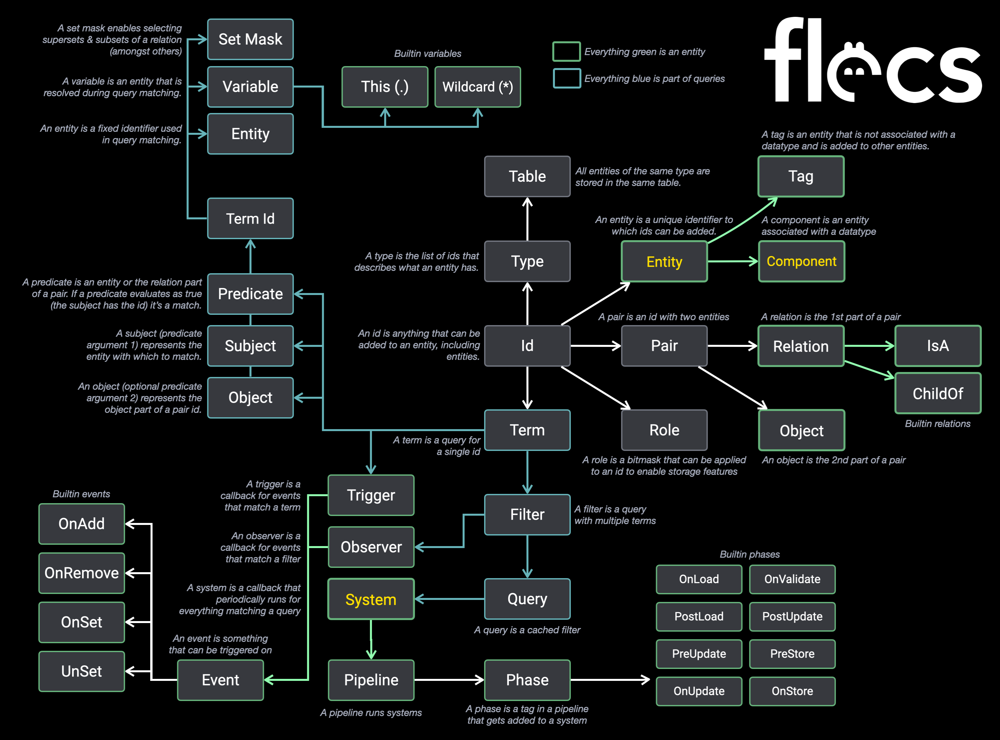

# Flecs Quickstart
This document provides a quick overview of the different features and concepts in Flecs with short examples. This is a good resource if you're just getting started or just want to get a better idea of what kind of features are available in Flecs!

## Overview
This shows an overview of all the different concepts in Flecs and how they wire together. The sections in the quickstart go over them in more detail and with code examples.



## World
The world is the container for all ECS data. It stores the entities and their components, does queries and runs systems. Typically there is only a single world, but there is no limit on the number of worlds an application can create.

```c
ecs_world_t *world = ecs_init();

// Do the ECS stuff

ecs_fini(world);
```
```cpp
flecs::world world;

// Do the ECS stuff
```

## Entity
An entity is a unique thing in the world, and is represented by a 64 bit id. Entities can be created and deleted. If an entity is deleted it is no longer considered "alive". A world can contain up to 4 billion(!) alive entities. Entity identifiers contain a few bits that make it possible to check whether an entity is alive or not.

```c
ecs_entity_t e = ecs_new_id(world);
ecs_is_alive(world, e); // true!

ecs_delete(world, e);
ecs_is_alive(world, e); // false!
```
```cpp
auto e = world.entity();
e.is_alive(); // true!

e.destruct();
e.is_alive(); // false!
```

Entities can have names which makes it easier to identify them in an application. In C++ the name can be passed to the constructor. In C a name can be assigned with the `ecs_entity_init` function. If a name is provided during entity creation time and an entity with that name already exists, the existing entity will be returned.

```c
ecs_entity_t e = ecs_entity_init(world, &(ecs_entity_desc_t){ .name = "Bob" });

printf("Entity name: %s\n", ecs_get_name(world, e));
```
```cpp
auto e = world.entity("Bob");

std::cout << "Entity name: " << e.name() << std::endl;
```

Entities can be looked up by name with the `lookup` function:

```c
ecs_entity_t e = ecs_lookup(world, "Bob");
```
```cpp
auto e = world.lookup("Bob");
```

## Id
An id is a 64 bit number that can encode anything that can be added to an entity. In flecs this can be either a component, tag or a pair. A component is data that can be added to an entity. A tag is an "empty" component. A pair is a combination of two component/tag ids which is used to encode entity relationships. All entity/component/tag identifiers are valid ids, but not all ids are valid entity identifier.

The following sections describe components, tags and pairs in more detail.

## Component
A component is a type of which instances can be added and removed to entities. Each component can be added only once to an entity (though not really, see [Pair](#pair)). In C applications components must be registered before use. In C++ this happens automatically.

```c
ECS_COMPONENT(world, Position);
ECS_COMPONENT(world, Velocity);

ecs_entity_t e = ecs_new_id(world);

// Add a component. This creates the component in the ECS storage, but does not
// assign it with a value.
ecs_add(world, e, Velocity);

// Set the value for the Position & Velocity components. A component will be
// added if the entity doesn't have it yet.
ecs_set(world, e, Position, {10, 20});
ecs_set(world, e, Velocity, {1, 2});

// Get a component
const Position *p = ecs_get(world, e, Position);

// Remove component
ecs_remove(world, e, Position);
```
```cpp
auto e = world.entity();

// Add a component. This creates the component in the ECS storage, but does not
// assign it with a value.
e.add<Velocity>();

// Set the value for the Position & Velocity components. A component will be
// added if the entity doesn't have it yet.
auto e = ecs.entity()
    .set<Position>({10, 20})
    .set<Velocity>({1, 2});

// Get a component
const Position *p = e.get<Position>();

// Remove component
e.remove<Position>();
```

Each component is associated by a unique entity identifier by Flecs. This makes it possible to inspect component data, or attach your own data to components. C applications can use the `ecs_id` macro to get the entity id for a component. C++ applications can use the `world::id` function:

```c
ECS_COMPONENT(world, Position);

ecs_entity_t pos_e = ecs_id(Position);
printf("Name: %s\n", ecs_get_name(world, pos_e)); // outputs 'Name: Position'

// It's possible to add components like you would for any entity
ecs_add(world, pos_e, Serializable);
```
```cpp
flecs::entity pos_e = world.id<Position>();
std::cout << "Name: " << pos_e.name() << std::endl;  // outputs 'Name: Position'

// It's possible to add components like you would for any entity
pos_e.add<Serializable>();
```

The thing that makes an ordinary entity a component is the `EcsComponent` (or `flecs::Component`, in C++) component. This is a builtin component that tells Flecs how much space is needed to store a component, and can be inspected by applications:

```c
ECS_COMPONENT(world, Position);

ecs_entity_t pos_e = ecs_id(Position);

const EcsComponent *c = ecs_get(world, pos_e, EcsComponent);
printf("Component size: %u\n", c->size);
```
```cpp
flecs::entity pos_e = world.id<Position>();

const EcsComponent *c = pos_e.get<flecs::Component>();
std::cout << "Component size: " << c->size << std::endl;
```

Because components are stored as regular entities, they can in theory also be deleted. To prevent unexpected accidents however, by default components are registered with a tag that prevents them from being deleted. If this tag were to be removed, deleting a component would cause it to be removed from all entities. For more information on these policies, see [Relation cleanup properties](Relations.md#relation_cleanup_properties).

## Tag
A tag is a component that does not have any data. In Flecs tags can be either empty types (in C++) or regular entities (C & C++) that do not have the `EcsComponent` component (or have an `EcsComponent` component with size 0). Tags can be added & removed using the same APIs as adding & removing components, but because tags have no data, they cannot be assigned a value. Because tags (like components) are regular entities, they can be created & deleted at runtime.

```c
// Create Enemy tag
ecs_entity_t Enemy = ecs_new_id(world);

// Create entity, add Enemy tag
ecs_entity_t e = ecs_new_id(world);

ecs_add_id(world, e, Enemy);
ecs_has_id(world, e, Enemy); // true!

ecs_remove_id(world, e, Enemy);
ecs_has_id(world, e, Enemy); // false!
```
```cpp
// Option 1: create Tag as empty struct
struct Enemy { };

// Create entity, add Enemy tag
auto e = world.entity().add<Enemy>();
e.has<Enemy>(); // true!

e.remove<Enemy>();
e.has<Enemy>(); // false!


// Option 2: create Tag as entity
auto Enemy = world.entity();

// Create entity, add Enemy tag
auto e = world.entity().add(Enemy);
e.has(Enemy); // true!

e.remove(Enemy);
e.has(Enemy); // false!
```

Note that both options in the C++ example achieve the same effect. The only difference is that in option 1 the tag is fixed at compile time, whereas in option 2 the tag can be created dynamically at runtime.

When a tag is deleted, the same rules apply as for components (see [relation cleanup properties](Relations.md#relation_cleanup_properties)).

## Pair
A pair is a combination of two entity ids. Pairs can be used to store entity relations, where the first id represents the relation kind and the second id represents the relation target (called "object"). This is best explained by an example:

```c
// Create Likes relation
ecs_entity_t Likes = ecs_new_id(world);

// Create a small graph with two entities that like each other
ecs_entity_t Bob = ecs_new_id(world);
ecs_entity_t Alice = ecs_new_id(world);

ecs_add_pair(world, Bob, Likes, Alice); // Bob likes Alice
ecs_add_pair(world, Alice, Likes, Bob); // Alice likes Bob
ecs_has_pair(world, Bob, Likes, Alice); // true!

ecs_remove_pair(world, Bob, Likes, Alice);
ecs_has_pair(world, Bob, Likes, Alice); // false!
```
```cpp
// Create Likes relation as empty type (tag)
struct Likes { };

// Create a small graph with two entities that like each other
auto Bob = world.entity();
auto Alice = world.entity();

Bob.add<Likes>(Alice); // Bob likes Alice
Alice.add<Likes>(Bob); // Alice likes Bob
Bob.has<Likes>(Alice); // true!

Bob.remove<Likes>(Alice);
Bob.has<Likes>(Alice); // false!
```

A pair can be encoded in a single 64 bit identifier by using the `ecs_pair` macro in C, or the `world.pair` function in C++:

```c
ecs_id_t id = ecs_pair(Likes, Bob);
```
```cpp
flecs::id id = world.pair(Likes, Bob);
```

The following examples show how to get back the elements from a pair:

```c
if (ecs_id_is_pair(id)) {
    ecs_entity_t relation = ecs_pair_first(world, id);
    ecs_entity_t target = ecs_pair_second(world, id);
}
```
```cpp
if (id.is_pair()) {
    auto relation = id.first();
    auto target = id.second();
}
```

A component or tag can be added multiple times to the same entity as long as it is part of a pair, and the pair itself is unique:

```c
ecs_add_pair(world, Bob, Eats, Apples);
ecs_add_pair(world, Bob, Eats, Pears);
ecs_add_pair(world, Bob, Grows, Pears);

ecs_has_pair(world, Bob, Eats, Apples); // true!
ecs_has_pair(world, Bob, Eats, Pears);  // true!
ecs_has_pair(world, Bob, Grows, Pears); // true!
```
```cpp
Bob.add(Eats, Apples);
Bob.add(Eats, Pears);
Bob.add(Grows, Pears);

Bob.has(Eats, Apples); // true!
Bob.has(Eats, Pears);  // true!
Bob.has(Grows, Pears); // true!
```

The `get_object` function can be used in C and C++ to get the object for a relation:

```c
ecs_entity_t o = ecs_get_object(world, Alice, Likes, 0); // Returns Bob
```
```cpp
auto o = Alice.get_object<Likes>(); // Returns Bob
```

Entity relations enable lots of interesting patterns and possibilities. Make sure to check out the [relations manual](Relations.md).

## Hierarchies
Flecs has builtin support for hierarchies with the builtin `EcsChildOf` (or `flecs::ChildOf`, in C++) relationship. A hierarchy can be created with the regular relationship API, or with the `child_of` shortcut in C++:

```c
ecs_entity_t parent = ecs_new_id(world);

// ecs_new_w_pair is the same as ecs_new_id + ecs_add_pair
ecs_entity_t child = ecs_new_w_pair(world, EcsChildOf, parent);

// Deleting the parent also deletes its children
ecs_delete(world, parent);
```
```cpp
auto parent = world.entity();
auto child = world.entity().child_of(parent);

// Deleting the parent also deletes its children
parent.destruct();
```

When entities have names, they can be used together with hierarchies to generate path names or do relative lookups:

```c
ecs_entity_t parent = ecs_entity_init(world, &(ecs_entity_desc_t){
    .name = "parent"
});

ecs_entity_t child = ecs_entity_init(world, &(ecs_entity_desc_t){
    .name = "child"
});

ecs_add_pair(world, child, EcsChildOf, parent);

char *path = ecs_get_fullpath(world, child);
printf("%s\n", path); // output: 'parent.child'
ecs_os_free(path);

ecs_lookup_path(world, 0, "parent.child"); // returns child
ecs_lookup_path(world, parent, "child");   // returns child
```
```cpp
auto parent = world.entity("parent");
auto child = world.entity("child").child_of(parent);
std::cout << child.path() << std::endl; // output: 'parent::child'

world.lookup("parent::child"); // returns child
parent.lookup("child"); // returns child
```

Queries (see below) can use hierarchies to order data breadth-first, which can come in handy when you're implementing a transform system:

```c
ecs_query_t *q = ecs_query_init(world, &(ecs_query_desc_t){
    .filter.terms = {
        { ecs_id(Position) },
        { ecs_id(Position), .subj.set = {
            .mask = EcsCascade,    // Force breadth-first order
            .relation = EcsChildOf // Use ChildOf relation for ordering
        }}
    }
});

ecs_iter_t it = ecs_query_iter(world, q);
while (ecs_query_next(&it)) {
    Position *p = ecs_term(&it, Position, 1);
    Position *p_parent = ecs_term(&it, Position, 2);
    for (int i = 0; i < it.count; i++) {
        // Do the thing
    }
}
```
```cpp
auto q = world.query_builder<Position, Position>()
    .arg(2).set(flecs::Cascade, flecs::ChildOf)
    .build();

q.each([](Position& p, Position& p_parent) {
    // Do the thing
});
```

## Instancing
Flecs has builtin support for instancing (sharing a single component with multiple entities) through the builtin `EcsIsA` relation (`flecs::IsA` in C++). An entity with an `IsA` relation to a base entity "inherits" all entities from that base:

```c
// Shortcut to create entity & set a component
ecs_entity_t base = ecs_set(world, 0, Triangle, {{0, 0}, {1, 1}, {-1, -1}});

// Create entity that shares components with base
ecs_entity_t e = ecs_new_w_pair(world, EcsIsA, base);
const Triangle *t = ecs_get(world, e, Triangle); // gets Triangle from base
```
```cpp
auto base = world.entity().set<Triangle>({{0, 0}, {1, 1}, {-1, -1}});

// Create entity that shares components with base
auto e = world.entity().is_a(base);
const Triangle *t = e.get<Triangle>(); // gets Triangle from base
```

Entities can override components from their base:

```c
// Add private instance of Triangle to e, copy value from base
ecs_add(world, e, Triangle);
```
```cpp
// Add private instance of Triangle to e, copy value from base
e.add<Triangle>();
```

Instancing can be used to build modular prefab hierarchies, as the foundation of a batched renderer with instancing support, or just to reduce memory footprint by sharing common data across entities.

## Type
The type (often referred to as "archetype") is the list of ids an entity has. Types can be used for introspection which is useful when debugging, or when for example building an entity editor. The most common thing to do with a type is to convert it to text and print it:

```c
ECS_COMPONENT(world, Position);
ECS_COMPONENT(world, Velocity);

ecs_entity_t e = ecs_new_id(world);
ecs_add(world, e, Position);
ecs_add(world, e, Velocity);

const ecs_type_t *type = ecs_get_type(world, e);
char *type_str = ecs_type_str(world, type);
printf("Type: %s\n", type_str); // output: 'Position,Velocity'
ecs_os_free(type_str);
```
```cpp
auto e = ecs.entity()
    .add<Position>()
    .add<Velocity>();

std::cout << e.type().str() << std::endl; // output: 'Position,Velocity'
```

A type can also be iterated by an application:
```c
const ecs_type_t *type = ecs_get_type(world, e);
for (int i = 0; i < type->count; i++) {
    if (type->array[i] == ecs_id(Position)) {
        // Found Position component!
    }
}
```
```cpp
e.each([&](flecs:id id) {
    if (id == world.id<Position>()) {
        // Found Position component!
    }
}
```

## Singleton
A singleton is a single instance of a component that can be retrieved without an entity. The functions for singletons are very similar to the regular API:

```c
// Set singleton component
ecs_set_singleton(world, Position, {10, 20});

// Get singleton component
const Position *p = ecs_get_singleton(world, Position);
```
```cpp
// Set singleton component
world.set<Position>({10, 20});

// Get singleton component
const Position *p = world.get<Position>();
```

Singleton components are created by adding the component to its own entity id. The above code examples are shortcuts for these regular API calls:

```c
ecs_set(world, ecs_id(Position), Position, {10, 20});

const Position *p = ecs_get(world, ecs_id(Position), Position);
```
```cpp
flecs::entity pos_e = world.id<Position>();

pos_e.set<Position>({10, 20});

const Position *p = pos_e.get<Position>();
```

## Term
A term is the simplest kind of query in Flecs, and enables finding all entities for a single specific component, tag or pair. The following examples show how to find & iterate over all entities that have the `Position` component:

```c
// Create an iterator that finds all entities that have Position
ecs_iter_t it = ecs_term_iter(world, &(ecs_term_t){ ecs_id(Position) });
while (ecs_term_next(&it)) {
    Position *p = ecs_term(&it, Position, 1);

    // Iterate the entities & their Position components
    for (int i = 0; i < it.count; i++) {
        printf("%s: {%f, %f}\n", ecs_get_name(world, it.entities[i]),
            p[i].x, p[i].y);
    }
}
```
```cpp
// Iterate the entities & their Position components
world.each([](flecs::entity e, Position& p) {
    std::cout << e.name() << ": {" << p.x << ", " << p.y << "}" << std::endl;
});
```

## Filter
A filter is a list of terms that are matched against entities. Filters are cheap to create and match entities as iteration takes place. This makes them a good fit for scenarios where an application doesn't know in advance what it has to query for, a typical use case for this being runtime tags. Another advantage of filters is that while they can be reused, their cheap creation time doesn't require it. The following example shows a simple filter:

```c
// Initialize a filter with 2 terms on the stack
ecs_filter_t *f = ecs_filter_init(world, &(ecs_filter_desc_t){
    .terms = {
        { ecs_id(Position) },
        { ecs_pair(EcsChildOf, parent) }
    }
});

// Iterate the filter results. Because entities are grouped by their type there
// are two loops: an outer loop for the type, and an inner loop for the entities
// for that type.
ecs_iter_t it = ecs_filter_iter(world, f);
while (ecs_filter_next(&it)) {
    // Each type has its own set of component arrays
    Position *p = ecs_term(&it, Position, 1);

    // Iterate all entities for the type
    for (int i = 0; i < it.count; i++) {
        printf("%s: {%f, %f}\n", ecs_get_name(world, it.entities[i]),
            p[i].x, p[i].y);
    }
}

ecs_filter_fini(f);
```
```cpp
// For simple queries the each function can be used
world.each([](Position& p, Velocity& v) { // flecs::entity argument is optional
    p.x += v.x;
    p.y += v.y;
});

// More complex filters can first be created, then iterated
auto f = world.filter_builder<Position>()
    .term(flecs::ChildOf, parent)
    .build();

// Option 1: each() function that iterates each entity
f.each([](flecs::entity e, Position& p) {
    std::cout << e.name() << ": {" << p.x << ", " << p.y << "}" << std::endl;
});

// Option 2: iter() function that iterates each archetype
f.iter([](flecs::iter& it, Position *p) {
    for (int i : it) {
        std::cout << e.name()
            << ": {" << p[i].x << ", " << p[i].y << "}" << std::endl;
    }
});
```

The time complexity of a filter is roughly `O(n)`, where `n` is the number of archetypes matched by the term with the smallest number of matching archetypes. Each subsequent term adds a constant-time check per archetype, which makes the average time complexity `O(n)`.

Filters can use operators to exclude components, optionally match components or match one out of a list of components. Additionally filters may contain wildcards for terms which is especially useful when combined with pairs.

The following example shows a filter that matches all entities with a parent that do not have `Position`:

```c
ecs_filter_t *f = ecs_filter_init(world, &(ecs_filter_desc_t){
    .terms = {
        { ecs_pair(EcsChildOf, EcsWildcard) }
        { ecs_id(Position), .oper = EcsNot },
    }
});

// Iteration code is the same
```
```cpp
auto f = world.filter_builder<>()
    .term(flecs::ChildOf, flecs::Wildcard)
    .term<Position>().oper(flecs::Not)
    .build();

// Iteration code is the same
```

## Query
A query is like a filter in that it is a list of terms that is matched with entities. The difference with a filter is that queries cache their results, which makes them more expensive to create, but cheaper to iterate. Because a query caches a list of archetypes rather than a list of entities, the cache stabilizes fast as new archetypes are only created for new component combinations. This makes queries an attractive option for scenarios where an application knows in advance which things to query for (such as with systems), as over the lifespan of an application approximately no time is spent on finding the right entities.

The API for queries looks very similar to filters:

```c
// Create a query with 2 terms
ecs_query_t *q = ecs_query_init(world, &(ecs_query_desc_t){
    .filter.terms = {
        { ecs_id(Position) },
        { ecs_pair(EcsChildOf, EcsWildcard) }
    }
});

ecs_iter_t it = ecs_query_iter(world, q);
while (ecs_query_next(&it)) {
    // Same as for filters
}
```
```cpp
// Create a query with two terms
auto q = world.query_builder<Position>()
    .term(flecs::ChildOf, flecs::Wildcard)
    .build();

// Iteration is the same as filters
```

Queries support additional features, such as breadth-first sorting based on relation (the `cascade` modifier) and sorting by component values. See the [query manual](Queries.md) for more details.

## System
A system is a query combined with a callback. Systems can be either ran manually or ran as part of an ECS-managed main loop (see [Pipeline](#pipeline)). The system API looks similar to queries:

```c
// Option 1, use the ECS_SYSTEM convenience macro
ECS_SYSTEM(world, Move, 0, Position, Velocity);
ecs_run(world, Move, delta_time, NULL); // Run system

// Option 2, use the ecs_system_init function
ecs_entity_t move_sys = ecs_system_init(world, &(ecs_system_desc_t){
    .query.filter.terms = {
        {ecs_id(Position)},
        {ecs_id(Velocity)},
    },
    .callback = Move
});

ecs_run(world, move_sys, delta_time, NULL); // Run system

// The callback code (same for both options)
void Move(ecs_iter_t *it) {
    Position *p = ecs_term(it, Position, 1);
    Velocity *v = ecs_term(it, Velocity, 2);

    for (int i = 0; i < it->count; i++) {
        p[i].x += v[i].x * it->delta_time;
        p[i].y += v[i].y * it->delta_time;
    }
}
```
```cpp
// Use each() function that iterates each individual entity
auto move_sys = world.system<Position, Velocity>()
    .iter([](flecs::iter it, Position *p, Velocity *v) {
        for (int i : it) {
            p[i].x += v[i].x * it.delta_time();
            p[i].y += v[i].y * it.delta_time();
        }
    });

    // Just like with filters & queries, systems have both the iter() and
    // each() methods to iterate entities.

move_sys.run();
```

Systems are stored as entities with an `EcsSystem` component (`flecs::System` in C++), similar to components. That means that an application can use a system as a regular entity:

```c
printf("System: %s\n", ecs_get_name(world, move_sys));
ecs_add(world, move_sys, EcsOnUpdate);
ecs_delete(world, move_sys);
```
```cpp
std::cout << "System: " << move_sys.name() << std::endl;
move_sys.add(flecs::OnUpdate);
move_sys.destruct();
```

## Pipeline
A pipeline is a list of tags that when matched, produces a list of systems to run. These tags are also referred to as a system "phase". Flecs comes with a default pipeline that has the following phases:

```c
EcsOnLoad
EcsPostLoad
EcsPreUpdate
EcsOnUpdate
EcsOnValidate
EcsPostUpdate
EcsPreStore
EcsOnStore
```
```cpp
flecs::OnLoad
flecs::PostLoad
flecs::PreUpdate
flecs::OnUpdate
flecs::OnValidate
flecs::PostUpdate
flecs::PreStore
flecs::OnStore
```

When a pipeline is executed, systems are ran in the order of the phases. This makes pipelines and phases the primary mechanism for defining ordering between systems. The following code shows how to assign systems to a pipeline, and how to run the pipeline with the `progress()` function:

```c
ECS_SYSTEM(world, Move, EcsOnUpdate, Position, Velocity);
ECS_SYSTEM(world, Transform, EcsPostUpdate, Position, Transform);
ECS_SYSTEM(world, Render, EcsOnStore, Transform, Mesh);

ecs_progress(world, 0); // run systems in default pipeline
```
```cpp
world.system<Position, Velocity>("Move").kind(flecs::OnUpdate).each( ... );
world.system<Position, Transform>("Transform").kind(flecs::PostUpdate).each( ... );
world.system<Transform, Mesh>("Render").kind(flecs::OnStore).each( ... );

world.progress();
```

Because phases are just tags that are added to systems, applications can use the regular API to add/remove systems to a phase:
```c
ecs_remove_id(world, Move, EcsOnUpdate);
ecs_add_id(world, Move, EcsPostUpdate);
```
```cpp
move_sys.add(flecs::OnUpdate);
move_sys.remove(flecs::PostUpdate);
```

Inside a phase, systems are guaranteed to be ran in their declaration order.

### Custom Pipeline
Under the hood a pipeline is a query that finds all the systems to run in a pipeline. To customize how and which systems are matched by a pipeline, applications can create custom pipelines:

```c
// Create a pipeline that matches systems with the "Foo" tag
ecs_entity_t pipeline = ecs_pipeline_init(world, &(ecs_pipeline_desc_t){
    .entity = { .name = "CustomPipeline" },
    .query.filter.terms = {
        { .id = ecs_id(EcsSystem) }, // mandatory, pipeline must match systems
        { .id = Foo }
    }
});

ecs_set_pipeline(world, pipeline);
```
```cpp
// Create a pipeline that matches systems with the "Foo" tag
auto pipeline = world.pipeline()
    .term(flecs::System)
    .term(Foo)
    .build();

world.set_pipeline(pipeline);
```

## Observer
Observers are callbacks that are invoked when one or more events matches the query of an observer. Events can be either user defined or builtin. Examples of builtin events are `OnAdd`, `OnRemove` and `OnSet`.

When an observer has a query with more than one component, the observer will not be invoked until the entity for which the event is emitted satisfies the entire query.

An example of an observer with two components:

```c
ecs_observer_init(world, &(ecs_observer_desc_t){
    .filter.terms = { { ecs_id(Position) }, { ecs_id(Velocity) }},
    .event = EcsOnSet,
    .callback = OnSetPosition
});

// Callback code is same as system

ecs_entity_t e = ecs_new_id(world);    // Doesn't invoke the observer
ecs_set(world, e, Position, {10, 20}); // Doesn't invoke the observer
ecs_set(world, e, Velocity, {1, 2});   // Invokes the observer
ecs_set(world, e, Position, {20, 40}); // Invokes the observer
```
```cpp
world.observer<Position, Velocity>("OnSetPosition").event(flecs::OnSet).each( ... );

auto e = ecs.entity();     // Doesn't invoke the observer
e.set<Position>({10, 20}); // Doesn't invoke the observer
e.set<Velocity>({1, 2});   // Invokes the observer
e.set<Position>({20, 30}); // Invokes the observer
```

## Module
A module is a function that imports and organizes components, systems, triggers, observers, prefabs into the world as reusable units of code. A well designed module has no code that directly relies on code of another module, except for components definitions. All module contents are stored as child entities inside the module scope with the `ChildOf` relation. The following examples show how to define a module in C and C++:

```c
// Module header (e.g. MyModule.h)
typedef struct {
    float x;
    float y;
} Position;

extern ECS_COMPONENT_DECLARE(Position);

// The import function name has to follow the convention: <ModuleName>Import
void MyModuleImport(ecs_world_t *world);

// Module source (e.g. MyModule.c)
ECS_COMPONENT_DECLARE(Position);

void MyModuleImport(ecs_world_t *world) {
    ECS_MODULE(world, MyModule);
    ECS_COMPONENT_DEFINE(world, Position);
}

// Import code
ECS_IMPORT(world, MyModule);
```
```cpp
struct my_module {
    my_module(flecs::world& world) {
        world.module<my_module>();

        // Define components, systems, triggers, ... as usual. They will be
        // automatically created inside the scope of the module.
    }
};

// Import code
world.import<my_module>();
```
